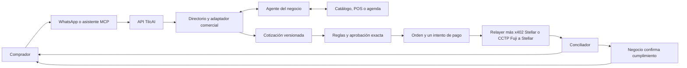

# TilcAI: contexto oficial para construir

**Corte:** 8 de octubre de 2026 · **Objetivo inmediato:** demo reproducible el sábado 10 de octubre, en testnet. Este documento es la referencia de coordinación; el código y una prueba reproducible determinan qué capacidad está terminada.

## Qué construimos

**TilcAI es infraestructura de comercio entre agentes de compradores y negocios.** Recibe una intención de compra o reserva, obtiene del negocio una oferta con precio, disponibilidad y destino de cobro verificables, aplica identidad, límites y aprobación, coordina un pago por un riel soportado y vincula el resultado financiero con la orden y la confirmación comercial. El comprador entra por WhatsApp, por un asistente conectado mediante **MCP** (Model Context Protocol) o por una aplicación que use la API. Un SDK es una capa futura sobre esa API. El negocio responde con su agente, un adaptador a POS/agenda o una consola operada por una persona. Ningún modelo de IA obtiene por sí mismo autoridad para mover fondos o inventar precios.

**Una sola operación une ambos lados.** Caso elegido para la primera demo: «compra 20 bolsas de cemento» a un negocio piloto con catálogo pequeño y agente vendedor conectado. Puede sustituirse por una reserva de parqueo solo si hay cupo y confirmación comprobables. El pitch no necesita dos recorridos inconexos.

## Límites y vocabulario

| TilcAI construye y opera | Se conecta, pero es externo |
| --- | --- |
| API/gateway, contratos compartidos, adaptadores de canales, directorio comercial, cotización/orden, reglas, aprobación, router de pago, conciliación, recibos, eventos, registro de cuentas y tenants | WhatsApp Business Platform, asistentes/modelos de IA, POS/inventario/agenda, Circle Iris/CCTP, cadenas Stellar y EVM, exploradores, proveedor de conversión fiat |

- **x402** es el protocolo de solicitud/respuesta para pagar un recurso o servicio HTTP. El plugin del **OpenZeppelin Relayer** verifica y liquida ese payload; no sustituye catálogo, orden, identidad ni aprobación.
- **OpenZeppelin Relayer** envía transacciones según sus redes, firmantes y políticas. Patrocinar gas no convierte a TilcAI en propietario de fondos ajenos.
- **CCTP** mueve **USDC nativo** entre redes habilitadas: burn en origen, atestación de Circle y mint en destino. No convierte bolivianos ni cualquier token. Una red soportada por Circle no queda automáticamente habilitada en TilcAI.
- **Cuenta/wallet:** el chat inicia el alta, pero el dueño crea o conecta su credencial en una superficie web segura. No se solicitan semillas ni firmas privadas por chat. Emitir cuenta, fondearla y aprobar una compra son actos distintos.
- **MCP** conecta herramientas de un asistente existente. **A2A** entre agentes es una evolución; el primer agente del negocio puede escuchar solicitudes estructuradas por API. `ALLOW` de una política es elegibilidad, no firma ni pago.

## Contrato de la operación de extremo a extremo

1. El comprador pide producto o servicio, cantidad y condiciones. TilcAI estructura la intención y registra el principal autenticado.
2. El negocio consulta **su fuente de verdad** y devuelve una cotización identificada, con vigencia, activo, importe, costes, disponibilidad y `payTo` registrado. Si no puede garantizar stock o cupo, confirma antes de prometerlo.
3. TilcAI verifica identidad del negocio, destino de cobro, versión de oferta, límites y política. Presenta las condiciones exactas. Un rechazo o una aprobación pendiente no inicia el pago.
4. La persona aprueba en superficie confiable. La aprobación compromete importe, activo, red, destinatario, `quoteId`, vencimiento y `orderId`. Una retención de presupuesto, si existe, es atómica.
5. El router escoge **una** ruta: pago directo Stellar mediante x402 con USDC, aún por probar integrado; **o** USDC en Avalanche Fuji mediante CCTP hacia Stellar, corredor técnico ya verificado. Cada intento tiene clave de idempotencia.
6. La conciliación comprueba evidencia on-chain y relaciona `orderId`, `quoteId`, `paymentAttemptId`, hash de origen, atestación y hash de destino. Un timeout significa `UNCERTAIN` hasta conciliar, no permiso para repetir el burn.
7. El negocio ve **pagado** y después confirma reserva, retiro o entrega por separado. Ambos lados reciben estado consistente, recibo financiero y enlaces de testnet. El cumplimiento tiene otra evidencia.

**Contrato común mínimo:** `principalId`, `agentId`, `businessId`, `serviceId`, `quoteId`, `orderId`, `paymentAttemptId`; estados de comercio, pago y presupuesto de `tilcai-shared-v1`; `Idempotency-Key` en escrituras; monto en unidades atómicas; red inequívoca; `payTo` versionado. Los [contratos compartidos](https://github.com/TilcAI/tilcai-core/blob/main/docs/shared-contracts.md) son una propuesta que el equipo debe revisar antes de fijar como API definitiva.

## Módulos y evidencia al corte

| Capacidad | Estado | Evidencia y siguiente comprobación |
| --- | --- | --- |
| Política determinista y contratos de IDs/estados | **Código base; sin checkout integrado** | `tilcai-core` local: `src/contracts.ts`, `src/authority.ts`, tests. `ALLOW` no mueve fondos. |
| USDC Avalanche Fuji → Stellar Testnet por CCTP V2, gasless | **Implementado; reportado como verificado en testnet** | `tilcai-infrastructure` `main` `6f0671c`: API, worker, tests y `xpay`. Reproducir por otro integrante antes del pitch. |
| OpenZeppelin Relayer + x402 Stellar | **Prueba aislada con XLM** | [Guía reproducible](https://github.com/TilcAI/tilcai-core/blob/main/docs/payment-rail-reproducibility.md). Repetir `/supported`, `/verify` y `/settle` con USDC y cuenta prevista. |
| Ocho redes del laboratorio CCTP | **Código y matriz; no ocho corredores comerciales** | `tilcai-cctp-engine`: Ethereum Sepolia, Fuji, Arbitrum Sepolia, Base Sepolia, Arc, Solana, Sui y Stellar. Registrar E2E por ruta antes de habilitarla. |
| WhatsApp en la demo del 2/10 | **Reportado por el equipo** | Instrucción, pago y comprobante con enlaces. Falta integrar adaptador y repetir con código/credenciales accesibles al equipo. |
| Negocio, catálogo, cotización y orden | **Puertos/diseño; implementación pendiente** | `modules/commerce` y `businesses` de infraestructura. Conectar un negocio piloto. |
| Política, presupuesto, aprobación y firma | **Prototipo/puertos; enlace real pendiente** | Probar aprobación exacta, rechazo y reintento antes de un intento financiero. |
| Emisión SCA desde chat | **EVM (Fuji): implementada en `main` y verificada en testnet. Stellar: plan** | [Fase SCA, §13 bis](../TILCAI_FASE_SCA_EMISION_DE_CUENTAS_2026-10-06.md): `POST /v1/accounts`, cuenta con passkey, factory y router v2 desplegados en Fuji ([PR #24](https://github.com/TilcAI/tilcai-infrastructure/pull/24)). Optipagos la usa para crear billeteras sin clave ([PR](https://github.com/Optus-development-team/optipagos-backend/pull/1)). Falta: delegación a agentes, recuperación, Stellar y auditoría. |
| MCP comprador | **Contrato de herramientas; servidor pendiente** | [Contrato MCP](https://github.com/TilcAI/tilcai-core/blob/main/docs/mcp-intent-mandate.md). Usar servicios comunes con API/canal. |
| Agente del negocio o portal | **Por construir** | Un adaptador con catálogo/operador basta para primer flujo; portal general no bloquea demo. |
| Router de orden y recibos de ambos lados | **Riel técnico existe; unión comercial pendiente** | Trazar `orderId` de cotización a hashes y cumplimiento. |
| Vault de desembolsos (`TilcaiVault` en Fuji) | **Implementado; verificado en testnet el 9/10** | `tilcai-infrastructure` `/v1/vault`: seis desembolsos `CONFIRMED` en la prueba E2E de Optipagos. Reproducir por otro integrante. El vault estuvo vacío el 8/10 porque la recarga llegó a la cuenta del relayer: recargar siempre el contrato. |
| Cobro con QR Simple | **Mock; sin banco ni proveedor** | `tilcai-infrastructure` `/mock/vendis`: contrato de Vendis («QR Dinámico para Pagos» v1.3) con un botón «Simular depósito». Verificado E2E con Optipagos: QR → depósito simulado → aviso → desembolso. No mueve dinero ni prueba un corredor real. |
| Monitorización del backend en la web | **Canal implementado y verificado en local; tablero pendiente** | [Documento](../2-ARQUITECTURA/TILCAI_MONITORIZACION_EVENTOS_BACKEND_FRONTEND_2026-10-09.md). Eventos firmados de `tilcai-infrastructure` a `tilcai-web`, vista base en `/[lang]/monitor`. Falta el tablero ([web #25](https://github.com/TilcAI/tilcai-web/issues/25)), un almacén duradero en el sitio y apuntar el relayer real a TilcAI. |
| Rampa BOB ↔ USDC y mainnet | **Sin corredor/proveedor verificado** | No prometer depósito por QR ni producción en la demo testnet: el QR que existe es un mock. |

El `main` local de `tilcai-infrastructure` contiene Fuji → Stellar y puertos de otros módulos; la preparación Docker/SCA descrita en los planes no se da por fusionada ni ejecutada. WhatsApp procede del relato de la presentación, no de inspeccionar su API privada. Las escenas de la web siguen siendo simulaciones si no consumen backend.

## Criterio de la demo del sábado

**Historia única:** chat comprador → agente del negocio → oferta respaldada por catálogo o cupo → aprobación exacta → pago **testnet** en ruta demostrable → conciliación → ambos ven el mismo `orderId`, estado y pruebas; el negocio confirma cumplimiento aparte. Fuji → Stellar es la prueba técnica principal porque ya existe. La escena visual puede revelar esos eventos durante el scroll, pero una animación no es telemetría en vivo.

**Salida comprobable:** otro integrante reproduce la operación con runbook; la orden sobrevive refresh/reintento; no hay segundo burn; fallo o incertidumbre se muestra honestamente; importe/destino coinciden con oferta y aprobación; comprador y negocio reciben referencias verificables; «entregado» no aparece automáticamente al pagar. Si emisión SCA o MCP no pasan sus pruebas antes del cierre, se usa wallet testnet existente o cliente API y se rotula lo pendiente. Todo permanece dentro del alcance final.

**Relato web/pitch:** 1) definición; 2) problema en ambos lados; 3) infraestructura común; 4) pedido y agente vendedor; 5) oferta y controles; 6) aprobación y pago; 7) nodo USDC de origen → TilcAI/CCTP → Stellar, Fuji «verificado», otras redes «laboratorio»; 8) recibos y cumplimiento; 9) evidencia, estado y métricas reales del piloto. No inventar adopción ni decir «cualquier dinero en cualquier red».

La [arquitectura integrada](../2-ARQUITECTURA/TILCAI_FLUJO_INTEGRADO_Y_DEMO_2026-10-08.md) desarrolla diagramas, creación de cuenta y comandos. El [backlog asignado](../3-CONSTRUCCION/ISSUES_PROPUESTAS_2026-10-08.md) enlaza diez issues nuevas creadas el 8/10 y los trabajos que el equipo ya tenía abiertos. Los planes fechados de [backend](../TILCAI_PLAN_ARQUITECTURA_BACKEND_INFRA_2026-10-02.md), [SCA](../TILCAI_FASE_SCA_EMISION_DE_CUENTAS_2026-10-06.md), [producto](../TILCAI_NUEVO_RUMBO_COMERCIO_AGENTICO_2026-09-29.md) y [web](../TILCAI_WEB_FASE_1_DISENO_MARCA_IMPLEMENTACION_2026-09-29.md) conservan el detalle histórico; el código y la prueba deciden qué está terminado hoy.
