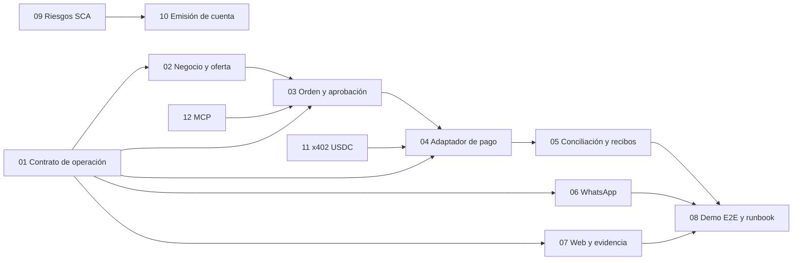

# Issues de construcción de TilcAI

**Estado:** diez issues nuevas creadas y asignadas en GitHub el 8 de octubre de 2026; ver enlaces de cada fila. Los IDs `TIL-xx` son identificadores de coordinación de este documento, no números de GitHub. Otros paquetes corresponden a issues que el equipo ya tenía abiertas y asignadas. Objetivo de la primera tanda: una orden realista, reproducible en testnet el sábado 10. La prioridad indica orden de integración, no recorte de alcance.

Cada responsable debe leer el [contexto oficial](../0-OFICIAL/CONTEXTO_OFICIAL_TILCAI.md), la [secuencia integrada](../2-ARQUITECTURA/TILCAI_FLUJO_INTEGRADO_Y_DEMO_2026-10-08.md) y el README del repositorio que vaya a editar. La persona que tome TIL-01 publica primero los ejemplos de payload; las demás pueden arrancar en paralelo contra ese contrato y cerrar la integración al fusionarlo.

## Issues existentes: conservarlas y coordinar

Consultadas en GitHub el 8/10. Mantener sus responsables actuales salvo decisión posterior del equipo:

| Trabajo ya abierto | Enlace | Relación con el backlog |
| --- | --- | --- |
| Contrato `Quote`, `Order`, `MerchantAdapter` | [core #3](https://github.com/TilcAI/tilcai-core/issues/3) | Cierra revisión de TIL-01; no duplicar definición en una issue nueva. |
| Aprobación por compra y smart account limitada | [core #6](https://github.com/TilcAI/tilcai-core/issues/6) | Diseño que alimenta TIL-03 y pruebas SCA. |
| QA del corredor actual | [infra #3](https://github.com/TilcAI/tilcai-infrastructure/issues/3), [#4](https://github.com/TilcAI/tilcai-infrastructure/issues/4), [#5](https://github.com/TilcAI/tilcai-infrastructure/issues/5), [#10](https://github.com/TilcAI/tilcai-infrastructure/issues/10) | Reproducción y revisión cruzada de la base de TIL-04/TIL-08. |
| Pruebas SCA M0 | [infra #6](https://github.com/TilcAI/tilcai-infrastructure/issues/6), [#7](https://github.com/TilcAI/tilcai-infrastructure/issues/7), [#11](https://github.com/TilcAI/tilcai-infrastructure/issues/11), [#12](https://github.com/TilcAI/tilcai-infrastructure/issues/12) | Ya cubren TIL-09 y TIL-11; actualizar estas issues, no recrearlas. |
| Tenants, datos y API de cuentas M1 | [infra #8](https://github.com/TilcAI/tilcai-infrastructure/issues/8), [#9](https://github.com/TilcAI/tilcai-infrastructure/issues/9) | Ya cubren TIL-13 y parte de TIL-10. |

Los [PR de contenedores #1](https://github.com/TilcAI/tilcai-infrastructure/pull/1) y [preparación SCA #2](https://github.com/TilcAI/tilcai-infrastructure/pull/2) estaban abiertos al corte; #2 parte de la rama de #1. No contar ese código como presente en `main` hasta fusionarlo y repetir sus pruebas.

## Mapa de dependencias

Las flechas a TIL-04 desde TIL-11 y a TIL-03 desde TIL-12 representan **integración posterior**; la ruta Fuji → Stellar y el cliente WhatsApp/API pueden cerrar la primera demo sin esperar esos dos módulos. Aceptar un PR exige evidencia; «compila» no equivale a «pagó», y un hash no equivale a entrega.

## Primera tanda: integración de la demo

| ID | Paquete de trabajo | Repo | Prioridad | Depende de | Responsable / acción |
| --- | --- | --- | --- | --- | --- |
| TIL-01 | Cerrar contrato v1 de operación, oferta y evidencia | `tilcai-core` + `tilcai-infrastructure` | P0 | — | **Continuar [core #3](https://github.com/TilcAI/tilcai-core/issues/3)**; proponer issue nueva solo para un hueco transversal comprobado. |
| [TIL-02](https://github.com/TilcAI/tilcai-infrastructure/issues/13) | Exponer un negocio piloto y cotización verificable | `tilcai-infrastructure` | P0 | 01 | **Jhamil** · [infra #13](https://github.com/TilcAI/tilcai-infrastructure/issues/13). |
| [TIL-03](https://github.com/TilcAI/tilcai-infrastructure/issues/14) | Persistir orden, política y aprobación exacta | `tilcai-infrastructure` | P0 | 01, 02 | **Jose** · [infra #14](https://github.com/TilcAI/tilcai-infrastructure/issues/14), basada en [core #6](https://github.com/TilcAI/tilcai-core/issues/6). |
| [TIL-04](https://github.com/TilcAI/tilcai-infrastructure/issues/15) | Vincular una orden al riel CCTP Fuji → Stellar | `tilcai-infrastructure` | P0 | 01, 03 | **Saul** · [infra #15](https://github.com/TilcAI/tilcai-infrastructure/issues/15); sin duplicar QA de [infra #3–5](https://github.com/TilcAI/tilcai-infrastructure/issues/3). |
| [TIL-05](https://github.com/TilcAI/tilcai-infrastructure/issues/16) | Conciliar pago y emitir estados para ambos lados | `tilcai-infrastructure` | P0 | 03, 04 | **Jhamil** · [infra #16](https://github.com/TilcAI/tilcai-infrastructure/issues/16). |
| [TIL-06](https://github.com/TilcAI/tilcai-infrastructure/issues/17) | Conectar canal WhatsApp al flujo común | `tilcai-infrastructure` + canal existente | P0 | 01 | **Saul** · [infra #17](https://github.com/TilcAI/tilcai-infrastructure/issues/17); confirmar acceso a su API/número. |
| [TIL-07](https://github.com/TilcAI/tilcai-web/issues/24) | Mostrar pedido, agente vendedor, controles y prueba en la web | `tilcai-web` | P0 | 01; datos E2E para modo vivo | **Omar** · [web #24](https://github.com/TilcAI/tilcai-web/issues/24); coordinar con la simulación. |
| [TIL-08](https://github.com/TilcAI/tilcai-infrastructure/issues/18) | Reproducir y grabar compra testnet punta a punta | `tilcai-infrastructure` + `doc` | P0 | 02–07 | **Omar** · [infra #18](https://github.com/TilcAI/tilcai-infrastructure/issues/18), enlazada a QA técnico [#4](https://github.com/TilcAI/tilcai-infrastructure/issues/4) y [#10](https://github.com/TilcAI/tilcai-infrastructure/issues/10). |

### TIL-01 · Contrato v1 de operación

**Entregable.** Revisar `tilcai-shared-v1` y fijar payloads mínimos `Intent`, `BusinessCapability`, `Quote`, `Order`, `ApprovalBinding`, `PaymentAttempt`, `PaymentReceipt` y `FulfillmentReceipt`; versionar ejemplos JSON y estados; decidir qué API pública expone cada transición. El `payTo` de la oferta debe estar ligado a una versión del perfil del negocio. **Aceptación:** dos clientes distintos pueden enviar la misma intención válida; importes atómicos y redes se validan; una oferta vencida, un destinatario cambiado y un ID cruzado se rechazan; las rutas documentadas coinciden con los tipos del código. Revisar con quienes construyan comercio, pagos y cuentas antes de fusionar.

### TIL-02 · Negocio piloto y oferta

**Entregable.** Un agente vendedor o servicio adaptador escucha solicitudes estructuradas de un solo negocio piloto y consulta catálogo/cupo controlado, con versión y timestamp. Puede escalar a un operador para confirmar stock. Responde cotización con cantidad, importe, activo, vigencia, condiciones y `payTo` registrado. **Aceptación:** producto existente responde; stock insuficiente, precio vencido y destino no verificado no generan oferta pagable; dos consultas idénticas no reservan dos veces. El equipo puede reemplazar el fixture por una fuente de verdad sin cambiar el contrato.

### TIL-03 · Orden, reglas y aprobación

**Entregable.** Persistir intención, oferta y orden; aplicar política, presupuesto si corresponde y aprobación ligada a los datos exactos. Preparar una pantalla/enlace de aprobación seguro cuando el chat no pueda firmar. **Aceptación:** `DENY` y `REQUIRE_APPROVAL` no invocan riel financiero; modificar importe, red, destino, versión o vencimiento invalida la aprobación; mismo `Idempotency-Key` devuelve la misma orden; una operación incierta conserva la retención en lugar de liberar saldo prematuramente.

### TIL-04 · Orden → pago CCTP

**Entregable.** Adaptar el corredor existente Avalanche Fuji → Stellar para que reciba la orden aprobada y genere **un** `paymentAttemptId`, sin duplicar la lógica ya probada del servicio crosschain. Guardar `quoteId`, `orderId`, ruta, autorización y referencias de burn/mint. **Aceptación:** aprobación válida produce un intento; aprobación inexistente/vencida no produce burn; mismo intento repetido no dispara otro burn; el pago queda ligado al `payTo` de la oferta. Reproducir con USDC testnet y documentar hashes de ambas redes.

### TIL-05 · Conciliación y dos recibos

**Entregable.** Proyectar el estado técnico del pago a la orden, emitir un recibo financiero común y avisar a comprador y negocio. Añadir una transición de cumplimiento que el negocio confirma por separado. **Aceptación:** ambos ven mismo `orderId`, monto y estado; `UNCERTAIN` no se muestra como `FAILED` o `SETTLED`; pagar no marca «entregado»; los enlaces Fuji/Stellar corresponden a esa operación y son verificables; reintentar notificación no crea otro pago ni otra entrega.

### TIL-06 · Adaptador WhatsApp

**Entregable.** Conectar el número/API que el equipo ya usó a los servicios comunes: recibir intención, mostrar oferta, abrir aprobación segura y devolver resultado. Mantener secretos fuera del repositorio y usar el identificador del proveedor solo como referencia de canal, no como identidad financiera. **Aceptación:** el mismo `orderId` persiste desde primer mensaje a recibo; un webhook duplicado no duplica orden/pago; mensaje fuera de orden se reconcilia; se puede probar localmente con eventos sanitizados. Confirmar repo, proveedor y acceso con el integrante que operó la demo al iniciar la implementación.

### TIL-07 · Relato y evidencia web

**Entregable.** Alinear página principal con secuencia del [contexto oficial](../0-OFICIAL/CONTEXTO_OFICIAL_TILCAI.md): problema de ambos lados, pedido, agente del negocio, controles, pago, recibos y mapa USDC de origen → TilcAI/CCTP → Stellar. Distinguir Fuji → Stellar «verificado» de siete redes «laboratorio», y simulación de datos vivos. Respetar secciones que trabajan otros integrantes. **Aceptación:** recorrido comprensible de arriba abajo; una operación viva muestra sus IDs/hash reales o está rotulada «simulación»; estados no cambian solo por animación; funciona en móvil y escritorio sin tapar pruebas ni controles. No atribuir empresas o métricas no verificadas.

### TIL-08 · Demostración repetible

**Entregable.** Runbook, cuentas testnet de prueba, datos de negocio, configuración sin secretos, secuencia de comandos y plan de recuperación. Medir un escenario exitoso y al menos uno de rechazo/reintento. **Aceptación:** un segundo integrante arranca servicios y completa la misma compra; registra `quoteId`, `orderId`, `paymentAttemptId`, hashes, saldos y mensajes de ambos lados; una orden incierta no se vuelve a cobrar; si falla WhatsApp, un cliente API de respaldo prueba la misma lógica. El video o capturas se etiquetan con fecha, red y estado real.

## Segunda tanda: completar la infraestructura

| ID | Paquete de trabajo | Repo | Prioridad | Depende de | Responsable / acción |
| --- | --- | --- | --- | --- | --- |
| TIL-09 | Resolver pruebas de riesgo SCA de Stellar, x402 y destino C… | `tilcai-infrastructure` | P1 | — | **Seguir [infra #6, #7, #11 y #12](https://github.com/TilcAI/tilcai-infrastructure/issues/11)**. |
| [TIL-10](https://github.com/TilcAI/tilcai-infrastructure/issues/19) | Emitir cuenta Stellar desde enlace seguro iniciado en chat | `tilcai-infrastructure` + cliente web seguro | P1 | 09, 13 | **Jose** · [infra #19](https://github.com/TilcAI/tilcai-infrastructure/issues/19), posterior a [infra #8/#9](https://github.com/TilcAI/tilcai-infrastructure/issues/9). |
| TIL-11 | Verificar/settle x402 Stellar con USDC y cuenta prevista | `tilcai-core` + config del Relayer + `tilcai-infrastructure` | P1 | 09 | **Seguir [infra #11](https://github.com/TilcAI/tilcai-infrastructure/issues/11)**. |
| [TIL-12](https://github.com/TilcAI/tilcai-infrastructure/issues/20) | Servidor MCP con herramientas de compra y autorización separada | `tilcai-infrastructure` | P1 | 01, 03 | **Omar** · [infra #20](https://github.com/TilcAI/tilcai-infrastructure/issues/20). |
| TIL-13 | Tenants, claves, cuotas y aislamiento de negocio/cuentas | `tilcai-infrastructure` | P1 | 01 | **Seguir [infra #8](https://github.com/TilcAI/tilcai-infrastructure/issues/8) y [#9](https://github.com/TilcAI/tilcai-infrastructure/issues/9)**. |
| [TIL-14](https://github.com/TilcAI/tilcai-infrastructure/issues/21) | Incorporar una segunda red origen CCTP con prueba E2E | `tilcai-cctp-engine` + `tilcai-infrastructure` | P1 | 04, 05 | **Saul** · [infra #21](https://github.com/TilcAI/tilcai-infrastructure/issues/21). |
| [TIL-15](https://github.com/TilcAI/tilcai-web/issues/25) | Tablero de monitorización del backend: recursos y eventos en vivo | `tilcai-web` | P1 | — | **Jhamil** · [web #25](https://github.com/TilcAI/tilcai-web/issues/25), creada el 9/10 sobre la base ya fusionada. |

### TIL-09 · Pruebas de riesgo SCA

Ejecutar los hitos S1–S4 del [plan SCA](../TILCAI_FASE_SCA_EMISION_DE_CUENTAS_2026-10-06.md) en testnet: cuenta Stellar controlada por usuario y usada; x402 con cuenta `C…`; CCTP mint hacia `C…`; passkey/relayer en Fuji. Registrar **sirve / no sirve / alternativa** con hashes y versiones. No convertir la preparación de contratos del PR en emisión operativa sin estas pruebas.

### TIL-10 · Emisión segura de cuenta

Sesión breve vinculada al chat → web HTTPS con passkey o credencial de usuario compatible → registro de clave pública → `POST /v1/accounts` idempotente → despliegue por relayer → `ACTIVE` solo tras confirmación on-chain. Aceptación: el relayer nunca aparece como dueño; dos solicitudes con la misma clave no crean dos cuentas; una cuenta fallida no se presenta como activa; hay segunda credencial o procedimiento de recuperación ensayado. Elegir biblioteca WebAuthn tras comprobar formato esperado por el verificador on-chain.

### TIL-11 · x402 USDC directo

Configurar el activo USDC de Stellar Testnet en el plugin, fondear pagador testnet y repetir `/supported`, `/verify`, `/settle`, rechazos y replay. Probar cuenta `G…` y, si TIL-09 pasa, `C…`. Aceptación: hash y saldo USDC verificados; una repetición no paga dos veces; el resultado se puede usar como `PaymentRail`. La prueba previa con XLM no satisface esta issue.

### TIL-12 · MCP comprador

Implementar transporte, autenticación y handlers de las herramientas ya especificadas en `tilcai-core`; todos llaman servicios comunes de catálogo, orden y política. Aceptación: un cliente MCP obtiene oferta y prepara intención; no puede gastar solo por conectarse, saltar aprobación ni leer órdenes de otro principal. Mantener API REST como camino equivalente para aplicaciones.

### TIL-13 · Tenants y cuotas

Completar almacenamiento/API de terceros, credenciales rotables, cuotas de mensajes/pagos/gas y aislamiento de recursos. Aceptación: un tenant no lista ni modifica negocios, cuentas u órdenes de otro; cuota agotada rechaza antes de patrocinar una transacción; las claves no aparecen en logs ni respuestas.

### TIL-14 · Segunda red CCTP

Elegir una red de las siete de laboratorio según fondos y soporte verificado; añadirla al router productivo sin alterar Fuji → Stellar. Aceptación: cotización, burn, atestación, mint y recibo E2E con hashes y ruta etiquetada; errores/reintentos siguen idempotentes. Solo entonces cambiar su etiqueta web de «laboratorio» a «verificado».

### TIL-15 · Tablero de monitorización

Añadida el 9 de octubre. Diseñar y construir el tablero sobre el canal que ya existe ([cómo funciona](../2-ARQUITECTURA/TILCAI_MONITORIZACION_EVENTOS_BACKEND_FRONTEND_2026-10-09.md)): alertas activas, recursos del backend en el tiempo, seguimiento de una operación por sus eventos y un almacén duradero en el sitio. Aceptación: un QR pagado y su desembolso aparecen en menos de 5 segundos sin recargar; una alerta se ve con qué hacer y desaparece al resolverse; los eventos sobreviven a un reinicio del sitio y a dos instancias; sin token no se lee nada en producción.

## Evolución prevista, pendiente de desglose después de la demo

| Área | Resultado que exigirá su propia issue |
| --- | --- |
| Portal para PYMES | Alta, catálogo corto, solicitudes, roles, cotización manual y confirmación de cumplimiento. |
| Integraciones POS/agenda e importación | Un conector versionado, fuente de precio/cupo, sincronización y manejo de datos vencidos. |
| Delegación/mandatos SCA | Límites por activo, destinatario, periodo, vigencia, revocación y pruebas on-chain. |
| BOB ↔ USDC | Seleccionar socio de rampa, contrato operativo, comprobación de pago fiat y conciliación; CCTP no cubre conversión. |
| A2A y SDK | Después de estabilizar API/MCP; publicar esquema, cliente y control de permisos. |
| Mainnet y operación | Seguridad, recuperación, monitoreo, soporte, compliance y revisiones antes de fondos reales. |

## Reglas para ejecutar y verificar las issues

1. **Conservar responsables de las issues existentes.** Las diez nuevas se verificaron con asignado en GitHub; elegir un revisor distinto en sus PR.
2. Coordinar los paquetes ya abiertos desde sus issues existentes. Evitar una issue de «hacer toda la infraestructura» o una nueva copia de SCA/QA.
3. Al fusionar cada entrega, enlazar PR, pruebas y hashes testnet pertinentes en la issue; actualizar el [contexto oficial](../0-OFICIAL/CONTEXTO_OFICIAL_TILCAI.md) con evidencia. Una issue cerrada sin ruta reproducible conserva estado «implementado», no «verificado E2E».
