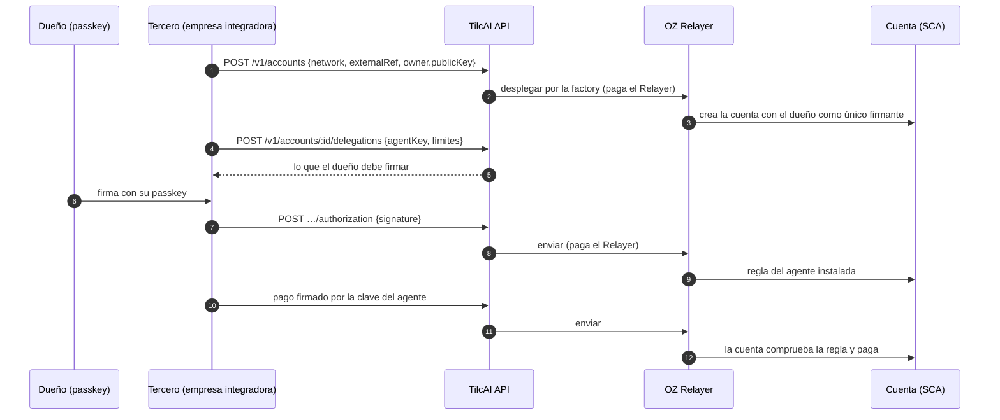
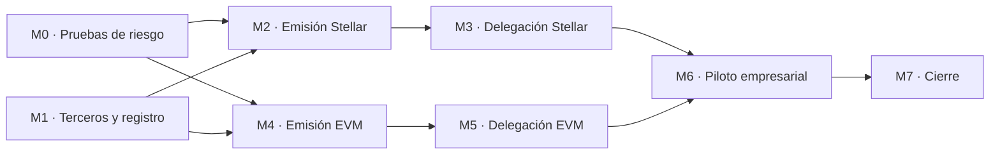

# TilcAI — fase SCA: emisión de cuentas abstractas para agentes y terceros

> **Vigencia:** este es el plan técnico de cuentas, no una API de emisión ya terminada. Ver el [contexto oficial](0-OFICIAL/CONTEXTO_OFICIAL_TILCAI.md) para el estado de hoy y las [issues propuestas](3-CONSTRUCCION/ISSUES_PROPUESTAS_2026-10-08.md) antes de asignar trabajo.

**Alcance:** que TilcAI emita y patrocine *smart contract accounts* (SCA) en Stellar y en EVM para sus propios agentes y para empresas y PYMES integradoras, con un dueño que nunca es TilcAI y un agente con límites verificados on-chain.
**Base:** [[TILCAI_PLAN_ARQUITECTURA_BACKEND_INFRA_2026-10-02|plan de arquitectura]] (v1.1, ADR-06, ADR-07 y ADR-10 a ADR-13) e [[TILCAI_NUEVO_RUMBO_COMERCIO_AGENTICO_2026-09-29|informe de producto 2.0]] §12.
**Código:** `tilcai-infrastructure/` (`contracts/soroban`, `contracts/evm`, `src/modules/accounts`, `src/modules/tenants`).
**Equipo:** Omar · Jhamil · Saul · Jose. Los responsables de esta fase son una **propuesta** hasta que el equipo los confirme.

> Convenciones del plan de arquitectura. **Implementado** = existe código con tests. **Verificado** = ejecutado contra la red o el servicio real. **Diseño** = decisión tomada, sin código. **Verificar** = dato que hay que confirmar antes de implementarlo. Todo es **testnet**.

## Índice

1. [[#1. Resumen]]
2. [[#2. Punto de partida]]
3. [[#3. Hechos verificados]]
4. [[#4. Modelo de emisión]]
5. [[#5. Cuenta en Stellar]]
6. [[#6. Cuenta en EVM]]
7. [[#7. Backend: terceros, datos y API]]
8. [[#8. Hitos]]
9. [[#9. M0 paso a paso]]
10. [[#10. Piloto con empresa integradora]]
11. [[#11. Pruebas]]
12. [[#12. Riesgos y preguntas abiertas]]
13. [[#13. Preparación realizada]]
    - [[#13 bis. Estado de la parte EVM al 2026-10-09]]
14. [[#14. Referencias]]

---

## 1. Resumen

TilcAI pasa de mover pagos a **emitir cuentas**. Un tercero pide una cuenta para su usuario con una llamada a la API y entrega solo la clave pública del dueño. TilcAI despliega la cuenta, paga todas las comisiones con su Relayer y guarda el registro. El dueño puede después autorizar a un agente con límites que la propia cuenta comprueba en cada pago.

| Pieza | Decisión | Estado |
| --- | --- | --- |
| Papel de TilcAI | Emisor y patrocinador. Nunca firmante de una cuenta emitida | Diseño (ADR-10) |
| Dirección de la cuenta | Una factory la deriva de la clave del dueño y de un salt | Diseño (ADR-11) |
| Stellar | `tilcai_account` sobre OpenZeppelin `stellar-accounts` 0.7.2 | Contrato base **implementado** (2 tests), sin desplegar |
| EVM | Cuenta ERC-4337 sobre OpenZeppelin Contracts 5.7.0, EntryPoint v0.9, dueño con passkey | Diseño; dependencias instaladas y compiladas |
| Gas en EVM | El Relayer envía `EntryPoint.handleOps` con UserOps de tarifa cero. Sin bundler externo ni paymaster | Diseño (ADR-12). **Verificar** en M0 |
| Clave del agente | La guarda el tercero. TilcAI no custodia claves de agente en esta fase | Diseño (ADR-10) |
| Terceros | Tenants con claves propias, cuotas de patrocinio y `tenant_id` en cuentas y pagos | Diseño (ADR-13); puertos definidos |
| Persistencia | SQLite durante esta fase | Sin cambios (ADR-04) |

**Relación con el roadmap.** Esta fase adelanta la fase 3 del plan de arquitectura (account abstraction) y la amplía con la emisión para terceros. La fase 2 (órdenes, política, MCP, x402 con USDC) sigue pendiente. Emitir cuentas no depende de ella. Ligar una delegación a un mandato de TilcAI sí depende, y queda para cuando la fase 2 exista.

## 2. Punto de partida

Estado del código al 2026-10-06.

| Área | Qué hay | Qué falta para emitir cuentas |
| --- | --- | --- |
| Pagos crosschain | Fase 1 implementada y verificada: USDC Fuji → Stellar sin gas para el pagador | Aceptar una cuenta de contrato como pagador |
| Router EVM | `TilcaiCctpRouter` en Fuji, con firma `(v, r, s)` | Variante con firma `bytes` (ERC-1271) |
| Cuentas | Puertos en `src/modules/accounts/ports.ts` | Toda la implementación |
| Terceros | Lista plana `TILCAI_API_KEYS`, sin identidad de tercero | Tenants, claves, cuotas, `tenant_id` |
| Datos | Tablas de cotizaciones, pagos, eventos y recibos | Tablas de tenants, cuentas y delegaciones |
| Relayer | Envía el mint en Stellar y el burn en Fuji | Desplegar cuentas y enviar UserOps |

**Punto de partida de una empresa integradora.** Sus dos superficies llaman a la API v1 en modo `gasless`.

- **Interfaz de pagos** crea una EOA por usuario en Avalanche. La clave se genera en el navegador y se guarda cifrada con la passkey del usuario. Su propia fase 2 prevé una cuenta inteligente con passkey.
- **Backend del agente** paga a proveedores con una clave caliente (`PRIVATE_KEY_MOCK`) que puede gastar todo el saldo. La aprobación del administrador con passkey se verifica solo off-chain.

## 3. Hechos verificados

Comprobados el 2026-10-06. Los cinco primeros se repiten con `npm run sca:preflight` en `tilcai-infrastructure` (solo lectura).

| # | Hecho | Cómo se comprobó | Consecuencia |
| --- | --- | --- | --- |
| 1 | Fuji tiene EntryPoint v0.9 en `0x433709009B8330FDa32311DF1C2AFA402eD8D009` (también v0.6, v0.7 y v0.8) | `eth_getCode` | Se usa v0.9, el que trae por defecto OpenZeppelin Contracts 5.7.0 |
| 2 | El precompilado P-256 en `0x…0100` devuelve 1 para una firma válida | `eth_call` con un vector de Wycheproof | Passkey como dueño en EVM, sin clave exportable |
| 3 | La implementación del USDC de Fuji (`0x6f3c4787…d9f4`) tiene `receiveWithAuthorization(…, bytes)` | Selector `0x88b7ab63` en el bytecode | Una cuenta de contrato puede pagar con EIP-3009 |
| 4 | Stellar Testnet está en protocolo 29. Existen el SAC de USDC y el `CctpForwarder` | Soroban RPC | — |
| 5 | Los relayers `stellar-example` y `avalanche-fuji-relayer` están activos y con saldo | API del Relayer | Pueden patrocinar las pruebas de M0 |
| 6 | El Relayer 1.8.0 acepta `upload_wasm`, `create_contract` (con salt y argumentos de constructor) e `invoke_contract` con `auth: xdr` | Código del fork, `src/models/transaction/stellar/` | Despliegue patrocinado sin tocar el Relayer |
| 7 | El Relayer no tiene función de bundler ERC-4337 | Búsqueda en el código del fork: 0 referencias | ADR-12 |
| 8 | El plugin x402 0.6.0 acepta credenciales de dirección (clásicas y V2), rechaza credenciales delegadas y subinvocaciones, y vuelve a simular | Código del plugin, `src/stellar/utils.ts` y `verify.ts` | El agente es firmante externo. La compatibilidad con cuentas `C…` se prueba en M0 |
| 9 | La configuración del plugin en `deploy/relayer/config/config.json` no incluye el SAC de USDC | Lectura del archivo | Paso previo de M0-S2 |
| 10 | `stellar-accounts` 0.7.2 es la última versión estable (2026-06-09); existe 0.8.0-rc.3 | GitHub y crates.io | Se fija 0.7.2 |
| 11 | La auditoría del RC v0.7.0 (2026-03) encontró un fallo alto en smart accounts, ya corregido, y avisos sobre `spending_limit` | Informe de OpenZeppelin | Reglas de §5.4 |
| 12 | OpenZeppelin Contracts 5.7.0 incluye `Account`, `SignerWebAuthn`, `SignerP256`, `MultiSignerERC7913`, ERC-7739, ERC-7821 y `PaymasterSigner`, y compila con solc 0.8.28 | Instalado en `contracts/evm/lib` y compilado | Misma base de OpenZeppelin en las dos redes |
| 13 | EIP-7702 no está en Avalanche: ACP-209 figura como propuesta | Documentación de Avalanche | Se descarta esa ruta |

## 4. Modelo de emisión

### 4.1 Quién es quién

| Papel | Quién | Qué tiene | Qué puede hacer |
| --- | --- | --- | --- |
| Emisor y patrocinador | TilcAI | Factory, Relayer, registro de cuentas | Desplegar la cuenta que el dueño definió y pagar comisiones. Nada sobre los fondos |
| Tercero | Una empresa o PYME integradora | Clave de API, su interfaz y sus usuarios | Pedir cuentas, preparar delegaciones, presentar firmas |
| Dueño | Usuario o empresa del tercero | Passkey, ed25519 o EOA | Todo: gastar, delegar, revocar, cambiar firmantes |
| Agente | Backend del tercero o agente de TilcAI | Clave de sesión | Pagar dentro de la regla que el dueño firmó |



### 4.2 Principios

1. **TilcAI nunca es firmante.** Una cuenta emitida solo obedece a las credenciales del dueño y a las reglas que el dueño firmó.
2. **La dirección compromete al dueño.** La factory deriva la dirección de la clave del dueño. Nadie, tampoco TilcAI, puede desplegar otra configuración en una dirección que ya recibió fondos.
3. **Los límites del agente viven en la cuenta.** El gateway puede negar antes, pero lo que impide gastar de más es el contrato.
4. **Patrocinar no da autoridad.** El Relayer paga comisiones y no puede cambiar lo firmado.
5. **Misma disciplina que la fase 1.** Idempotencia, intento persistido antes de enviar, conciliación por evidencia on-chain y nunca `FAILED` sin evidencia.

## 5. Cuenta en Stellar

### 5.1 Contratos

| Contrato | Origen | Estado |
| --- | --- | --- |
| `tilcai_account` | Envoltorio de `stellar_accounts::smart_account`. Sin lógica de autorización propia. No actualizable | **Implementado**, 2 tests |
| `tilcai_ed25519_verifier`, `tilcai_webauthn_verifier` | Envoltorios de los verificadores de OpenZeppelin. Sin estado, uno por red | Compilan |
| `tilcai_spending_limit_policy` | Envoltorio de la política de límite de OpenZeppelin. Compartida, con estado por (cuenta, regla) | Compila |
| `tilcai_account_factory` | Propio | M2 |
| `tilcai_spend_policy` | Propio | M3 |

### 5.2 Creación

1. El tercero envía la clave pública del dueño. Para una passkey, el dato del firmante es la clave de 65 bytes seguida del identificador de la credencial.
2. TilcAI calcula `salt = sha256(tenantId ‖ externalRef ‖ índice)` y pide a la factory la dirección. La factory deriva el salt final de ese valor y de los firmantes del dueño.
3. El Relayer invoca la factory y paga. La factory despliega `tilcai_account` con el constructor `(signers, policies)`, que crea la regla `owner` de tipo `Default`.
4. La cuenta no necesita trustline para tener USDC por el SAC. Fondearla es una acción aparte.
5. En M0 la cuenta se despliega directamente con la operación `create_contract` del Relayer, sin factory.

### 5.3 Delegación a un agente

El dueño añade una regla con `add_context_rule`:

| Campo | Valor |
| --- | --- |
| Tipo | `CallContract(<SAC de USDC>)` |
| Firmante | `External(tilcai_ed25519_verifier, <clave pública del agente>)` |
| Vencimiento | `valid_until`, en número de ledger |
| Política 1 | `tilcai_spending_limit_policy`: `spending_limit` y `period_ledgers` |
| Política 2 | `tilcai_spend_policy`: solo `transfer`, `payTo` en lista, tope por llamada |

Flujo: TilcAI construye la invocación y la simula. El dueño firma `sha256(signature_payload ‖ context_rule_ids.to_xdr())` con su passkey. El Relayer envía la transacción con la entrada de autorización firmada (`auth: xdr`).

**Ventana del límite.** La política de OpenZeppelin usa una ventana móvil en ledgers. El mandato del informe usa una ventana fija en segundos. La ventana móvil nunca permite más que la fija en un mismo periodo, así que la cuenta actúa como tope y el gateway aplica la ventana exacta del mandato. La conversión es de unos 5 s por ledger (17 280 ledgers por día).

### 5.4 Reglas que vienen de la librería y de su auditoría

- El agente es firmante **externo**. Así el pago lleva una sola entrada de autorización. Un firmante delegado necesita una segunda entrada o credenciales delegadas, que el plugin x402 rechaza.
- `spending_limit` solo se instala en reglas `CallContract(<token>)`. En una regla `Default` un mismo límite sumaría importes de tokens con decimales distintos.
- Una regla admite como máximo 15 firmantes y 5 políticas. Su nombre tiene como máximo 20 bytes.
- Quitar un firmante o una política exige su id. Se consulta en la cuenta con `get_signer_id` y `get_policy_id`; el backend guarda además el id de cada regla que crea.

### 5.5 Pago, revocación y recuperación

- **Pago del agente:** `transfer(cuenta, payTo, importe)` del SAC de USDC. El agente firma la entrada de autorización de la cuenta. Se envía por el plugin x402 si M0-S2 lo confirma. Si no, por el Relayer con `invoke_contract` y `auth: xdr`. Se concilia igual en los dos casos.
- **Revocación:** el gateway deja de aceptar pagos al instante. `remove_context_rule`, firmado por el dueño, lo hace efectivo on-chain. Una entrada ya firmada sigue siendo ejecutable hasta su ledger de expiración.
- **Recuperación:** una segunda credencial de dueño (otra passkey o una clave que guarda el usuario). TilcAI no puede recuperar una cuenta.

## 6. Cuenta en EVM

### 6.1 Contratos

| Contrato | Base | Hito |
| --- | --- | --- |
| `TilcaiAccount` | OpenZeppelin `Account` (EntryPoint v0.9), ERC-7739 para ERC-1271, ERC-7821 para ejecutar en lote. Dueño con passkey (`SignerWebAuthn`) o EOA | M4 |
| `TilcaiAccountFactory` | CREATE2 con salt derivado de la clave del dueño | M4 |
| `TilcaiCctpRouterV2` | El router actual con la variante `bytes signature` de EIP-3009 | M4 |
| `TilcaiSessionPolicy` | Propio: límites de la clave del agente | M5 |

Una sola implementación con `MultiSignerERC7913` o dos implementaciones (passkey y EOA): se decide en M4 midiendo el gas.

### 6.2 Creación

La cuenta se despliega al crearla, con una transacción normal del Relayer a la factory. No se deja para la primera operación porque el USDC solo puede comprobar una firma ERC-1271 si la cuenta ya tiene código.

### 6.3 Dos caminos de pago

| Camino | Quién firma | Cómo se ejecuta | Límite on-chain |
| --- | --- | --- | --- |
| A · Aprobación por pago | El dueño, con su passkey, firma `ReceiveWithAuthorization` | `TilcaiCctpRouterV2.payWithAuthorization`. El USDC llama a `isValidSignature` de la cuenta | El importe y la ruta CCTP exactos que firmó |
| B · Agente | La clave de sesión firma una UserOp | `execute` con el lote `USDC.approve(TokenMessengerV2, x)` + `depositForBurnWithHook(…)` | `TilcaiSessionPolicy`: solo ese lote, hacia el forwarder, `payTo` en lista, tope por llamada y por periodo, vencimiento |

El camino A reutiliza todo el flujo de la fase 1: mismo nonce ligado a la ruta, mismo evento `CrosschainPayment`, misma conciliación. El camino B existe porque ERC-1271 es una función de solo lectura y no puede llevar la cuenta de lo gastado en un periodo.

### 6.4 Gas

El Relayer EVM llama a `EntryPoint.handleOps([userOp], beneficiario)` como una transacción normal. La UserOp lleva `maxFeePerGas = 0`, así que el EntryPoint no exige depósito a la cuenta ni paymaster, y el Relayer paga el gas de la transacción.

- Antes de enviar, TilcAI simula la operación y comprueba que el remitente es una cuenta emitida por TilcAI y que el tenant tiene cupo.
- Una validación que falla on-chain hace que el Relayer pierda el gas de esa transacción. Por eso solo se envían operaciones de cuentas propias y ya simuladas.
- `TilcaiPaymaster` queda aplazado hasta que haya que aceptar bundlers de terceros. OpenZeppelin Contracts ya trae `PaymasterSigner` como base.

## 7. Backend: terceros, datos y API

### 7.1 Terceros

Un tenant tiene claves de API guardadas como hash, permisos (`payments`, `accounts:read`, `accounts:write`) y una cuota diaria de cuentas y de operaciones patrocinadas. Las claves de `TILCAI_API_KEYS` pasan a un tenant heredado con permiso `payments`, para que la interfaz de pagos y el backend del agente sigan funcionando sin cambios.

### 7.2 Datos (migración 3, borrador)

| Tabla | Contenido | Garantías |
| --- | --- | --- |
| `tenants` | Nombre, estado, cuotas | — |
| `tenant_api_keys` | Hash de la clave, permisos, etiqueta, revocación | Hash único |
| `tenant_usage` | Contador por tenant, día y tipo | Incremento atómico con comprobación de cuota |
| `smart_accounts` | Tenant, `external_ref`, red, dirección, dueño, estado, código, salt, envío del despliegue | Dirección única por red · `external_ref` único por tenant y red · `idempotency_key` única · `version` |
| `account_delegations` | Cuenta, regla, estado, referencia on-chain, solicitud de firma, envío | Una referencia on-chain por cuenta |
| `account_events` | Bitácora de transiciones | Solo inserción, en la misma transacción que el cambio de estado |

`route_quotes` y `crosschain_payments` reciben `tenant_id`.

Estados de una cuenta: `DEPLOYING → ACTIVE | FAILED`. El worker concilia preguntando a la red si la dirección tiene código. Un despliegue repetido no es un error: si la cuenta existe, pasa a `ACTIVE`.

### 7.3 API (borrador, se cierra en M1)

| Método | Ruta | Descripción |
| --- | --- | --- |
| POST | `/v1/accounts` | Cabecera `Idempotency-Key`. `{network, externalRef, owner}` → cuenta con su dirección final |
| GET | `/v1/accounts/:id` · `/v1/accounts?externalRef=&network=` | Estado, dirección, dueño, enlaces al explorador |
| POST | `/v1/accounts/:id/delegations` | `{agentKey, assetId, payTo[], maxPerCall, maxPerPeriod, periodSeconds, validUntil}` → delegación y lo que el dueño firma |
| POST | `/v1/accounts/:id/delegations/:did/authorization` | `{signature}` del dueño. TilcAI la verifica y la envía |
| POST | `/v1/accounts/:id/delegations/:did/revocation` | Prepara la revocación. Se confirma con `…/revocation/authorization` |
| GET | `/v1/accounts/:id/delegations` | Delegaciones y su estado |
| POST | `/v1/crosschain/payments` | Modos nuevos: `account` (firma el dueño, camino A) y `account_agent` (firma el agente, camino B) |

Los contratos de desarrollo paralelo están en `src/modules/accounts/ports.ts` (`SmartAccountProvider`, `UserOperationSubmitter`) y `src/modules/tenants/ports.ts` (`TenantRegistry`).

## 8. Hitos

M0 y M1 arrancan a la vez: M1 no depende del resultado de M0. M2–M3 (Stellar) y M4–M5 (EVM) pueden avanzar en paralelo cuando M0 y M1 estén cerrados. El tamaño es relativo, no una estimación de fechas. El seguimiento se hace con issues en `TilcAI/tilcai-infrastructure` y en el tablero del equipo.



| Hito | Entregable | Criterio de aceptación | Responsable propuesto | Tamaño |
| --- | --- | --- | --- | --- |
| **M0** | Cuatro pruebas en testnet (§9) con su resultado documentado | Cada ruta queda en «sirve» o «no sirve, se usa la alternativa» | Jose (S1 y S4 en un fork de Fuji) + Saul (S2, S3 y S4 por el Relayer) | S |
| **M1** | Migración 3, autenticación por tenant, cuotas, registro de cuentas | Una clave de un tenant no ve cuentas de otro. La cuota agotada rechaza sin gastar. Las claves actuales siguen funcionando | Jhamil (datos y cuotas) + Omar (autenticación y API) | M |
| **M2** | `tilcai_account_factory`, verificadores y política desplegados, `POST /v1/accounts` en Stellar | Usuario sin XLM obtiene su cuenta. Mismo `Idempotency-Key` devuelve la misma cuenta. La dirección calculada antes coincide con la desplegada | Jose | M |
| **M3** | `tilcai_spend_policy`, delegación, pago y revocación | Un pago dentro de la regla se liquida. Importe mayor, otro destinatario, otra función, periodo agotado, regla vencida o regla revocada se rechazan on-chain | Jose + Jhamil | L |
| **M4** | `TilcaiAccount`, factory y router v2 en Fuji; modo `account` | Cuenta con passkey paga por el camino A y el pago queda `SETTLED`. Una firma para otra ruta o de otra cuenta se rechaza | Saul + Jose | L |
| **M5** | `TilcaiSessionPolicy`, envío de UserOps, modo `account_agent` | UserOp del agente con el lote permitido se liquida. Otro objetivo, otro `payTo` o importe sobre el tope se rechazan on-chain | Saul + Jose | L |
| **M6** | Backend del agente sin `PRIVATE_KEY_MOCK`; después, interfaz de pagos | El backend de la empresa integradora no puede pagar a un destino fuera de la regla aunque su clave se filtre | Saul + equipo de la empresa piloto | M |
| **M7** | Cliente TypeScript, OpenAPI, runbooks, reproducción | Un segundo integrante repite M2 a M5 con la documentación | Equipo | M |

## 9. M0 paso a paso

M0 responde cuatro preguntas antes de escribir producto. Cada una tiene una alternativa ya identificada. Los comandos siguen el ejemplo de OpenZeppelin v0.7.2 y las opciones de la CLI 28.1.0; **todavía no se han ejecutado**.

Antes de empezar: `npm run sca:preflight` debe terminar en `Ready for M0`.

### S1 · Cuenta de OpenZeppelin en Stellar, desplegada y usada

```sh
cd tilcai-infrastructure/contracts/soroban && stellar contract build
stellar keys generate sca-spike --network testnet --fund
stellar contract deploy --network testnet --source-account sca-spike --alias ed25519_verifier \
  --wasm target/wasm32v1-none/release/tilcai_ed25519_verifier.wasm
stellar contract deploy --network testnet --source-account sca-spike --alias sca-spike-account \
  --wasm target/wasm32v1-none/release/tilcai_account.wasm \
  -- --signers '[{"External": ["<C… del verificador>", "<clave pública ed25519 en hex>"]}]' --policies '{}'
```

1. Repetir el despliegue de la cuenta por el Relayer: `upload_wasm` una vez y `create_contract` con `wasm_hash`, `salt` y `constructor_args`.
2. Enviar USDC a la cuenta y hacer un `transfer` firmado por el dueño, enviado por el Relayer con `auth: xdr`.

**Sirve si** la cuenta existe, recibe USDC sin trustline y paga con el Relayer como fuente. **Si no,** desplegar con una cuenta de operador y abrir el caso con el Relayer.

### S2 · Pago x402 con una cuenta `C…`

1. Añadir `CBIELTK6YBZJU5UP2WWQEUCYKLPU6AUNZ2BQ4WWFEIE3USCIHMXQDAMA` a `assets` de `stellar:testnet` en la configuración del plugin y reiniciar el Relayer.
2. Repetir `tilcai-core/scripts/payment-rail` con `ASSET` = SAC de USDC y pagador G….
3. Repetir con la cuenta de S1 como pagador.

**Sirve si** `/verify` y `/settle` aceptan la entrada de autorización de la cuenta. **Si no,** el pago del agente va por el Relayer con `invoke_contract` y `auth: xdr`, y se evalúa contribuir el soporte al plugin.

### S3 · Mint de CCTP hacia un `payTo` `C…`

Un pago de 0,1 USDC con `npm run xpay -- --amount 0.1 --to <C… de S1> --gasless`.

**Sirve si** el pago queda `SETTLED` y la cuenta recibe el USDC. **Si no,** el `payTo` de un pago crosschain sigue siendo una cuenta G… con trustline y `accountStatus` deja de dar por buena una dirección `C…`.

### S4 · Cuenta con passkey en Fuji

1. Desplegar una cuenta mínima de OpenZeppelin (`Account` + `SignerWebAuthn`) con una clave P-256 de prueba.
2. Enviar por el Relayer `EntryPoint.handleOps` con una UserOp de tarifa cero.
3. Llamar a `USDC.receiveWithAuthorization` con firma `bytes` de esa cuenta.

**Sirve si** las tres transacciones se confirman y el Relayer es quien paga el gas. **Si la tarifa cero no sirve,** se despliega un paymaster sobre `PaymasterSigner`. **Si ERC-1271 no sirve,** el camino A pasa a ser una UserOp firmada por el dueño.

## 10. Piloto con empresa integradora

1. **Backend del agente, primero.** La empresa recibe una cuenta en Fuji con la passkey del administrador como dueño. El backend de la empresa integradora genera una clave de sesión y el administrador firma una regla limitada al proveedor, con tope por pago y por periodo. `PRIVATE_KEY_MOCK` desaparece. Es el caso de más valor: hoy esa clave puede gastar todo el saldo.
2. **Interfaz de pagos, después.** Los usuarios nuevos reciben una cuenta con passkey en lugar de una EOA cifrada. Los usuarios actuales mueven su saldo con una firma. Coincide con la fase 2 de su modelo de custodia.
3. **Receptores en Stellar.** Si S3 sirve, un proveedor puede cobrar en una cuenta `C…` sin crear trustline.

## 11. Pruebas

| Nivel | Contenido |
| --- | --- |
| Soroban (`cargo test`) | Camino positivo y los rechazos de M3: importe, destinatario, función, periodo, vencimiento, invocación anidada, administración con la clave del agente, revocación |
| Foundry (`forge test`) | Router v2 con firma ERC-1271, dirección de la factory ligada al dueño, política de sesión con fuzz de importes y de lotes |
| Unitario (`npm test`) | Aislamiento entre tenants, cuotas, idempotencia de la creación, máquina de estados de cuentas y delegaciones |
| Integración testnet | Creación, delegación, pago y revocación reales en las dos redes |
| Adversarial | Clave del agente filtrada, firma movida a otra regla, tenant que pide la cuenta de otro, despliegue adelantado por un tercero |

## 12. Riesgos y preguntas abiertas

| # | Riesgo o pregunta | Mitigación o decisión pendiente | Responsable propuesto |
| --- | --- | --- | --- |
| 1 | El plugin x402 no acepta cuentas `C…` | Ruta directa por el Relayer (S2) | Saul + Jose |
| 2 | La tarifa cero no funciona con EntryPoint v0.9 en Fuji | Paymaster sobre `PaymasterSigner` (S4) | Saul |
| 3 | El `CctpForwarder` no entrega a un `C…` | `payTo` solo G… (S3) | Saul |
| 4 | `tilcai_spend_policy`, `TilcaiSessionPolicy`, factory y router v2 son código propio sin auditar | Revisión cruzada, fuzz y auditoría antes de mainnet | Saul + Jose |
| 5 | Archivado de estado en Soroban: una cuenta sin uso deja de estar disponible hasta restaurarla | El worker extiende el TTL o el Relayer restaura antes de operar. Diseñar en M2 | Jose |
| 6 | El Relayer pierde gas si una UserOp falla on-chain | Simulación previa, solo cuentas propias, cuota por tenant | Saul |
| 7 | Pérdida de la passkey del dueño | Segunda credencial desde la creación. Ejercicio de recuperación en M3 y M5 | Jose |
| 8 | Custodia: qué puede hacer TilcAI con una cuenta emitida | Documentar los poderes reales antes de fondos reales (informe §12.16) | Jose |
| 9 | `stellar-accounts` 0.8.0 puede cambiar la interfaz | Se fija 0.7.2. Actualizar es una decisión con revisión del diff | Jose |
| 10 | La cuenta de Stellar no es actualizable | Decisión de esta fase. Revisar en M2 si hace falta un camino de migración | Jose |

## 13. Preparación realizada

Hecho el 2026-10-06 en `tilcai-infrastructure`, sin cambiar el comportamiento de la API ni de la base de datos.

| Qué | Dónde | Comprobación |
| --- | --- | --- |
| Workspace de Soroban con la cuenta, dos verificadores y la política de límite | `contracts/soroban/` | `cargo test` (2 tests) y `stellar contract build` (4 wasm) |
| Dependencias EVM fijadas | `contracts/evm/remappings.txt`, `README.md` | `forge test` (4 tests) y compilación de `Account`, `SignerWebAuthn`, ERC-7739, ERC-7821 y `PaymasterSigner` |
| Chequeo de prerrequisitos | `npm run sca:preflight` | 16 comprobaciones en verde |
| Direcciones verificadas | `src/config/networks.ts` (`erc4337`, `p256Precompile`) | `npm run typecheck`, `npm test` (25 tests) |
| Puertos de la fase | `src/modules/accounts/ports.ts`, `src/modules/tenants/ports.ts` | `npm run typecheck` |
| Herramientas locales | Target `wasm32v1-none` instalado | `sca:preflight` |

Para trabajar hace falta Node ≥ 22.16 (en la máquina de Saul, `nvm use 24`) y Foundry en el `PATH` (`~/.foundry/bin`).

## 13 bis. Estado de la parte EVM al 2026-10-09

Lo que sigue describe lo fusionado en `main` de `tilcai-infrastructure` el 2026-10-09 ([PR #24](https://github.com/TilcAI/tilcai-infrastructure/pull/24)), que incluye la capa de datos de M1 ([PR #23](https://github.com/TilcAI/tilcai-infrastructure/pull/23)). El primer consumidor es Optipagos ([optipagos-backend#1](https://github.com/Optus-development-team/optipagos-backend/pull/1)).

| Hito | Estado | Evidencia |
| --- | --- | --- |
| M0 · S4 (passkey en Fuji, EIP-3009 con ERC-1271) | **Verificado en Fuji**, por el camino de EIP-3009. La UserOp de tarifa cero no se probó | `npm run sca -- verify`: una cuenta emitida por la factory pagó USDC real con firma de passkey ([tx](https://testnet.snowtrace.io/tx/0xea3cf8ac256d63812667ae7017c0f525d95e80980bb8a4ffdfbff1f86e29ad3f)) |
| M1 · datos y cuotas | En `main` (viene de #23); la migración es la **5**, no la 3 | Sus pruebas pasan junto con las de `main` |
| M1 · autenticación por tercero y API de cuentas | **Implementado en `main`**; pendiente de revisión de su responsable (#9) | Pruebas de permisos y de aislamiento entre terceros |
| M4 · `TilcaiAccount`, factory, router v2 y modo `account` | **Implementado y desplegado en Fuji** | Factory `0x55a5b0ed47c5dfb168cfe2b431a56455576d51b8`, router v2 `0x09483803916e6cb2027741c9287361ad55507a66`; un pago en modo `account` quedó `SETTLED` en Stellar Testnet |
| M5 · `TilcaiSessionPolicy`, UserOps, modo `account_agent` | **Pendiente** | La cuenta ya valida UserOps; no hay reglas de sesión ni envío por `handleOps` |
| M2–M3 · Stellar | **Pendiente** | — |

Decisiones tomadas al implementar, que cierran puntos que §6 dejaba abiertos:

- **Una sola implementación, con passkey.** La dueña es una clave P-256 (`SignerWebAuthn`); no hay variante EOA ni `MultiSignerERC7913`. La API solo acepta `owner.kind = "webauthn-p256"`.
- **Clones mínimos.** La factory despliega un clon por cuenta (142 000 de gas) en una dirección CREATE2 que compromete la clave de la dueña y un salt derivado del tercero y de su `externalRef`. La implementación queda bloqueada con una «dueña» sin clave conocida.
- **Qué firma la passkey.** Nunca el hash de la aplicación a secas: un `TypedDataSign` de ERC-7739 que envuelve el mensaje y nombra la cuenta, para que una firma no valga en otra cuenta de la misma passkey. La cuenta exige verificación del usuario y firma con `s` baja.
- **Camino A como en §6.3**, por `TilcaiCctpRouterV2`. El nonce lleva la etiqueta `tilcai-cctp-router-v2`: una autorización de un router no sirve en el otro.
- **Quién ve qué.** Las claves de `TILCAI_API_KEYS` son las del operador (permiso `payments` y acceso al vault, al registro de eventos y al relayer). Las claves de un tercero (`npm run tenant -- key`) solo ven sus cotizaciones, pagos y cuentas. Solo paga con una cuenta el tercero al que se le emitió.
- **Un despliegue no se da por perdido.** La cuenta queda `DEPLOYING`, se reintenta con espera creciente y avisa al panel al tercer rechazo; pasa a `ACTIVE` cuando la dirección tiene código, la haya desplegado quien sea.

Sigue pendiente de lo que este documento plantea: delegación a agentes (M5), recuperación (el contrato permite `setOwner`, sin flujo), cuentas en Stellar, cliente TypeScript y OpenAPI (M7) y **auditoría**: los contratos no están auditados y todo es testnet.

## 14. Referencias

- Plan de arquitectura: [[TILCAI_PLAN_ARQUITECTURA_BACKEND_INFRA_2026-10-02]] (ADR-06, ADR-07, ADR-10 a ADR-13, §8, §10).
- Informe de producto: [[TILCAI_NUEVO_RUMBO_COMERCIO_AGENTICO_2026-09-29]] §12.
- OpenZeppelin Stellar: https://docs.openzeppelin.com/stellar-contracts/accounts/smart-account · políticas: https://docs.openzeppelin.com/stellar-contracts/accounts/policies · flujo de autorización: https://docs.openzeppelin.com/stellar-contracts/accounts/authorization-flow · ejemplo: `OpenZeppelin/stellar-contracts` v0.7.2, `examples/multisig-smart-account`.
- Auditoría del RC v0.7.0: https://www.openzeppelin.com/news/stellar-contracts-rc-v0.7.0-audit.
- OpenZeppelin Contracts 5.x, cuentas: https://docs.openzeppelin.com/contracts/5.x/accounts.
- ERC-4337: https://eips.ethereum.org/EIPS/eip-4337 · ERC-1271: https://eips.ethereum.org/EIPS/eip-1271 · EIP-3009: https://eips.ethereum.org/EIPS/eip-3009.
- ACP-209 (EIP-7702 en Avalanche): https://docs.avax.network/docs/acps/209-eip7702-style-account-abstraction.
- Material interno de la empresa piloto: modelo de custodia y manual de pago a proveedores.
