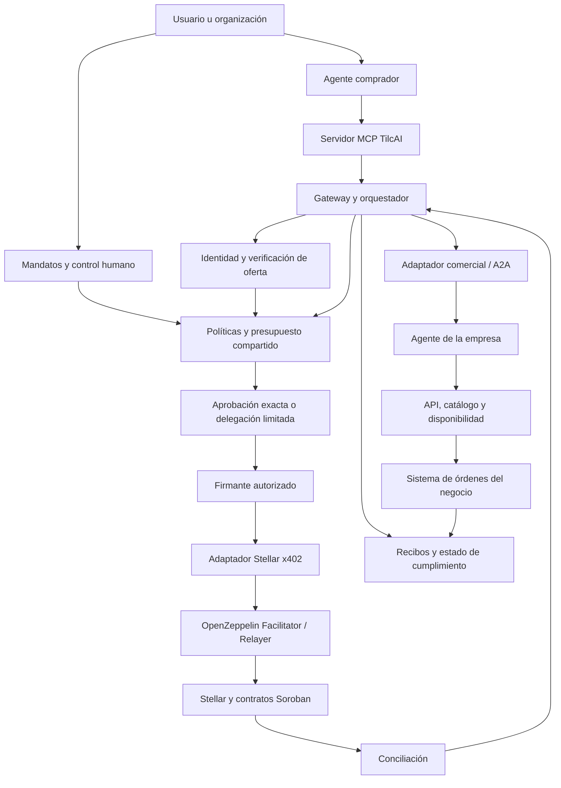
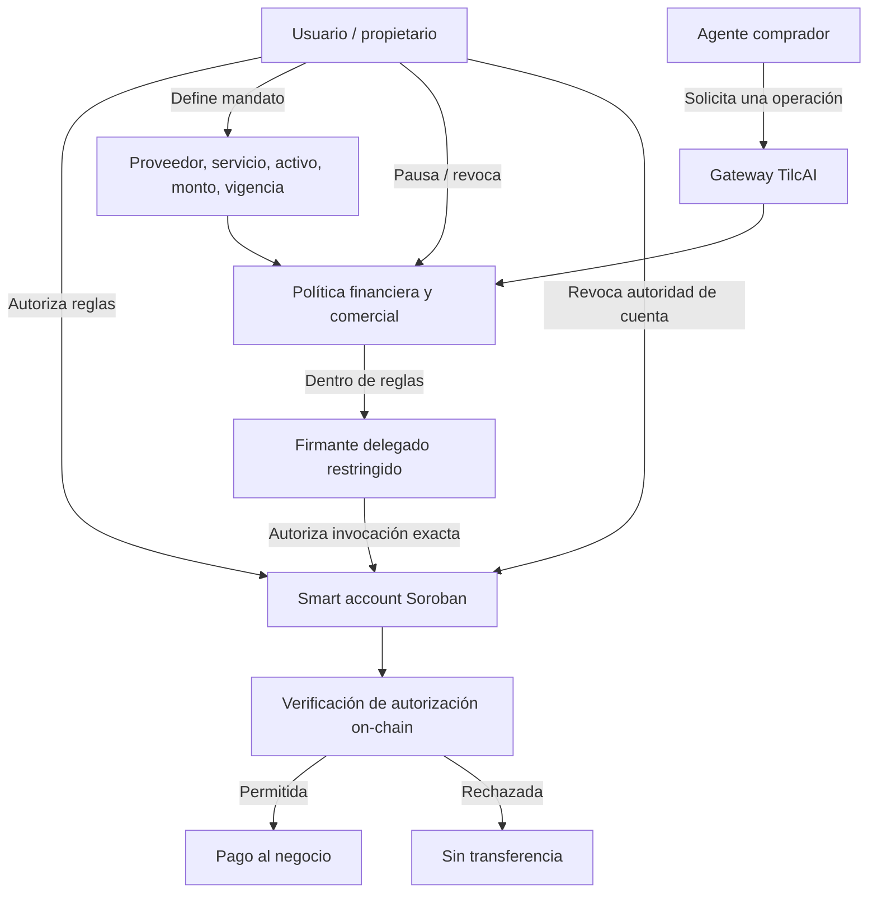
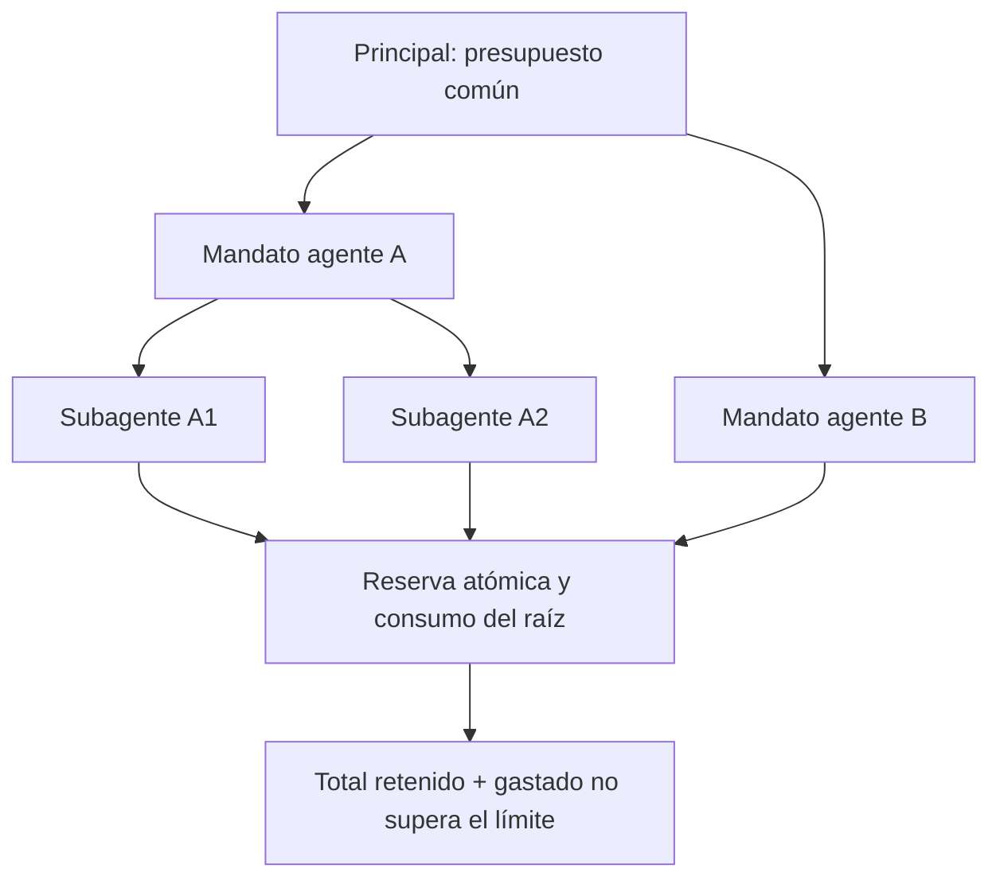
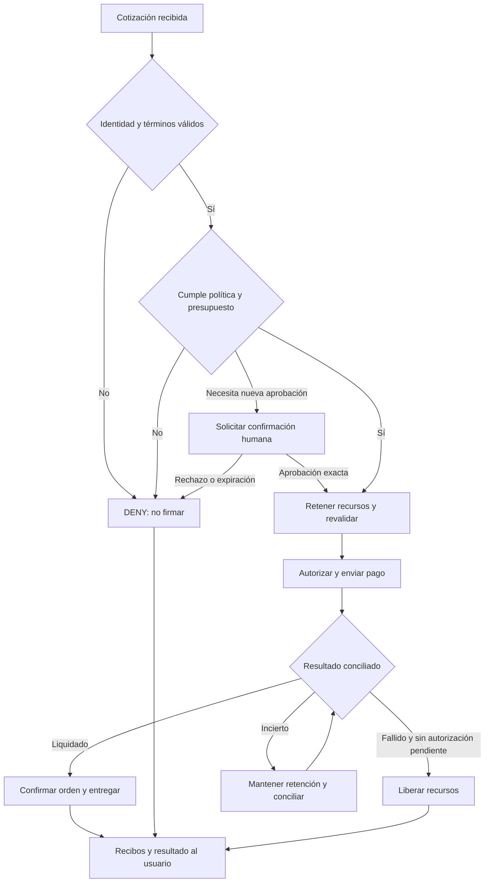
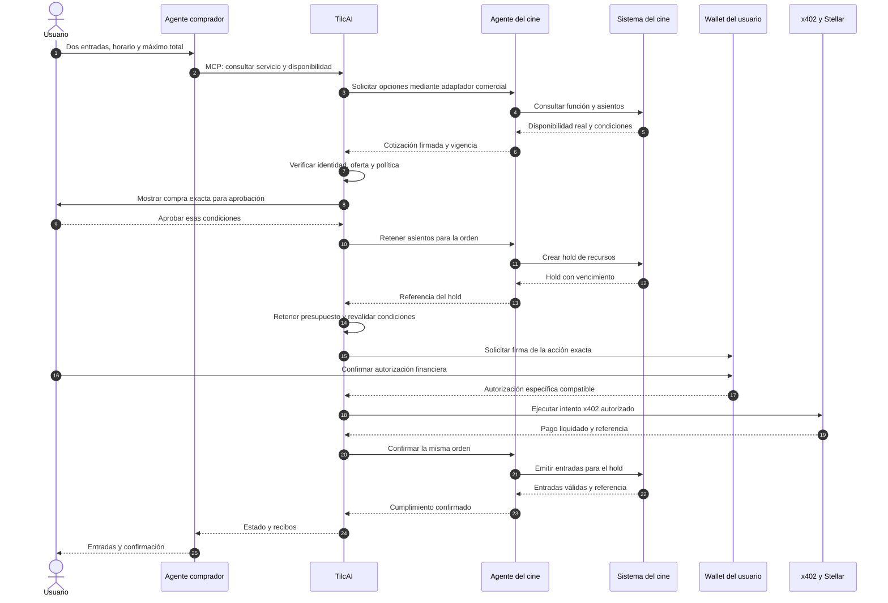
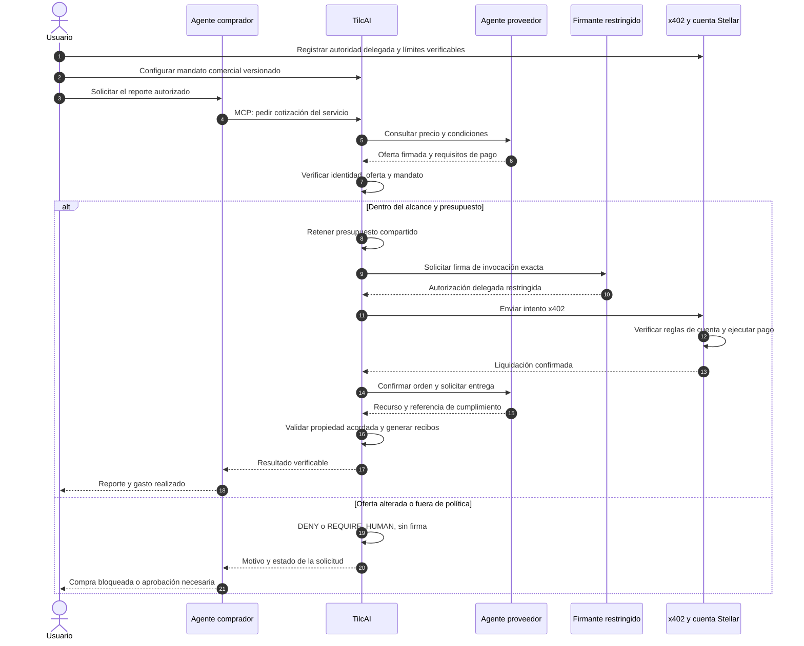
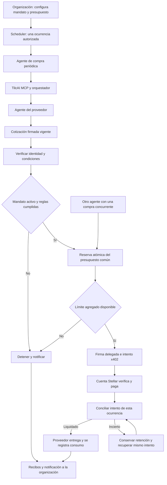
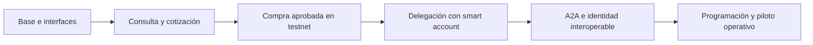

# TilcAI — infraestructura de comercio entre agentes sobre Stellar

> **Vigencia:** visión y plan de producto del 29/09. La definición de trabajo, el estado comprobado y el recorrido de la presentación del 10/10 están en el [contexto oficial](0-OFICIAL/CONTEXTO_OFICIAL_TILCAI.md); las [issues propuestas](3-CONSTRUCCION/ISSUES_PROPUESTAS_2026-10-08.md) siguen pendientes de revisión.

**Informe de producto, arquitectura y plan de construcción.**  
**Equipo:** Omar · Jhamil · Saul · Jose.  
**Versión:** 2.0 · 29 de septiembre de 2026.

## Índice

1. [[#1. Definición del proyecto]]
2. [[#2. Problema que resolvemos]]
3. [[#3. Objetivo general y objetivos específicos]]
4. [[#4. Solución y propuesta de valor]]
5. [[#5. Usuarios, clientes y participantes]]
6. [[#6. Innovación y diferenciación]]
7. [[#7. Visión e impacto]]
8. [[#8. Alcance y base técnica]]
9. [[#9. Arquitectura general]]
10. [[#10. Función de cada módulo]]
11. [[#11. Comunicación, MCP, A2A y skills]]
12. [[#12. Wallets, cuentas y account abstraction]]
13. [[#13. Políticas y presupuesto compartido]]
14. [[#14. Pagos x402 y OpenZeppelin Relayer]]
15. [[#15. Identidad, reputación y ERC-8004]]
16. [[#16. Modelo de datos y condiciones firmadas]]
17. [[#17. Ciclo de una operación]]
18. [[#18. Tres casos de uso con diagramas]]
19. [[#19. Recuperación, cancelaciones y devoluciones]]
20. [[#20. Seguridad, privacidad e incidentes]]
21. [[#21. Organización técnica y contratos de interfaz]]
22. [[#22. Equipo y distribución de responsabilidades]]
23. [[#23. Roadmap de construcción]]
24. [[#24. Pruebas de aceptación y métricas]]
25. [[#25. Criterios de implementación y escalabilidad]]
26. [[#26. Glosario]]
27. [[#27. Referencias técnicas]]

## 1. Definición del proyecto

**TilcAI es una infraestructura para que el agente de una persona u organización interactúe con el agente de una empresa y gestione consultas, cotizaciones, reservas y compras con autoridad limitada, condiciones verificables y pagos sobre Stellar.**

TilcAI conecta la intención del usuario con la operación del negocio. Entre ambos aplica identidad, políticas de gasto, autorización, coordinación de órdenes, pago y evidencia del resultado. La inteligencia del agente facilita la tarea; la infraestructura determina qué acciones puede ejecutar y bajo qué condiciones.

La unidad de producto es TilcAI. Comprador, proveedor y agentes son participantes de una misma operación, no marcas ni productos separados.

### 1.1 En una frase

> TilcAI permite que personas y empresas deleguen operaciones comerciales a sus agentes sin delegarles control ilimitado sobre su dinero.

### 1.2 Qué construimos

Un sistema común de integración para agentes compradores y agentes de empresas, con interfaces MCP, coordinación agent-to-agent, ofertas firmadas, permisos financieros, pagos x402 en Stellar y recibos verificables. El sistema incluye herramientas para que el usuario conceda, consulte y revoque autoridad, y para que la empresa exponga capacidades comerciales reales.

### 1.3 Límites del producto

TilcAI se centra en infraestructura comercial y financiera para agentes. La construcción de webs corporativas, landing pages y chatbots independientes pertenece a proyectos externos y queda fuera de este alcance.

TilcAI no es un marketplace de agentes, un modelo fundacional, una blockchain propia ni una rampa de conversión de moneda. Integra componentes existentes y construye la coordinación, los controles y las interfaces que permiten usarlos en una operación comercial completa.

## 2. Problema que resolvemos

### 2.1 Para la persona

Una compra exige buscar un proveedor, consultar condiciones, comprobar disponibilidad, coordinar horarios, pagar y confirmar el resultado. Esas tareas se repiten para servicios, productos y reservas.

Un asistente puede interpretar la solicitud, pero disponer de una wallet no basta para delegarle toda la compra. El usuario necesita decidir cuánto puede gastar, a quién puede pagar, qué puede comprar y cuándo debe pedir confirmación. También necesita detenerlo y entender qué ocurrió.

### 2.2 Para la empresa

La empresa necesita una forma estructurada de atender solicitudes de software: exponer servicios, responder con precios vigentes, reservar recursos, cobrar y confirmar el cumplimiento. Una conversación no sustituye una orden ni una respuesta del modelo acredita disponibilidad.

Sin una interfaz común, cada asistente requiere una integración distinta. Sin controles, una solicitud puede generar reservas duplicadas, pagos incongruentes o confirmaciones que el negocio no puede cumplir.

### 2.3 Para la infraestructura

Comunicación, identidad, autorización, pago y entrega son problemas diferentes. Un protocolo de herramientas no concede permisos financieros; una firma del vendedor no autoriza gasto; una transferencia no demuestra entrega; una reseña no garantiza honestidad.

TilcAI organiza esas piezas alrededor de una operación identificable y recuperable.

### 2.4 Riesgos concretos

- El agente interpreta una condición de forma incorrecta.
- Un proveedor o documento manipulado cambia el precio o destinatario.
- Dos agentes consumen simultáneamente el mismo presupuesto.
- Un reintento genera otra orden o intenta pagar dos veces.
- El pago se ejecuta, pero se pierde su respuesta.
- La reserva vence mientras la liquidación está en curso.
- El usuario revoca permisos cuando ya existe una autorización en vuelo.
- Una empresa afirma haber cumplido sin una referencia válida en su sistema.

El diseño debe resolver estas situaciones, no limitarse a una ruta ideal de conversación y pago.

## 3. Objetivo general y objetivos específicos

### 3.1 Objetivo general

Construir una infraestructura interoperable sobre Stellar que permita a agentes de usuarios y empresas completar operaciones comerciales bajo reglas humanas, con información auténtica, pagos controlados y trazabilidad.

### 3.2 Objetivos específicos

1. Conectar asistentes compatibles mediante herramientas MCP y una API común.
2. Incorporar agentes de empresas con capacidades comerciales explícitas.
3. Consultar servicios y disponibilidad desde la fuente de verdad del negocio.
4. Emitir y verificar cotizaciones/ofertas firmadas.
5. Implementar aprobación por compra y delegación limitada mediante mandatos.
6. Aplicar presupuesto compartido y controles frente a concurrencia y duplicación.
7. Integrar la infraestructura x402 de OpenZeppelin Relayer con el flujo de órdenes.
8. Desarrollar una ruta de smart accounts y permisos restringidos en Soroban.
9. Conservar recibos de decisión, pago y cumplimiento con propósitos separados.
10. Recuperar operaciones ante fallos y gestionar cancelaciones y devoluciones.
11. Habilitar interoperabilidad de identidad y coordinación A2A por etapas.
12. Extender el flujo a tareas programadas cuando la compra individual sea fiable.

### 3.3 Resultado mínimo del primer ciclo

Un usuario solicita un servicio a su agente. El agente obtiene una oferta del negocio. TilcAI valida identidad, términos y política. El usuario autoriza la compra. El pago se liquida en Stellar Testnet y el negocio entrega una confirmación válida. Una oferta alterada, un gasto fuera de política y una orden repetida se bloquean sin un nuevo pago.

## 4. Solución y propuesta de valor

### 4.1 La solución

TilcAI implementa una cadena de control entre la solicitud y su resultado:

```mermaid
flowchart LR
    U["Intención del usuario"] --> A["Agente comprador"]
    A --> T["TilcAI"]
    T --> B["Agente de la empresa"]
    B --> O["Oferta y disponibilidad"]
    O --> V["Verificación y política"]
    V --> P["Autorización y pago"]
    P --> E["Confirmación y entrega"]
    E --> R["Recibos y trazabilidad"]
```



La comunicación puede ser conversacional, pero las condiciones que gobiernan el dinero se representan como datos estructurados y verificables.

### 4.2 Valor para usuarios

Delegar tareas con límites claros, reducir coordinación manual, recibir confirmaciones comprensibles y conservar control del presupuesto. El usuario decide la autoridad del agente y puede consultar o pausar mandatos.

### 4.3 Valor para empresas

Recibir solicitudes de asistentes, responder con condiciones auténticas, vincular cada cobro con una orden y automatizar capacidades comerciales autorizadas. La integración respeta las reglas y sistemas del negocio.

### 4.4 Valor para desarrolladores

Una superficie común para consulta, cotización, preparación, compra y estado. Los desarrolladores integran un flujo documentado en lugar de reconstruir permisos, controles de pago y conciliación para cada proveedor.

### 4.5 Principio central

> La IA propone y coordina. La infraestructura verifica y ejecuta bajo autoridad humana.

## 5. Usuarios, clientes y participantes

### 5.1 Participantes de una operación

| Participante | Función | Autoridad |
| --- | --- | --- |
| Usuario o principal | Define la tarea y aporta fondos | Otorga y revoca permisos |
| Agente comprador | Interpreta la solicitud y usa herramientas | Solo el alcance concedido |
| Empresa proveedora | Ofrece y cumple un servicio/producto | Administra oferta, operación y cobro |
| Agente de la empresa | Consulta y ejecuta capacidades comerciales | Reglas otorgadas por el negocio |
| TilcAI | Coordina, verifica y controla el flujo | Permisos explícitos, no autoridad ilimitada |
| Firmante/cuenta | Autoriza la acción financiera exacta | Aprobación o delegación verificable |
| Facilitador/relayer | Verifica y presenta el pago | Funciones de infraestructura configuradas |
| Stellar | Ejecuta la transacción y su autorización on-chain | Reglas de red y contratos |

### 5.2 Clientes de la infraestructura

Empresas que habilitan servicios para agentes, equipos que construyen asistentes y organizaciones que delegan compras a varios agentes. Una empresa puede usar TilcAI como proveedor o como comprador; no necesita dos identidades de producto.

### 5.3 Usuario inicial

Una persona o equipo con un asistente capaz de utilizar herramientas y un caso comercial definido. La primera integración prioriza usuarios que puedan comprender y probar autorización, cotización y confirmación; después se simplifica el onboarding para públicos menos técnicos.

### 5.4 Incorporación del negocio

La empresa registra identidad, operadores autorizados, servicios, fuente de disponibilidad, condiciones, destino de cobro y soporte. Cada capacidad se habilita con pruebas: consultar, cotizar, reservar o confirmar una compra no son permisos equivalentes.

Si la disponibilidad depende de una persona, el flujo produce una solicitud pendiente de confirmación. La autonomía aumenta cuando el sistema de la empresa puede respaldar la acción solicitada.

## 6. Innovación y diferenciación

### 6.1 Aporte propio de TilcAI

El aporte consiste en **integrar operación comercial, delegación financiera y evidencia dentro de un flujo reutilizable para agentes**. La combinación busca responder:

> ¿Puede este agente, con autoridad de este usuario, comprar este servicio, a este negocio, por este monto, ahora; y cómo se demuestra el resultado?

No se atribuye a TilcAI la invención de MCP, A2A, x402, account abstraction o los presupuestos para agentes. La diferenciación está en su implementación conjunta, la operación comercial que habilita y las pruebas de sus controles.

### 6.2 Diferencias frente a piezas aisladas

| Pieza aislada | Qué aporta | Qué añade TilcAI |
| --- | --- | --- |
| Agente conversacional | Comprensión y diálogo | Acciones comerciales verificables |
| Wallet | Capacidad de autorizar fondos | Mandatos, intención de compra y controles contextuales |
| Facilitador x402 | Verificación/liquidación del pago | Política humana y vínculo con la orden |
| Registro de identidad | Identificadores y señales | Uso contextual antes de comprar |
| API de negocio | Operación de un proveedor | Adaptador común para distintos asistentes |
| Sistema de reservas | Gestión de cupos | Coordinación con permisos y pago |

### 6.3 Innovación que debe demostrarse

La propuesta gana valor cuando una segunda empresa se incorpora reutilizando módulos, un segundo asistente utiliza las mismas herramientas y los fallos no producen gasto indebido. La novedad se sostiene con una integración reproducible, no con una afirmación de ser los primeros.

## 7. Visión e impacto

### 7.1 Visión de agentes en el corto plazo

Asistentes que consultan servicios y preparan compras con herramientas estructuradas, sujetos a confirmación humana. El usuario conserva su cuenta y revisa condiciones antes del primer pago.

La empresa expone capacidades limitadas y comprobables. No necesita reemplazar toda su operación por IA ni dejar que el modelo fije precios o destinos financieros.

### 7.2 Visión de evolución

Agentes que ejecutan mandatos de bajo riesgo, coordinan tareas con agentes de empresas, administran presupuestos compartidos y realizan compras programadas dentro de límites verificables. El usuario interviene ante excepciones y conserva la posibilidad de revocar autoridad.

La ampliación incluye más asistentes, negocios y capacidades, sin asumir compatibilidad universal ni pagos multirred por defecto.

### 7.3 Impacto inmediato del primer piloto

Demostrar que una compra solicitada por un agente puede vincularse a condiciones auténticas, autorización humana, liquidación y cumplimiento. Obtener datos sobre tiempos, errores y comprensión de permisos.

El impacto inmediato es técnico y operativo: reducir pasos repetitivos y hacer la delegación controlable. El aumento de ventas o ahorro económico se mide, no se presupone.

### 7.4 Impacto a escala

Para personas: menos coordinación manual. Para empresas: un nuevo canal interoperable de atención y venta. Para organizaciones: compras recurrentes con presupuestos y auditoría. Para el ecosistema Stellar: un caso comercial que utiliza pagos y autorización programable con propósito.

### 7.5 Realidad de adopción

La compra por agentes necesita demanda en ambos lados, información comercial actualizada y un método de pago útil para los participantes. Si un negocio fija precios en bolivianos, la cotización USDC debe definir conversión, vigencia y aceptación; la conversión no queda a criterio del modelo.

El acceso a moneda local, facturación, privacidad, custodia y soporte comercial requieren una operación definida antes de utilizar fondos reales. TilcAI integra proveedores adecuados cuando el caso lo exige; no opera una rampa propia ni presupone un corredor habilitado.

## 8. Alcance y base técnica

### 8.1 Base disponible

- Infraestructura x402 con OpenZeppelin Relayer sobre Stellar, implementada por Saul.
- Evaluador determinista de políticas en `tilcai-core`, con seis pruebas aprobadas.
- Equipo full stack con capacidad en frontend, backend, bases de datos, IA, blockchain y contratos.
- Acceso a contactos empresariales en El Alto y La Paz para trabajar casos comerciales.

### 8.2 Trabajo de integración

Conectar el riel existente con cotizaciones, identidad, mandatos, órdenes y conciliación. Ampliar el evaluador para aprobación humana y reservas de presupuesto. Implementar el conector MCP y la interfaz del agente vendedor. Desarrollar y probar el modelo de smart accounts antes de habilitar autonomía financiera.

El relayer es la base de pago; la infraestructura TilcAI añade el control y la operación alrededor de ese pago.

### 8.3 Primer alcance de construcción

Un negocio, un servicio, un asistente comprador, un usuario, un activo y Stellar Testnet. Oferta firmada, verificación, aprobación por operación, pago, recibos y recuperación frente a errores.

### 8.4 Extensiones por etapas

Delegación con smart accounts, presupuesto multiagente, A2A formal, identidad externa ERC-8004, feedback ligado a órdenes, validaciones específicas y programación. Se diseñan interfaces desde el inicio y se habilitan capacidades conforme pasan sus pruebas.

### 8.5 Fuera del primer alcance

Marketplace de agentes, trading/DeFi, bridges cross-chain, negociación libre de precios, compras de cualquier producto sin adaptador, servicios regulados y autonomía ilimitada. La prioridad es una operación controlada de principio a fin.

## 9. Arquitectura general

### 9.1 Arquitectura funcional



Este esquema describe la arquitectura a construir. Los módulos son responsabilidades lógicas; no exigen un microservicio independiente para cada caja. MCP permite al agente comprador acceder a las herramientas; el adaptador comercial conecta con la empresa; A2A estandariza esa coordinación cuando se habilita.

### 9.2 Tres planos separados

1. **Plano de comunicación:** asistentes, MCP, capacidades y mensajes agent-to-agent.
2. **Plano de comercio/control:** identidad, cotización, órdenes, mandatos y política.
3. **Plano financiero:** cuenta, autorización, firma, pago y conciliación.

Una solicitud puede avanzar en el primer plano sin tener permisos en el tercero. Esta separación evita convertir una respuesta del modelo en autorización financiera.

### 9.3 Despliegue inicial

Backend modular, base de datos transaccional, worker de recuperación, servidor MCP y la infraestructura relayer existente. El firmante tiene una frontera de seguridad separada del modelo y de los datos del negocio.

La persistencia de órdenes, mandatos y estados es obligatoria. La memoria de un chat no es un registro de compras ni un sistema de idempotencia.

## 10. Función de cada módulo

| Módulo | Responsabilidad | Entrada / salida | Control esencial |
| --- | --- | --- | --- |
| Agente comprador | Interpretar la tarea y seleccionar herramientas | Solicitud / operaciones estructuradas | No crear autoridad propia |
| MCP TilcAI | Exponer herramientas a asistentes | Petición autenticada / resultado | Scopes y contexto del principal |
| Gateway/orquestador | Coordinar el ciclo de compra | Solicitud / orden y estado | Idempotencia y máquina de estados |
| Adaptador comercial | Conectar capacidades del negocio | Operación común / API del proveedor | Fuente de verdad y permisos |
| Agente vendedor | Atender solicitudes usando esas capacidades | Requerimiento / cotización o estado | Reglas del negocio |
| Identidad | Resolver operador, origen y claves | Perfil / relación confiable | Rotación y revocación |
| Verificador de oferta | Comprobar integridad y términos | Oferta firmada / resultado | Comparar con requisitos de pago |
| Política | Evaluar proveedor, servicio, monto y reglas | Intención + mandato / decisión | Rechazo por defecto |
| Presupuesto | Reservar y consumir límites compartidos | Orden + monto / retención | Atomicidad y concurrencia |
| Autorización | Vincular acción a consentimiento/mandato | Intención exacta / autorización | Vigencia y alcance |
| Firmante | Firmar lo permitido | Invocación verificada / firma | Secretos fuera del modelo |
| Adaptador Stellar | Construir y validar el pago x402 | Términos / payload del riel | Activo, red y árbol de invocaciones |
| Facilitador/relayer | Verificar y presentar pago | Payload / resultado de ejecución | Infraestructura configurada |
| Conciliador | Determinar resultado real | Intento / estado definitivo | No repetir pagos inciertos |
| Recibos | Registrar decisiones, pago y entrega | Eventos / evidencia vinculada | Separar tipos de evidencia |
| Scheduler | Ejecutar ocurrencias autorizadas | Regla temporal / tarea | Revaluar cada ejecución |
| Control de usuario | Crear, consultar y pausar mandatos | Acción humana / política versionada | Autenticación fuerte |

### 10.1 El agente vendedor y la fuente de verdad

El negocio conserva la autoridad sobre servicios, precios, cupos y condiciones. Su agente consulta sistemas autorizados y usa herramientas para ejecutar acciones. No inventa stock, descuentos ni confirmaciones.

Un runtime compartido puede atender varios negocios con configuración y aislamiento propios. No hace falta entrenar un modelo por empresa ni mantenerlo ejecutándose continuamente: las solicitudes y eventos activan el trabajo necesario.

### 10.2 Capacidad explícita

Cada empresa expone las operaciones que realmente puede respaldar. `get_availability` consulta; `hold_resource` retiene; `confirm_order` confirma. La documentación y permisos distinguen esas capacidades.

El contexto de empresa, usuario y rol se obtiene de la autenticación, no de un argumento libre del modelo. Todas las consultas y mutaciones se comprueban contra ese contexto.

## 11. Comunicación, MCP, A2A y skills

### 11.1 MCP: puerta de entrada de herramientas

**MCP, Model Context Protocol**, es la interfaz de herramientas y contexto para asistentes compatibles. TilcAI publica un servidor MCP con operaciones específicas. La conexión se autentica y respeta la [especificación de autorización MCP](https://modelcontextprotocol.io/specification/latest/basic/authorization).

Conectar el servidor no otorga permiso para gastar. Se separan conexión, acceso a datos y autoridad de compra.

### 11.2 Superficie de herramientas TilcAI

| Herramienta de diseño | Función | Permiso |
| --- | --- | --- |
| `list_businesses` | Descubrir proveedores incorporados | Consulta |
| `get_service` | Consultar servicios y condiciones | Consulta |
| `get_availability` | Consultar disponibilidad | Consulta |
| `request_quote` | Obtener cotización identificable | Preparación |
| `prepare_purchase` | Verificar y preparar una orden | Usuario autenticado y política |
| `request_purchase` | Solicitar ejecución de la orden preparada | Confirmación exacta o mandato |
| `get_order_status` | Consultar resultado de una orden propia | Propiedad de la orden |
| `request_cancellation` | Solicitar cancelación bajo términos | Permiso comercial correspondiente |
| `get_budget_status` | Consultar límites y retenciones | Acceso al presupuesto propio |

Son nombres de interfaz para implementación, no capacidades de un paquete ya publicado. El modelo trabaja con IDs de cotización y orden, no con una herramienta irrestricta para enviar dinero a cualquier dirección.

### 11.3 A2A: coordinación entre agentes

[A2A](https://a2a-protocol.org/latest/specification/) define comunicación de agentes, capacidades mediante Agent Cards y tareas con mensajes y resultados. En TilcAI, su adaptador conecta solicitudes del comprador con capacidades de la empresa.

A2A no sustituye inventario, mandato ni firma financiera. El primer flujo puede utilizar MCP y API comercial; la integración A2A formal se añade conservando las mismas operaciones y estados.

### 11.4 Skill: guía de uso, no permiso financiero

La skill explica cómo consultar, aclarar condiciones, preparar una compra, pedir confirmación y comunicar estados. Incluye instrucciones para no confundir solicitud con reserva, pago con entrega ni firma con autorización.

El servidor aplica esas reglas independientemente de la skill. Una instrucción maliciosa o un agente que omite la guía no debe poder saltarse los límites.

### 11.5 Comunicación estructurada

Precio, destino, cantidad, fecha, red, activo y términos se intercambian como datos versionados. La conversación explica esos datos, pero no los redefine. Los mensajes hacen referencia a `quoteId`, `orderId` y `taskId` cuando corresponda.

### 11.6 Compatibilidad por capacidad

La matriz de clientes distingue lectura, cotización, preparación y ejecución. Cada cliente se prueba con su versión, autenticación y políticas aplicables. Soportar MCP no garantiza soporte de pagos autónomos o publicación en una plataforma.

La infraestructura no depende de una mascota ni de un proveedor de modelos. Se prioriza un cliente de herramientas controlable y luego un segundo cliente para probar interoperabilidad.

## 12. Wallets, cuentas y account abstraction

### 12.1 Respuestas directas

| Pregunta | Diseño recomendado para TilcAI |
| --- | --- |
| ¿El agente necesita su propia wallet? | No necesariamente. Puede pedir una compra que autoriza la cuenta del usuario. Para autonomía necesita autoridad restringida, no la wallet principal completa. |
| ¿Creamos una wallet por agente? | No por defecto. Separar identidades de agente de cuentas financieras. Una cuenta por principal puede atender varios mandatos si el presupuesto compartido se controla correctamente. |
| ¿El usuario entrega su seed phrase? | Nunca. Conecta su cuenta o utiliza una smart account; conserva su credencial de propietario. |
| ¿Cómo delega? | Autoriza una acción exacta o registra un permiso limitado con límites, alcance y vencimiento. |
| ¿Qué firma el agente? | Una acción dentro de su permiso, mediante un componente firmante autorizado. El modelo no recibe la clave principal. |
| ¿Quién recibe el pago? | La cuenta de cobro del negocio, verificada y asociada a la oferta. El agente vendedor no necesita ser dueño del dinero. |
| ¿El relayer es la wallet del usuario? | No. Presenta la transacción según su configuración; no sustituye la autorización del pagador. |
| ¿Una passkey equivale a delegación? | No. Es una credencial de autenticación; el contrato y la política determinan qué permite. |
| ¿Account abstraction elimina la custodia? | No automáticamente. Importa quién controla firmantes, recuperación, upgrades y capacidad de gasto. |

### 12.2 Cuatro conceptos que no deben mezclarse

**Wallet:** interfaz y mecanismos para gestionar cuentas y firmas.  
**Cuenta:** entidad on-chain que mantiene activos o participa en su autorización.  
**Identidad del agente:** identificador, operador y capacidades del software.  
**Mandato:** permiso financiero/comercial otorgado por el principal.

Un agente puede cambiar de proceso o modelo sin cambiar la cuenta del usuario. Una cuenta puede tener varios mandatos. Registrar un agente no financia una wallet ni lo convierte en propietario legal de fondos.

### 12.3 Cuenta clásica y cuenta de contrato en Stellar

Una cuenta clásica se representa con dirección `G…`; una cuenta de contrato utiliza dirección `C…`. La [documentación de Stellar sobre contract accounts](https://developers.stellar.org/docs/build/guides/contract-accounts) explica que una cuenta de contrato puede mantener activos y decidir autorización mediante `__check_auth`, incluyendo reglas programables.

En TilcAI, esa distinción se usa así:

| Modelo | Propiedad/control | Ventaja | Límite |
| --- | --- | --- | --- |
| Cuenta clásica del usuario | El usuario conserva su firmante | Ruta inicial con aprobación por pago | Autonomía limitada si no hay delegación segura adicional |
| Smart account del usuario | Contrato con administración y reglas del principal | Permisos verificables para acciones delegadas | Requiere contrato, UX, recuperación y compatibilidad del pago |
| Cuenta operativa separada | Firmante técnico y fondos pequeños | Alternativa de compatibilidad para pruebas | Restricciones de negocio pueden depender del backend |

Agregar una clave del agente como firmante de una cuenta clásica **no crea automáticamente** límites de monto, servicio o destinatario. Si esa clave puede alcanzar el umbral exigido, su capacidad puede ser mucho mayor que la intención del usuario. No usar ese atajo como sustituto de una política restringida.

### 12.4 Ruta inicial: el usuario autoriza cada compra

Esta ruta no exige crear una nueva wallet para el agente:

1. El usuario conecta una cuenta compatible y acredita control mediante un flujo específico de autenticación.
2. La conexión da acceso al contexto de usuario, no permiso de gasto automático.
3. El agente solicita una cotización y prepara la compra.
4. TilcAI verifica términos y política, y construye la acción financiera exacta.
5. El usuario revisa servicio, monto, activo, red, destinatario y condiciones.
6. La wallet firma la autorización compatible con el riel utilizado.
7. TilcAI entrega el payload autorizado al flujo x402.
8. Se comprueba la liquidación y se confirma la orden.

En x402 Stellar, el flujo utiliza entradas de autorización Soroban; una firma genérica de mensaje de login o una simple conexión de wallet no basta como autorización del pago. La [guía de x402 de Stellar](https://developers.stellar.org/docs/build/agentic-payments/x402) describe este mecanismo.

La interfaz de firma debe mostrar datos derivados de la acción real, no de un resumen libre generado por el modelo. Si cambia la oferta o la invocación, se solicita otra aprobación.

### 12.5 Ruta objetivo: smart account con permiso delegado

**Account abstraction** permite programar cómo una cuenta acepta autorizaciones. En Stellar, TilcAI orienta esta ruta a una cuenta de contrato Soroban, no a copiar automáticamente una arquitectura EVM.

La cuenta pertenece al usuario u organización. Su credencial de administrador conserva el poder de crear y revocar reglas, recuperar acceso y retirar fondos bajo las condiciones acordadas. El agente recibe una credencial o ruta de firma restringida; no se convierte en administrador.



El diagrama representa el diseño de delegación a implementar. La integración con el cliente/facilitador x402 debe probarse antes de habilitar esta ruta. Una smart account funcional por sí sola no demuestra que el payload de pago utilizado sea compatible con ella.

### 12.6 Qué autoriza un permiso delegado

Diseño de restricciones para el mandato de TilcAI:

- Cuenta principal y actor autorizado.
- Red y activo exactos.
- Contratos y funciones permitidos.
- Destinatarios autorizados.
- Monto por operación y total por periodo.
- Proveedores, servicios y cantidades permitidos.
- Fecha de término.
- Reglas de confirmación para excepciones.
- Presupuesto compartido y relación con mandatos padre.
- Identificador/versionado de la política y capacidad de revocación.

La parte on-chain controla los datos que puede verificar efectivamente: contratos, acciones, activos, montos y reglas implementadas. Los campos comerciales que solo existen off-chain necesitan el gateway y, si se quiere enforcement criptográfico adicional, una atestación/firmante de política vinculado a la invocación exacta. No atribuir a la cuenta un conocimiento del servicio que el contrato no tiene.

### 12.7 Claves de sesión y firmante delegado

Una clave de sesión es una credencial temporal asociada a un permiso limitado. La limitación proviene de reglas que verifican su uso, **no** de llamarla «session key».

El modelo recibe referencias de operaciones, no el secreto. El componente firmante ejecuta la firma en un entorno protegido. Para tareas locales, la clave puede quedar en el entorno autorizado del usuario; para tareas gestionadas, el operador del firmante asume una capacidad delegada y debe describirla con precisión.

El permiso no debe habilitar administración, registro de nuevos firmantes, upgrades, retirada a destinos libres ni incremento de presupuesto. Una acción comercial y una acción administrativa usan reglas distintas.

La [guía de smart wallets de Stellar](https://developers.stellar.org/docs/build/guides/contract-accounts/smart-wallets) presenta passkeys, claves Ed25519 y claves de sesión como mecanismos posibles de autenticación. La política concreta de TilcAI y su protección frente a abuso requieren implementación y pruebas propias.

### 12.8 Implementación con componentes existentes

OpenZeppelin organiza smart accounts en reglas de contexto, firmantes y políticas; este enfoque permite separar identidad del firmante, alcance de la operación y restricciones. Se toma como base de evaluación el [framework de cuentas de OpenZeppelin](https://docs.openzeppelin.com/stellar-contracts/accounts/smart-account).

El [Smart Account Kit de Stellar](https://github.com/stellar/smart-account-kit) incorpora gestión de cuentas, passkeys, firmantes y políticas de ejemplo. Su política de spending limit tiene un alcance concreto, no todo el control comercial de TilcAI. El repositorio advierte que su software de integración no cuenta con auditoría independiente; la revisión de contratos subyacentes tiene otro alcance.

Consecuencia de diseño: seleccionar versiones, revisar contratos y APIs utilizados, limitar permisos y fondos, y probar los caminos positivo y negativo. Reutilizar infraestructura no equivale a heredar automáticamente una garantía de seguridad para la integración completa.

### 12.9 Onboarding financiero paso a paso

1. El usuario decide si solo consultará o habilitará compras.
2. Para comprar, conecta una cuenta existente compatible o configura la smart account del producto.
3. Se verifica control y se vincula la cuenta al principal autenticado.
4. Se configura red/activo y se explican fondos y costes operativos.
5. El usuario define una política o aprueba una compra individual.
6. Para delegación, registra el firmante restringido y reglas mediante una acción de propietario.
7. TilcAI guarda la versión del mandato y las referencias on-chain que correspondan.
8. El agente solicita compras a través de herramientas estrechas.
9. El gateway y la cuenta aplican los controles de sus respectivos ámbitos.
10. El usuario puede consultar consumo, retenciones, mandatos y revocaciones.

Crear una smart account no transfiere automáticamente activos de la wallet anterior. El fondeo es una acción separada y autorizada. Tampoco se crea una cuenta on-chain nueva por cada conversación o subagente.

### 12.10 Cuenta de cobro de la empresa

La empresa conserva su cuenta de cobro y define operadores autorizados. Su perfil y ofertas vinculan el destino permitido. El agente vendedor puede emitir cotizaciones dentro de sus reglas, pero no cambiar por iniciativa propia la cuenta receptora.

Modificar el destino de cobro es una acción administrativa sensible: autenticación fuerte, versionado, verificación del nuevo vínculo y actualización de confianza. Las aprobaciones anteriores no se reutilizan para el nuevo destinatario.

### 12.11 Fees y patrocinio

El pagador del servicio y el presentador/patrocinador de la transacción son roles diferentes. El relayer puede asumir funciones operativas según la configuración, sin recibir autoridad sobre el saldo del usuario.

Definir quién aporta costes de red, cómo se financia la operación y qué ocurre cuando falta capacidad para presentar transacciones. Patrocinar fees mejora UX; no vuelve gratuito el sistema ni permite ignorar límites del patrocinador.

### 12.12 Revocación y permisos en vuelo

Revocar debe bloquear nuevas solicitudes o firmas inmediatamente en el gateway. La revocación on-chain sigue las reglas del contrato y se comprueba al ejecutar.

Se revisan autorizaciones ya firmadas, su vencimiento y los intentos enviados. Una política off-chain pausada no invalida automáticamente un payload que otra parte todavía puede liquidar. El sistema muestra qué está detenido, qué sigue en comprobación y qué ya se ejecutó.

La [documentación de autorización Soroban](https://developers.stellar.org/docs/learn/fundamentals/contract-development/authorization) describe firmas, árboles de invocación, nonces y expiración. TilcAI debe validar el árbol autorizado completo y el comportamiento de su contrato; no proteger solo un campo de una pantalla.

### 12.13 Recuperación de acceso

La recuperación se diseña junto con la cuenta: credenciales secundarias, guardianes o mecanismos seleccionados, con separación de administración y uso diario. Un agente no puede recuperar la cuenta para sí mismo ni autorizar su propia ampliación de permisos.

Las passkeys facilitan autenticación, pero no resuelven por sí solas pérdida de dispositivo, sincronización, recuperación o custodia. Explicar el modelo elegido y probar un ejercicio de pérdida/revocación de credencial.

### 12.14 Alternativa de compatibilidad: cuenta operativa limitada

Si el flujo de pago requiere una cuenta clásica operativa, utilizar una cuenta separada con fondos pequeños y controles explícitos. Nunca sustituir la wallet principal por una cuenta de backend de saldo ilimitado.

En esta ruta, el gateway verifica comercio y política; el firmante protege la clave; un mecanismo de fondeo puede limitar recargas. Sin una autorización programable por compra, las restricciones de proveedor/servicio no se vuelven on-chain solo por existir un contrato de recarga.

Pausar recargas no retira saldo existente. El riesgo incluye ese saldo, autorizaciones en vuelo y recargas todavía permitidas. Esta alternativa se documenta como un modelo distinto, no como equivalente a la smart account objetivo.

### 12.15 Decisión de producto recomendada

**Primer hito:** cuenta del usuario y confirmación exacta por operación.  
**Línea de autonomía:** smart account con autoridad restringida y administración conservada por el principal.  
**Alternativa técnica:** cuenta operativa separada si la compatibilidad lo exige, con límites y modelo de riesgo propios.

No se exige wallet individual por agente. El sistema sí exige identidad del actor, mandato identificable y separación de permisos. Con varios agentes, el límite agregado pertenece al principal y no se multiplica al crear nuevos actores.

### 12.16 Custodia y responsabilidad

Si TilcAI o un operador mantiene una clave capaz de gastar, tiene una capacidad financiera real, aunque sea limitada. Si controla administración o recuperación, el alcance es mayor. Definir esos poderes y su responsabilidad antes de operar con fondos reales.

La arquitectura busca control del usuario y menor exposición, pero no etiqueta un modelo como «no custodial» sin analizar firmantes, roles administrativos y operación. La revisión jurídica y comercial complementa las pruebas técnicas.

## 13. Políticas y presupuesto compartido

### 13.1 Regla de elegibilidad para el pago

```text
Identidad reconocida
+ oferta auténtica y vigente
+ intención vinculada a una orden
+ mandato aplicable
+ presupuesto disponible y retenido
+ aprobación exacta o delegación verificable
= operación elegible para ejecución financiera
```

**Una firma válida no basta para autorizar un pago.** La oferta identifica condiciones; el principal determina qué compra se permite. La reputación puede informar esa decisión, pero no saltarse límites.

### 13.2 Resultado del motor

- `ALLOW`: pasó la evaluación de política para esa intención.
- `DENY`: incumplimiento o datos que no se pueden verificar.
- `REQUIRE_HUMAN`: necesita una aprobación o un mandato nuevo.

El evaluador actual devuelve `ALLOW` o `DENY`; la aprobación humana se añade como parte del flujo de autorización. Ninguno de esos estados significa por sí solo que el dinero se movió.

### 13.3 Presupuesto compartido

Cada principal dispone de límites por periodo, compra y actor. Los subagentes consumen el mismo presupuesto raíz. Un tope de 10 por agente no autoriza 30 si el total del principal es 10.



Un mandato hijo no crea fondos ni elimina restricciones del padre. La revocación o pausa de un mandato padre afecta nuevas operaciones de sus descendientes.

### 13.4 Concurrencia y reservas

El disponible comercial considera límites, gasto consumido y retenciones pendientes. Reservar presupuesto requiere una operación atómica en almacenamiento compartido o un mecanismo on-chain diseñado para ello.

Dos agentes no pueden aprobar compras contra una misma lectura vieja de saldo. La retención queda vinculada a orden, periodo, política y vencimiento, y se conserva mientras el pago pueda ejecutarse o permanezca incierto.

### 13.5 Contrato de presupuesto y contabilidad

Diferenciar fondos transferidos a una cuenta operativa, gasto autorizado, gasto liquidado y límite contable. Una recarga no se contabiliza además como compra si eso duplica el consumo; una devolución no resta automáticamente el gasto sin una regla definida.

En smart accounts, evaluar una política financiera compartida con estado bajo el principal. En el modelo de recargas, separar contabilidad de fondeo y contabilidad de órdenes. La reconciliación impide que diverjan los registros sin detectarlo.

### 13.6 Excepciones humanas

Precio cambiado, proveedor nuevo, servicio fuera de alcance o términos distintos requieren detener la operación. La persona puede aprobar una nueva intención específica o crear una nueva versión del mandato. El agente no puede incrementar su límite ni aprobar su propia excepción.

## 14. Pagos x402 y OpenZeppelin Relayer

### 14.1 Infraestructura de pago

La infraestructura x402 con OpenZeppelin Relayer y Stellar ya está implementada. La línea de trabajo integra ese riel con las decisiones, cuentas y órdenes de TilcAI.

El [facilitador de OpenZeppelin](https://docs.openzeppelin.com/relayer/1.5.x/guides/stellar-x402-facilitator-guide) verifica payloads/requisitos, presenta liquidación y expone `verify`, `settle` y `supported`. Ese componente se reutiliza; la lógica comercial y los permisos humanos pertenecen a TilcAI.

### 14.2 Flujo lógico de pago

1. El recurso comercial vinculado a la orden exige condiciones de pago.
2. El adaptador normaliza red, activo, monto, destino y esquema.
3. Se comparan esos requisitos con la oferta firmada y el mandato.
4. Se reserva presupuesto y se obtiene autorización exacta.
5. El firmante construye la autorización compatible y verifica la acción real.
6. El flujo x402 recibe el payload autorizado.
7. El facilitador verifica y liquida según el protocolo/configuración.
8. El conciliador obtiene resultado definitivo y referencia de ejecución.
9. La orden comercial avanza hacia confirmación y entrega.

No se usa texto libre del modelo como origen de la wallet receptora o del monto. Si los requisitos cambian, se invalida la aprobación anterior.

### 14.3 Semántica del pago y la orden

El pago HTTP no administra automáticamente cupos, facturación, entrega física o devoluciones. Esas capacidades viven en TilcAI y en el adaptador de operación del negocio.

`orderId` y hashes enlazan información comercial, pero no sustituyen protección criptográfica de la autorización. Se verifica qué campos quedan comprometidos por el riel y cómo se evita reutilizar un payload para otra operación.

### 14.4 Entornos, activos y cantidades

Configurar versiones, redes e identificadores exactos de activo. El texto `USDC` no basta para identificar un token. Evitar floats y convertir unidades con metadata del activo, rechazando importes que no se puedan representar exactamente.

El core actual utiliza micro-USDC como convención interna; el adaptador no presupone que todos los activos utilizan esa precisión. Testnet y mainnet tienen configuraciones y habilitación separadas.

### 14.5 Compatibilidad de smart accounts

La existencia de autorización programable en Soroban no garantiza compatibilidad de cualquier cliente/facilitador x402 con cualquier cuenta de contrato. Ejecutar una prueba de integración para la versión elegida, incluyendo límites, eventos, invocaciones y denegaciones.

El hito de esta línea es una compra delegada real en testnet bajo restricciones del contrato, más una compra prohibida que falle antes de mover fondos. Si se utiliza una ruta clásica, la prueba describe ese modelo concreto.

## 15. Identidad, reputación y ERC-8004

### 15.1 Identidad de empresa y agente

El negocio registra operador, origen, claves, capacidades y destino de cobro. El agente identifica su operador y alcance. TilcAI conserva esa relación versionada y la utiliza para reconocer ofertas.

El control de una clave o dominio no demuestra por sí solo identidad legal ni calidad comercial. Las señales tienen alcance explícito: control de clave, vínculo con origen, operación completada o validación de una propiedad determinada.

### 15.2 ERC-8004 y Stellar

[ERC-8004](https://eips.ethereum.org/EIPS/eip-8004) figura como Draft y propone registros de identidad, reputación y validación en Ethereum/EVM. Un agente puede estar registrado allí y operar en otra red; el registro no garantiza conducta benigna ni calidad de todas sus capacidades.

TilcAI desarrolla dos interfaces separadas:

| Capa | Implementación | Propósito |
| --- | --- | --- |
| Identidad operativa Stellar | Perfil verificable con clave, origen y destino | Reconocer al proveedor en la compra inicial |
| Resolución ERC-8004 | Adaptador a un registro EVM seleccionado | Interoperabilidad de identidad y señales |

Un perfil nativo no se presenta como un registro ERC-8004 desplegado en Soroban. Consultar una identidad EVM tampoco implica mover fondos entre redes o construir un bridge.

### 15.3 Raíz de confianza

La oferta se verifica contra una clave reconocida por una fuente independiente: onboarding, registro aceptado o configuración confiable del principal. No se acepta la clave pública incluida en el mismo documento como garantía suficiente de identidad.

Administrar rotación, revocación y cambios de destino. Si hay identidad externa, validar el vínculo entre registro, operador, dominio y configuración Stellar, con pruebas de control apropiadas y versionado.

### 15.4 Reputación contextual

El feedback se vincula a una orden liquidada y a su cumplimiento. Limitar duplicación, registrar autor y distinguir cancelación, devolución o disputa. La primera compra no necesita inventar un historial positivo para poder ejecutarse.

Los datos ayudan a decidir futuras compras, pero no convierten una compra fuera de política en permitida. Evitar puntajes universales, reseñas propias y falsa resistencia a colusión.

### 15.5 Validación específica

Validar propiedades concretas: la referencia existe en el sistema del negocio, el archivo cumple el formato, el resultado sigue vigente o la reserva corresponde al horario acordado. No convertir esa comprobación en garantía total de satisfacción.

El rol del validador se documenta. Una segunda clave controlada por el mismo equipo no acredita independencia económica.

## 16. Modelo de datos y condiciones firmadas

### 16.1 Objetos centrales

| Objeto | Campos/relaciones principales | Responsabilidad |
| --- | --- | --- |
| `Principal` | Usuario/organización, autenticación y cuenta | Raíz de autoridad |
| `AgentIdentity` | Actor, operador y capacidades | Atribución de solicitudes |
| `BusinessProfile` | Operador, origen, claves y destino | Identidad del proveedor |
| `Service` | Recurso, variantes, disponibilidad y términos | Oferta comercial publicable |
| `Quote` | Servicio, cantidad, importe, activo, red, destino y vigencia | Condiciones exactas firmadas |
| `Order` | Principal, negocio, cotización y estado | Operación comercial |
| `Mandate` | Actor, alcance, límites, periodo y revocación | Autoridad delegada |
| `BudgetReservation` | Orden, monto, periodo y estado | Retención financiera |
| `PaymentAttempt` | Orden, payload/referencia y conciliación | Intento de ejecución |
| `DecisionReceipt` | Intención, política, resultado y motivos | Evidencia de decisión |
| `PaymentReceipt` | Pago, monto y referencia verificable | Evidencia de liquidación |
| `Fulfillment` | Entrega/reserva y referencia del negocio | Evidencia de cumplimiento |

### 16.2 Condiciones de oferta

La oferta firmada incluye esquema/versionado, negocio, clave, origen, cotización, servicio, cantidad, precio total, red, activo, destinatario, vencimiento y hash de términos. Para reservas incorpora fecha, zona horaria, cupo/hold y condiciones de cancelación.

La implementación define canonicalización, separación de dominio, algoritmo y validación de campos. Toda condición que cambia la decisión debe quedar vinculada a la firma o al contexto autenticado que se verifica.

### 16.3 Mandato: ejemplo de estructura de diseño

```json
{
  "schema": "tilcai-mandate-v1",
  "principalId": "principal-example",
  "agentId": "agent-example",
  "accountRef": "CONFIGURED_ACCOUNT",
  "network": "stellar:testnet",
  "assetId": "CONFIGURED_ASSET_ID",
  "businesses": ["approved-business"],
  "services": ["approved-service"],
  "limits": {
    "maxPerPurchaseAtomic": "CONFIGURED_INTEGER_LIMIT",
    "maxPerPeriodAtomic": "CONFIGURED_INTEGER_LIMIT",
    "periodSeconds": 604800
  },
  "requiresConfirmation": true,
  "expiresAt": "CONFIGURED_UTC_EXPIRY",
  "policyVersion": 1
}
```

Es un esquema ilustrativo de TilcAI, no un payload oficial x402 ni una autorización on-chain lista para enviar. Los límites ilustrativos usan placeholders; la implementación fija los tipos, formato de tiempo y semántica del periodo.

### 16.4 Firma y aprobación

La aprobación del usuario se vincula al hash de condiciones e intención exacta. Si cambia monto, cuenta, servicio, red o términos, se requiere nueva aprobación. La versión del mandato utilizada queda registrada en el recibo.

Los campos off-chain no gobiernan una smart account por estar escritos en un JSON. Deben conectarse con reglas verificables por la cuenta y con el componente que acredita condiciones comerciales.

### 16.5 Tiempo y privacidad

Guardar instantes en UTC y mostrar zona horaria. Resolver expresiones como «este miércoles» a una fecha verificable antes de autorizar una reserva.

Datos personales, detalles sensibles de servicio y credenciales permanecen en almacenamiento protegido. Los perfiles públicos exponen capacidades, no pedidos privados.

## 17. Ciclo de una operación

### 17.1 Tres máquinas de estado

```text
Comercio:     BORRADOR → COTIZADO → PREPARADO → CONFIRMADO → ENTREGADO
Pago:         SIN_INTENTO → PREPARADO → ENVIADO → LIQUIDADO / FALLIDO / INCIERTO
Presupuesto:  SIN_RESERVA → RETENIDO → CONSUMIDO / LIBERADO
```

Una orden pagada puede estar pendiente de entrega. Un presupuesto retenido puede corresponder a un pago incierto. Una reserva vencida no demuestra que el pago falló.

### 17.2 Secuencia común

1. Interpretar solicitud y completar condiciones faltantes.
2. Resolver proveedor/capacidad y consultar su sistema.
3. Obtener cotización identificable y vigente.
4. Validar identidad, firma y requisitos de pago.
5. Evaluar mandato y obtener aprobación cuando corresponda.
6. Retener presupuesto de forma atómica.
7. Obtener hold comercial si el servicio requiere cupo/stock.
8. Revalidar mandato, cotización y holds antes de firmar.
9. Ejecutar un intento financiero idempotente.
10. Conciliar resultado, incluso cuando falla una llamada intermedia.
11. Consumir o liberar la retención según resultado y autorizaciones en vuelo.
12. Confirmar la orden con el negocio y obtener cumplimiento.
13. Comunicar un estado comprobado y conservar recibos.

### 17.3 Diagrama de decisiones



Una condición no verificable produce bloqueo o revisión humana, no una autorización basada en confianza del modelo. Ante incertidumbre del pago, no se repite la transferencia a ciegas.

### 17.4 Prueba de cumplimiento

Confirmación del proveedor, referencia de reserva o archivo entregado se validan contra el sistema correspondiente. Un QR generado por TilcAI no constituye por sí solo una entrada emitida por un cine.

La transferencia prueba movimiento de activos; el recibo de decisión explica autoridad; el cumplimiento demuestra el resultado comercial. Son evidencias diferentes.

## 18. Tres casos de uso con diagramas

Los siguientes casos son referencias de implementación. Sus montos y condiciones son ilustrativos, no tarifas de empresas ni integraciones comerciales anunciadas. Comparten la misma infraestructura; cambia el adaptador de negocio, la modalidad de autorización y el tipo de entrega.

### 18.1 Caso 1 — Comprar dos entradas de cine

**Solicitud:** «Compra dos entradas para este miércoles a las 19:00, en el cine seleccionado, hasta 12 USDC en total. Consúltame antes de pagar».

**Objetivo:** coordinar disponibilidad, selección, pago y emisión de entradas.  
**Cuenta:** wallet del usuario con autorización específica por compra.  
**Requisito comercial:** acceso autorizado al sistema de inventario/reservas del cine.

#### Flujo gráfico



`x402 y Stellar` agrupa aquí cliente/middleware, facilitador, relayer y ejecución financiera; la arquitectura general separa sus responsabilidades. El adaptador usa una API comercial o A2A según la integración habilitada.

#### Secuencia y controles

1. Resolver «este miércoles» a fecha/hora y zona verificables.
2. Consultar disponibilidad real del cine.
3. Identificar función, cantidad y precio total, con términos de cancelación.
4. Validar firma y destino de la cotización.
5. Preparar una aprobación vinculada a esa compra y con expiración.
6. Retener cupos y presupuesto; comprobar que los términos aprobados no cambiaron.
7. Liquidar una sola vez y reconciliar resultado.
8. Confirmar el hold y emitir entradas desde el sistema del cine.
9. Entregar al usuario referencias válidas y evidencia de pago.

La autorización debe mantenerse vigente durante los holds. Si el cine cambia condiciones, vence el hold o el precio supera el límite, se detiene la operación y se solicita una nueva aprobación cuando proceda.

**Papel de TilcAI:** traducir la tarea a una orden, verificar términos, gestionar autorización y recursos, coordinar pago y distinguir liquidación de emisión de entradas.

**Beneficio:** menos coordinación manual sin perder elección de horario, precio y control financiero.

**Fallo importante:** pago liquidado con emisión pendiente. La orden conserva ese estado y se recupera o compensa; el agente no anuncia «tus entradas están listas» hasta recibir la referencia válida.

### 18.2 Caso 2 — Comprar un servicio digital bajo un mandato

**Solicitud:** «Solicita al proveedor autorizado un reporte digital actualizado. Puedes pagar hasta 1 USDC por reporte y 3 USDC esta semana».

**Objetivo:** una compra pequeña sin aprobación manual en cada ejecución, dentro de reglas previamente otorgadas.  
**Cuenta:** smart account del principal y firmante delegado restringido.  
**Requisito comercial:** proveedor con cotización y entrega de un recurso verificable.

#### Flujo gráfico



La configuración de cuenta del diagrama corresponde a la ruta de delegación a desarrollar. La autoridad comercial del mandato y la autorización financiera de la cuenta se vinculan a la misma intención; una no reemplaza la otra.

#### Secuencia y controles

1. El principal autoriza proveedor, recurso, activo y límites temporales.
2. La cuenta restringe el firmante a acciones financieras permitidas, sin facultades administrativas.
3. El agente solicita la cotización; no elige libremente otro destinatario.
4. TilcAI verifica oferta, estado de mandato y saldo disponible/retenciones.
5. Se obtiene firma solo para la acción exacta permitida.
6. La smart account comprueba sus reglas al ejecutar.
7. El proveedor entrega el recurso de la orden pagada.
8. TilcAI verifica propiedades pactadas, por ejemplo formato y fecha del reporte, y registra evidencia.

**Papel de TilcAI:** convertir delegación limitada en un flujo comercial, coordinar política off-chain con reglas on-chain y evitar que una oferta auténtica pero no autorizada se pague.

**Beneficio:** una tarea repetitiva se realiza con menos intervención, conservando un tope por compra y un total compartido.

**Fallo importante:** firma del proveedor válida con precio superior al máximo. Se bloquea aunque identidad y reputación sean favorables. Requiere nueva autoridad, no un argumento del modelo.

### 18.3 Caso 3 — Compra programada de una organización con varios agentes

**Mandato:** «Cada lunes, compra al proveedor autorizado el servicio digital de seguimiento semanal, hasta 2 USDC por ejecución y 8 USDC durante el periodo establecido. Los otros agentes usan ese mismo presupuesto».

**Objetivo:** ejecutar una tarea programada con presupuesto organizacional compartido.  
**Cuenta:** principal empresarial con delegación limitada y autoridad administrativa separada.  
**Requisito comercial:** servicio con precio/entrega definidos y scheduler de ejecuciones autorizado.

#### Flujo gráfico



#### Secuencia y controles

1. La organización define periodo, límite común y autoridad de cada actor.
2. El scheduler asigna una clave única a la ocurrencia del lunes.
3. Se comprueba revocación, autenticación y condiciones vigentes.
4. El agente consulta al proveedor mediante herramientas de TilcAI.
5. La reserva del presupuesto es común para todas las compras concurrentes.
6. Si otro agente ya retuvo el disponible, esta ejecución se detiene; no obtiene un presupuesto nuevo.
7. La cuenta/firmante permiten la operación solo bajo reglas actuales.
8. El intento se concilia; un reinicio recupera el mismo intento, no crea otro cobro.
9. La organización recibe consumo, entrega y cualquier excepción.

**Papel de TilcAI:** transformar una tarea periódica en ejecuciones autorizadas, con control agregado, recuperación y evidencia.

**Beneficio:** compras recurrentes auditables y menos gestión manual de servicios de bajo riesgo.

**Fallos importantes:** precio cambiado, mandato vencido o pago incierto. No se aplica ciegamente la autorización original; se revalúa la ejecución y se detiene/notifica si procede.

### 18.4 Qué demuestran conjuntamente los casos

| Elemento | Cine | Servicio digital | Compra programada |
| --- | --- | --- | --- |
| Autoridad | Por compra | Mandato limitado | Mandato limitado por ocurrencia |
| Recursos comerciales | Cupos/asientos | Recurso digital | Servicio periódico |
| Presupuesto | Límite de orden | Límite individual y semanal | Total compartido multiagente |
| Entrega | Entradas emitidas por proveedor | Archivo/referencia válida | Servicio y confirmación periódicos |
| Riesgo principal | Hold/horario/confirmación | Precio, destino y calidad acotada | Concurrencia, repetición y revocación |
| Componentes comunes | Identidad, oferta, política, autorización, x402, conciliación y recibos | Mismos componentes | Mismos componentes + scheduler |

El piloto técnico más pequeño corresponde al servicio digital con aprobación por compra. El cine añade inventario y holds; la programación añade continuidad de autoridad y concurrencia. La arquitectura es común, pero esos requisitos no se simulan para declarar terminados los tres casos.

## 19. Recuperación, cancelaciones y devoluciones

### 19.1 Operaciones durables

Cada compra conserva una orden, una cotización, una autorización y uno o más intentos identificados. Se registran transiciones antes de depender de una respuesta del modelo.

Usar operaciones idempotentes y un worker de recuperación. La base de datos del negocio y Stellar no comparten automáticamente una transacción atómica; el flujo se coordina mediante estados y compensaciones.

### 19.2 Tratamiento de fallos

| Situación | Conducta |
| --- | --- |
| Firma/oferta inválida | Rechazar antes de autorización financiera |
| Precio o destino distintos | Invalidar aprobación y bloquear |
| Presupuesto insuficiente | Detener o solicitar autoridad nueva |
| Mensaje o herramienta repetidos | Devolver orden/estado existente |
| Timeout tras envío de pago | Conciliar el intento antes de cualquier nueva firma |
| Liquidación confirmada y caída de backend | Recuperar y completar la misma orden |
| Hold vencido durante el pago | Conciliar y aplicar la compensación acordada |
| Pago confirmado sin entrega | Mantener incidencia comercial, no anunciar éxito completo |
| Webhook repetido | Verificar autenticidad y no duplicar efectos |
| Mandato revocado con pago en vuelo | Bloquear nuevas firmas y resolver lo ya autorizado |

### 19.3 Reintentar no siempre significa volver a pagar

Reintentar una consulta puede ser seguro. Reintentar una orden exige su clave idempotente. Reintentar una ejecución financiera requiere conocer estado, nonce y posibilidad de que el payload anterior todavía liquide.

Con resultado incierto se conserva retención. Un presupuesto no se libera únicamente porque falló una conexión HTTP; eso permitiría gastar otra vez fondos ya comprometidos.

### 19.4 Cancelación

Antes del pago, cancelar libera recursos cuando no queda una autorización capaz de ejecutarse. Después del pago, cancelar sigue condiciones comerciales y puede requerir una devolución. Se registra la decisión y el actor que la tomó.

El usuario conoce si solicitó cancelación, si fue aceptada y si queda saldo por devolver. Esos estados no se condensan en «cancelado» sin explicar el resultado financiero.

### 19.5 Devolución

La devolución es una nueva operación autorizada, no borrar la transferencia original. Se vincula a la orden, controla importe pendiente y verifica destinatario legítimo. Una dirección nueva enviada en un mensaje no se acepta como destino por defecto.

La liquidación original, incidencia, decisión y devolución permanecen enlazadas. El recibo de TilcAI no se presenta como factura fiscal sin el proceso comercial correspondiente.

### 19.6 Observabilidad

Registrar IDs de orden, intento, mandato, evento y referencia de ejecución. Medir latencia, errores, pagos inciertos, órdenes pendientes y recuperación. Excluir secretos y datos personales innecesarios.

Las alertas operativas identifican responsable y acción: investigar, pausar nuevas firmas, contactar al negocio o resolver entrega. Un log sin procedimiento no es gestión de incidentes.

## 20. Seguridad, privacidad e incidentes

### 20.1 Fronteras de confianza

El contenido recibido del negocio, los resultados del modelo y las instrucciones de una skill no son autoridad financiera. El gateway autentica el contexto; el verificador comprueba términos; el firmante y la cuenta aplican permisos.

La clave principal permanece fuera del agente. Los secretos de relayer, proveedores y firmantes no se envían al prompt ni al cliente de interfaz.

### 20.2 Amenazas y controles

| Amenaza | Control de diseño | Prueba requerida |
| --- | --- | --- |
| Prompt injection en catálogo | Datos tratados como datos; acciones estrechas | Instrucción maliciosa no altera política ni destino |
| Clave falsa junto a oferta | Raíz de confianza independiente | Sustituir oferta y clave produce rechazo |
| Oferta manipulada | Verificación de firma y coincidencia con pago | Cambio de monto/servicio/destino bloqueado |
| Replay | Idempotencia comercial y protección del riel | Reenvío no duplica cobro ni entrega |
| Concurrencia | Retención atómica y raíz común | Dos agentes no superan el total |
| Invocación anidada maliciosa | Verificar árbol completo y scope | Acción no permitida dentro del árbol se rechaza |
| Credencial de sesión abusada | Cuenta/firmante restringidos | No permite administración ni ampliar permisos |
| SSRF | Egress, resolución y redirects controlados | Endpoint no accede a red privada |
| Token de otro recurso | Audience/scopes validados | Token ajeno no autoriza el servidor |
| Fuga entre negocios | Aislamiento por contexto autenticado | Un actor no consulta órdenes de otro |
| Webhook falso | Autenticidad y conciliación independiente | Mensaje falso no marca liquidación |
| Fuga de claves | Almacenamiento y logs protegidos | Secretos fuera de frontend, prompts y logs |
| Abuso de holds | Cuotas, TTLs y rate limiting | Un actor no agota disponibilidad sin límites |

Las [buenas prácticas de seguridad MCP](https://modelcontextprotocol.io/specification/latest/basic/security_best_practices) describen riesgos de token passthrough, confused deputy y SSRF. TilcAI aplica controles de conexión y permisos mínimos, sin reenviar tokens como si fueran válidos para cualquier servicio.

### 20.3 Privacidad

Guardar datos personales y órdenes en almacenamiento protegido, con acceso mínimo. La identidad pública expone capacidades y claves permitidas, no compradores, documentos o detalles sensibles de reservas.

No anclar datos privados en blockchain por comodidad. Incluso un hash de información predecible puede revelar su contenido. Definir qué evidencia pública es necesaria y qué se conserva off-chain, con retención y borrado adecuados.

### 20.4 Gestión de credenciales

Inventario de claves y roles, rotación, revocación, backup/recovery y separación entre entornos. Una credencial operativa no tiene acceso administrativo salvo necesidad expresa.

El compromiso de un firmante delegado exige evaluar su permiso real, fondos y autorizaciones firmadas; el compromiso de una clave principal es un incidente distinto y más amplio.

### 20.5 Procedimiento de incidentes

1. Detectar y clasificar: claves, operación comercial, pago incierto o fuga de datos.
2. Contener: bloquear nuevas firmas/capacidades, revocar credenciales pertinentes y proteger evidencia.
3. Conciliar: identificar pagos en vuelo, órdenes afectadas y recursos retenidos.
4. Resolver: recuperar, cancelar o devolver conforme a condiciones y autoridad.
5. Comunicar: estado claro a usuarios y negocio, sin exponer secretos.
6. Corregir: reproducir causa, añadir pruebas y reactivar con controles.

El equipo practica incidentes en testnet antes del uso comercial: caída del relayer, compromiso de clave de negocio y revocación con pago pendiente.

### 20.6 Límite de garantías

Firmas y permisos reducen riesgos definidos; no garantizan calidad universal ni fraude cero. La evidencia técnica se combina con operación y atención humana. Mainnet exige preparación técnica, comercial y jurídica adecuada al modelo de cuentas y fondos seleccionado.

## 21. Organización técnica y contratos de interfaz

### 21.1 Backend modular

Organización recomendada:

```text
tilcai-infrastructure/
  modules/
    principals/          # usuarios, organizaciones y autoridad
    agents/              # identidad, operadores y capacidades
    businesses/          # proveedores y permisos
    commerce/            # catálogo, cotizaciones y órdenes
    identity/            # raíces de confianza y resolución externa
    policies/            # evaluación determinista
    budgets/             # retenciones y consumo compartido
    authorization/       # aprobación exacta y mandatos
    accounts/            # conexión, smart accounts y delegación
    payments/            # adaptador x402 Stellar
    reconciliation/      # comprobación y recuperación
    receipts/            # decisiones, pago y cumplimiento
    connectors/mcp/      # herramientas para asistentes
    connectors/a2a/      # coordinación de agentes
    jobs/                # recuperación y programación
  contracts/
    mandates/            # reglas y presupuesto cuando corresponda
    account-policies/    # restricciones de autorización
  tests/
    unit/
    integration/
    adversarial/
```

Es una organización lógica de diseño, no un árbol de carpetas creado ni una obligación de migrar todo a un monorepo. Se aprovecha `tilcai-core` y la infraestructura de Saul, conservando módulos y contratos claros.

### 21.2 Límites de responsabilidad del código

El evaluador permanece puro y no depende de prompts, interfaces o un proveedor de modelos. El backend autentica y normaliza antes de llamarlo. El firmante valida la acción exacta. La interfaz de control muestra estados derivados del servidor.

Evitar reglas distintas copiadas en frontend, MCP y backend. Compartir esquemas, versionado y tests de compatibilidad. El navegador no importa secretos ni código de administración de claves del servidor.

### 21.3 Interfaces para desarrollo paralelo

| Interfaz | Operaciones conceptuales | Consumidores |
| --- | --- | --- |
| `MerchantAdapter` | Leer servicio, cotizar, retener recurso, confirmar, cancelar, consultar estado | Orquestador y agente vendedor |
| `IdentityResolver` | Resolver perfil, verificar vínculo, consultar revocación | Verificador |
| `PolicyEngine` | Evaluar intención y mandato | Gateway/autoridad |
| `BudgetStore` | Retener, consumir, liberar y consultar | Orquestador |
| `AuthorizationProvider` | Aprobar intención, comprobar mandato y revocar | Gateway y cuenta |
| `AccountProvider` | Conectar, crear cuenta, gestionar reglas y recuperación | Control de usuario |
| `SignerProvider` | Autorizar invocación exacta bajo scope | Adaptador de pago |
| `PaymentRail` | Preparar, verificar, ejecutar y reconciliar | Orquestador/worker |
| `ReceiptStore` | Guardar y consultar evidencia vinculada | Control y auditoría |

Los nombres no constituyen APIs externas publicadas. Se convierten en contratos de tipos y pruebas antes de conectar implementaciones reales.

### 21.4 Contratos Soroban

Separar responsabilidad de cuenta y presupuesto:

- La smart account verifica autoridad sobre invocaciones.
- La política financiera controla restricciones implementadas para esa cuenta.
- El módulo de mandatos/presupuesto gobierna agregación y relaciones cuando se utilice.
- El gateway gobierna términos comerciales y coordina orden/pago.

No desplegar contratos nuevos para cada dato si un componente existente resuelve su función. Tampoco afirmar que un contrato de presupuesto controla automáticamente compras hechas desde una cuenta clásica ya fondeada.

### 21.5 Calidad de ingeniería

Versiones fijadas, configuración reproducible, tests automatizados y separación de secretos. Cada módulo documenta entradas, salidas, fallos y límites de seguridad. CI prueba core, interfaces y ruta crítica de integración.

Conservar un ejemplo técnico reproducible y registrar contrato, red y referencia de pago cuando exista. La documentación distingue diseño, implementación y capacidad habilitada sin notas sobre conversaciones internas.

## 22. Equipo y distribución de responsabilidades

### 22.1 Composición

**Omar, Jhamil, Saul y Jose** son el equipo de TilcAI. Los cuatro trabajan con frontend, backend y bases de datos. La distribución aprovecha fortalezas y define propietarios de módulos, sin limitar a cada integrante a una sola tecnología.

| Integrante | Fortalezas | Línea principal propuesta |
| --- | --- | --- |
| Omar | Full stack, IA, agentes, MCP, contratos, arquitectura e integración | Gateway, MCP, agente comprador, autorización e integración del flujo |
| Jhamil | Frontend, backend y contratos | Modelo comercial, órdenes, agente vendedor y contratos de presupuesto |
| Saul | Full stack y pagos blockchain; implementación x402/OpenZeppelin/Stellar | Adaptador de pago, relayer/facilitador, conciliación y operación |
| Jose | Aplicaciones móviles, blockchain, account abstraction y full stack | Smart accounts, delegación, firmantes, recuperación y experiencia de permisos |

### 22.2 Distribución de módulos y revisión cruzada

| Entregable | Responsable principal | Revisión / colaboración |
| --- | --- | --- |
| Contratos de tipos e integración general | Omar | Jhamil, Saul y Jose |
| Servidor MCP y agente comprador | Omar | Jhamil |
| API comercial, cotizaciones y órdenes | Jhamil | Omar |
| Agente vendedor y adaptador de negocio | Jhamil | Omar |
| Política determinista y autorización comercial | Omar | Jose |
| Reserva de presupuesto y concurrencia | Jhamil | Saul y Jose |
| Wallets, smart account y permisos delegados | Jose | Saul y Omar |
| Contrato de presupuesto / políticas Soroban | Jhamil y Jose | Saul |
| x402, payloads y conexión de cuenta al riel | Saul | Jose |
| Conciliación, reintentos y recuperación financiera | Saul | Jhamil |
| Identidad, ofertas firmadas y resolver | Omar y Jhamil | Jose |
| Interfaz de control y aprobación | Jose y Omar | Jhamil |
| A2A y capacidades agent-to-agent | Omar y Jhamil | Saul |
| Scheduler y presupuesto de tareas | Jhamil | Saul y Omar |
| Seguridad, incidentes y QA end-to-end | Equipo completo | Revisión cruzada |

La división es un reparto inicial de trabajo. Los cambios se acuerdan por capacidad y dependencias, conservando un responsable claro por entregable.

### 22.3 Orden de colaboración

**Omar y Jhamil** fijan el contrato comercial y de herramientas. **Saul y Jose** fijan el contrato de autorización/cuenta/pago. Los cuatro acuerdan los IDs, estados y errores compartidos antes de desarrollar superficies incompatibles.

Después se integra una ruta vertical: cotización → verificación → política → aprobación → pago → conciliación → entrega. Los submódulos se incorporan a esa ruta y no quedan aislados hasta la última entrega.

### 22.4 Primera tanda de tareas

1. Omar: definir herramientas MCP y el esquema de intención/mandato.
2. Jhamil: definir `Quote`, `Order`, `MerchantAdapter` y el flujo de cumplimiento.
3. Saul: documentar el entorno x402 existente, payloads, referencias y contratos de error/conciliación.
4. Jose: definir ruta de aprobación por compra y prueba de smart account con firmante limitado.
5. Omar + Jhamil: implementar oferta verificable y proveedor de referencia.
6. Saul + Jose: ejecutar una prueba de integración de cuenta y riel, con permiso y denegación.
7. Equipo: integrar la orden real con esa ejecución financiera.
8. Equipo: probar repetición, concurrencia, revocación y recuperación.

### 22.5 Forma de trabajo

Un tablero de tareas, definición de terminado, revisión de interfaces y demostración frecuente del flujo funcional. Ningún componente crítico depende de una única persona sin documentación y revisión.

Las decisiones de arquitectura registran problema, alternativa elegida, motivo, riesgos y prueba de aceptación. La documentación acompaña el código y se actualiza cuando cambia una capacidad.

## 23. Roadmap de construcción

### 23.1 Secuencia de hitos



Las líneas de smart accounts, identidad y A2A comienzan con contratos de interfaz y pruebas técnicas mientras se completa la primera compra. Su habilitación se hace por hitos, no como dependencia simultánea de todo el sistema.

### Fase 0 — Base e interfaces comunes

**Objetivo:** convertir módulos en contratos de desarrollo compatibles.

**Trabajo:** aprovechar relayer/core existentes; fijar versiones y configuración; definir principal, cotización, orden, mandato, cuenta e intento; seleccionar servicio de referencia y raíz de confianza.

**Entrega:** esquemas compartidos, mapa de estados, interfaces y prueba reproducible del riel de pago.

**Criterio de cierre:** todos los módulos pueden intercambiar referencias y errores consistentes; los participantes entienden el mismo flujo de compra.

### Fase 1 — Consulta, identidad y oferta

**Objetivo:** que un agente obtenga condiciones comerciales reales y verificables.

**Trabajo:** MCP, adaptador del negocio, catálogo/servicio, cotización firmada, claves de confianza y verificación.

**Entrega:** el agente comprador consulta al proveedor y recibe una cotización auténtica; las versiones alteradas y vencidas se rechazan.

**Criterio de cierre:** precio/disponibilidad vienen de herramientas y sistema del negocio; firma y clave se verifican contra una raíz confiable independiente.

### Fase 2 — Compra con autorización humana en Stellar Testnet

**Objetivo:** completar una operación controlada de principio a fin.

**Trabajo:** motor de política, retención de presupuesto, aprobación exacta, cuenta compatible, adaptación al flujo x402, conciliación y entrega.

**Entrega:** una compra aprobada liquida en testnet y produce orden/recibos; destinatario alterado, monto excesivo y duplicado se bloquean.

**Criterio de cierre:** recuperación ante timeout/caída, ausencia de cobros duplicados y cumplimiento verificable. `ALLOW` no se confunde con pago confirmado.

### Fase 3 — Smart accounts y delegación limitada

**Objetivo:** permitir una compra sin firma humana por operación, dentro de autoridad previamente concedida.

**Trabajo:** prueba de compatibilidad x402, smart account, firmante restringido, políticas de cuenta, límites por periodo, revocación y recuperación.

**Entrega:** sesión/mandato limitado ejecuta una acción permitida y rechaza administración, destinatarios o montos fuera de scope.

**Criterio de cierre:** controles verificables en la cuenta, límites comerciales en gateway y comportamiento explícito de autorizaciones en vuelo. Se prueba compromiso/abuso del firmante delegado en testnet.

### Fase 4 — Interoperabilidad de agentes e identidad

**Objetivo:** reutilizar las operaciones entre distintos clientes/proveedores.

**Trabajo:** segundo cliente MCP, adaptador A2A, manifestación de capacidades, resolver ERC-8004 si se selecciona esa ruta y señales de feedback/validación acotadas.

**Entrega:** una operación común funciona desde más de un cliente y mantiene idénticas reglas. Se puede resolver identidad externa sin cambiar el riel Stellar.

**Criterio de cierre:** capacidades, versiones, fuentes de confianza y pruebas documentadas; no se depende de mensajes libres para vincular órdenes o pagos.

### Fase 5 — Programación y piloto operativo

**Objetivo:** validar utilidad y operación continuada.

**Trabajo:** scheduler, ocurrencias idempotentes, presupuesto organizacional, notificaciones, soporte y condiciones comerciales. Incorporar un negocio y personas al flujo completo.

**Entrega:** compra periódica limitada, recuperación ante interrupciones y resultados medidos. Preparación de uso con valor real cuando seguridad, cuentas y operación estén aprobadas.

**Criterio de cierre:** compra/entrega entendibles y repetibles, responsabilidades de custodia y soporte definidas, cancelación/devolución probadas y uso posterior al primer ensayo.

### 23.2 Del entorno técnico a operación real

Testnet valida integración sin equivaler a ingreso comercial. Mainnet requiere revisión de administración de cuentas, claves, términos, facturación, privacidad y proveedores de conversión cuando apliquen.

Una transacción aislada con valor real no demuestra un producto operativo completo. El hito incluye cumplimiento, soporte y capacidad de recuperar errores.

### 23.3 Prioridad y orden de recorte

Reducir primero sectores, cantidad de asistentes, negociación avanzada, agregación compleja de reputación y programación. Mantener autenticación, términos verificables, límites, idempotencia y conciliación.

El primer caso puede ser un servicio digital con confirmación por compra. Esa entrega se amplía hacia cuentas delegadas y reservas con inventario sin simular capacidades que el proveedor no tiene.

## 24. Pruebas de aceptación y métricas

### 24.1 QA de autoridad y cuentas

- [ ] Conectar una cuenta no autoriza gasto por sí mismo.
- [ ] El modelo nunca recibe la clave principal ni una seed phrase.
- [ ] Aprobar condiciones vincula la acción financiera exacta.
- [ ] Cambio de condiciones invalida la aprobación anterior.
- [ ] Firmante delegado no puede administrar la cuenta ni ampliar su permiso.
- [ ] Reglas de cuenta rechazan invocaciones fuera de scope, incluidas anidadas.
- [ ] Revocación impide nuevas firmas y muestra pagos/autoridades en vuelo.
- [ ] Pérdida o revocación de credencial tiene un procedimiento probado.
- [ ] Se documenta quién controla administración, recuperación y firma.

### 24.2 QA de comercio y pago

- [ ] Oferta y clave no se autoavalan dentro del mismo documento.
- [ ] Precio, cantidad, activo, red y destino coinciden con la orden.
- [ ] Firma válida fuera de política no autoriza pago.
- [ ] Vencimiento de cotización/hold se comprueba antes de ejecución.
- [ ] Dos agentes concurrentes no superan el presupuesto común.
- [ ] Repetición no genera segundo cobro ni segunda entrega.
- [ ] Pago incierto no induce nueva transferencia sin conciliación.
- [ ] Caída después de liquidación se recupera sobre la misma orden.
- [ ] Cumplimiento procede del sistema del negocio.
- [ ] Recibos de decisión, pago y entrega están diferenciados.
- [ ] Cancelación/devolución conserva trazabilidad e importe correcto.

### 24.3 QA de integración y seguridad

- [ ] Versiones de cuenta, cliente y facilitador reproducibles.
- [ ] Testnet/mainnet y activos separados sin ambigüedad.
- [ ] MCP aplica scopes y contexto autenticado.
- [ ] Tokens de otro recurso se rechazan y no se reenvían indebidamente.
- [ ] Aislamiento de usuarios/empresas probado.
- [ ] URLs, resolución y redirecciones no permiten SSRF.
- [ ] Secretos ausentes de frontend, prompts, logs y repositorios.
- [ ] Prompt injection no altera autoridad ni datos financieros.
- [ ] Worker recupera una ocurrencia sin duplicar efectos.
- [ ] Un segundo integrante reproduce el flujo integrado.

### 24.4 Métricas de impacto

| Dimensión | Métrica | Decisión que informa |
| --- | --- | --- |
| Utilidad | Tiempo de tarea, pasos manuales y abandono | Si delegar mejora la operación |
| Comprensión | Aprobaciones entendidas y errores de interpretación | Si la autoridad es clara |
| Comercio | Órdenes completadas, pendientes y canceladas | Si el negocio puede cumplir |
| Finanzas | Intentos inciertos, duplicados y conciliación | Si el pago es fiable |
| Seguridad | Bloqueos correctos y falsos rechazos | Si las reglas protegen sin inutilizar el servicio |
| Integración | Horas de incorporación del segundo proveedor/cliente | Si hay reutilización |
| Operación | Soporte, incidentes y tiempo de recuperación | Si el canal es sostenible |
| Costes | Modelo, alojamiento, fees y soporte por operación | Si el servicio tiene economía viable |
| Continuidad | Uso repetido de personas/empresas | Si supera el interés de una primera demo |

Distinguir pruebas internas, uso de terceros, órdenes testnet y compras comerciales. Las ejecuciones de tests no se contabilizan como usuarios o ventas.

### 24.5 Validación con participantes

Observar una tarea del canal actual y compararla con el flujo de agente. Registrar dónde ahorra tiempo, dónde agrega fricción y qué excepciones necesitan una persona. Investigar si el negocio puede mantener datos y cumplir órdenes sin trabajo manual excesivo.

No toda compra mejora por conversación. El valor de TilcAI se mide en coordinación, delegación y control, especialmente cuando hay varios pasos o tareas repetidas.

## 25. Criterios de implementación y escalabilidad

### 25.1 No sobredimensionar el primer flujo

La arquitectura contempla varios módulos, pero el primer hito usa una ruta pequeña. No requiere simultáneamente múltiples modelos, todos los protocolos, un registro externo, reservas de cine y programación autónoma.

La infraestructura se extiende conservando interfaces, estados y autoridad. Una capacidad nueva no relaja las reglas de compra existentes.

### 25.2 Interoperabilidad de verdad

Un segundo cliente debe usar las mismas herramientas. Un segundo negocio del mismo segmento debe reutilizar el contrato comercial y parte del adaptador. La implementación evita lógica particular incrustada en el agente o una integración financiera distinta por cada conversación.

Si las empresas necesitan operaciones diferentes, se expresan como capacidades/adaptadores explícitos. No se promete un conector universal que pueda comprar cualquier cosa sin permiso ni acceso a sistemas del proveedor.

### 25.3 Modelo económico de la infraestructura

Evaluar tarifas de incorporación técnica, operación por uso o suscripción empresarial, según costes y valor medidos. Este modelo pertenece a la infraestructura TilcAI y no se mezcla con servicios externos de construcción de sitios.

El coste real incluye soporte, mantenimiento de integraciones, llamadas de modelos, recuperación y seguridad, no solo la comisión de blockchain.

### 25.4 Decisiones técnicas de implementación

| Área | Dirección de trabajo | Criterio de decisión |
| --- | --- | --- |
| Primer servicio | Recurso de bajo riesgo y entrega comprobable | Compra vertical pequeña y repetible |
| Cuenta inicial | Aprobación exacta del usuario | Compatibilidad y control comprensible |
| Autonomía | Smart account con autoridad limitada | Enforcement y revocación demostrados |
| Identidad | Perfil confiable con resolver extensible | Integridad y pertenencia verificables |
| Comunicación | MCP y operación comercial común; A2A por capacidad | Interoperabilidad probada |
| Presupuesto | Raíz compartida y reservas atómicas | Concurrencia sin sobreasignación |
| Persistencia | Orden/intento durables | Recuperación e idempotencia |
| Entrega | Confirmación del negocio | Resultado comercial comprobable |
| Escalado | Reutilizar adapters y políticas | Menor esfuerzo por integración |

### 25.5 Mensaje de producto

> TilcAI conecta agentes de personas y empresas para gestionar compras, reservas y servicios sobre Stellar, con condiciones verificables, autoridad limitada y evidencia de cada operación.

Ese mensaje describe el producto a construir. Los entregables y capacidades habilitadas se muestran con su estado real, sin convertir una arquitectura en una promesa de integración terminada.

### 25.6 Conclusión

El centro de TilcAI es la infraestructura que une intención, operación comercial y autoridad financiera. El usuario conserva el control; el agente trabaja bajo permisos; la empresa mantiene su fuente de verdad; Stellar ejecuta el pago autorizado; TilcAI coordina y documenta el resultado.

La primera compra controlada es la base de la delegación. La smart account es la línea de autonomía. La interoperabilidad y programación amplían esa base, sin perder claridad sobre quién puede actuar, con qué fondos y bajo qué reglas.

## 26. Glosario

| Término | Significado |
| --- | --- |
| Principal | Persona u organización que otorga autoridad |
| Agente comprador | Software que solicita operaciones comerciales bajo mandato |
| Agente vendedor | Interfaz de la empresa conectada a capacidades y datos |
| MCP | Protocolo de herramientas/contexto para asistentes compatibles |
| A2A | Protocolo de coordinación y tareas entre agentes |
| Skill | Instrucciones de uso; no sustituye permisos verificables |
| Gateway | Punto de control de solicitud, política y coordinación |
| Wallet | Interfaz/mecanismos para gestionar cuenta y firmas |
| Cuenta clásica | Cuenta Stellar `G…` con autorización según sus firmantes |
| Smart account | Cuenta de contrato `C…` con autorización programable |
| Account abstraction | Programación de mecanismos y condiciones de autorización de la cuenta |
| Passkey | Credencial de autenticación; no autoridad de gasto ilimitada |
| Clave de sesión | Credencial temporal cuyo permiso depende de reglas verificables |
| Mandato | Autoridad comercial/financiera limitada otorgada por el principal |
| Política | Reglas deterministas que permiten, bloquean o piden confirmación |
| Presupuesto compartido | Límite común consumido por varios agentes/tareas |
| Hold | Retención temporal de recursos comerciales o presupuesto |
| Cotización | Condiciones exactas y vigentes de una compra |
| Oferta firmada | Condiciones verificables mediante una clave confiable |
| x402 | Protocolo de pago programático HTTP |
| Facilitador | Componente que verifica y liquida el pago según el riel |
| Relayer | Infraestructura que presenta transacciones conforme a configuración |
| Soroban | Entorno de contratos inteligentes de Stellar |
| ERC-8004 | Propuesta de registros de agentes del entorno Ethereum/EVM |
| Idempotencia | Repetir una petición no repite sus efectos |
| Conciliación | Determinar el resultado financiero y vincularlo a la orden |
| Fulfillment | Cumplimiento/entrega por parte del negocio |
| Testnet | Entorno técnico de prueba, sin equivalencia a ingresos comerciales |
| Mainnet | Entorno de valor real con preparación adicional |

## 27. Referencias técnicas

Las fuentes respaldan capacidades de protocolos/componentes. La arquitectura, herramientas, reparto y casos de uso del documento son el diseño de TilcAI. Las versiones concretas se fijan en la implementación.

### 27.1 Stellar y autorización

- [Stellar: contract accounts](https://developers.stellar.org/docs/build/guides/contract-accounts).
- [Stellar: smart wallets](https://developers.stellar.org/docs/build/guides/contract-accounts/smart-wallets).
- [Stellar: patrones de cuentas con guardrails](https://developers.stellar.org/docs/build/guides/contract-accounts/advanced-patterns).
- [Stellar: autorización Soroban](https://developers.stellar.org/docs/learn/fundamentals/contract-development/authorization).
- [OpenZeppelin: smart accounts](https://docs.openzeppelin.com/stellar-contracts/accounts/smart-account).
- [Stellar: Smart Account Kit](https://github.com/stellar/smart-account-kit).

### 27.2 Pago, identidad y comunicación

- [Stellar: x402](https://developers.stellar.org/docs/build/agentic-payments/x402).
- [OpenZeppelin: facilitador x402](https://docs.openzeppelin.com/relayer/1.5.x/guides/stellar-x402-facilitator-guide).
- [ERC-8004](https://eips.ethereum.org/EIPS/eip-8004).
- [A2A: especificación](https://a2a-protocol.org/latest/specification/).
- [MCP: autorización](https://modelcontextprotocol.io/specification/latest/basic/authorization).
- [MCP: seguridad](https://modelcontextprotocol.io/specification/latest/basic/security_best_practices).

### 27.3 Documentación relacionada

- [[TILCAI_DEFINICION|Definición técnica anterior]]: referencia de presupuesto, gateway y recibos.
- [[TILCAI_NORTE_PRODUCTO_2026-09-26|Norte anterior]]: continuidad de identidad y oferta firmada.
- [[1_PROYECTO/IDEA-PROJECT/TilcAI/tilcai-core/README|Core de políticas]]: base de evaluación determinista.

Este informe concentra la dirección actual en infraestructura agent-to-agent sobre Stellar. Los documentos relacionados conservan contexto técnico; el alcance de construcción se organiza con el roadmap y los contratos de interfaz aquí definidos.
