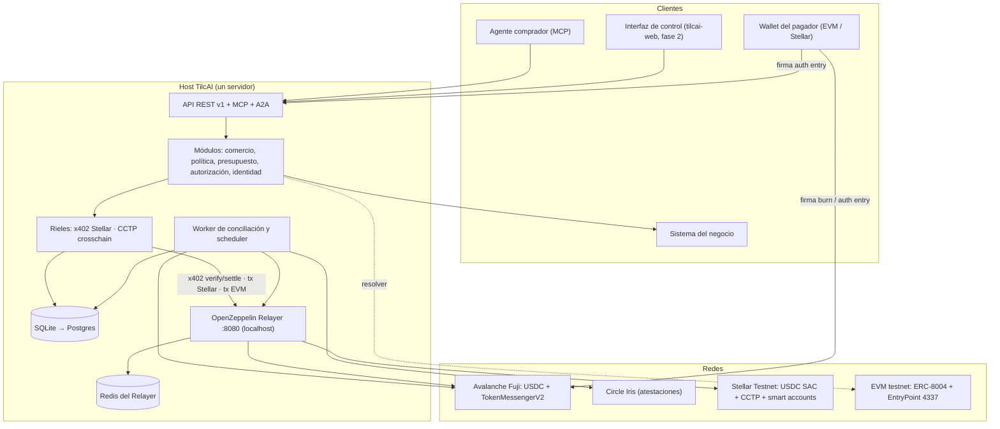
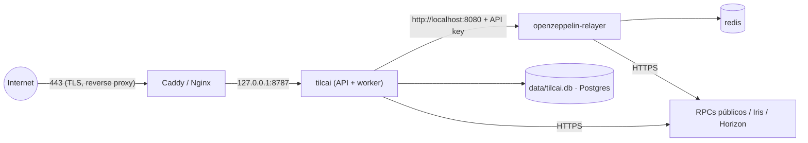
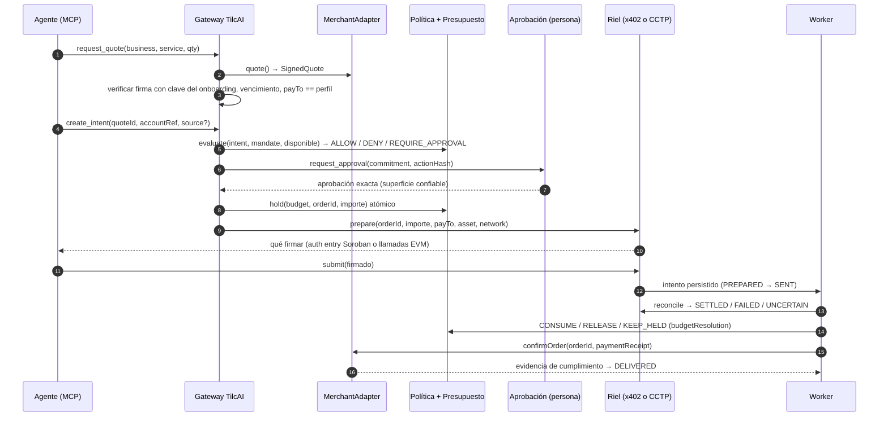
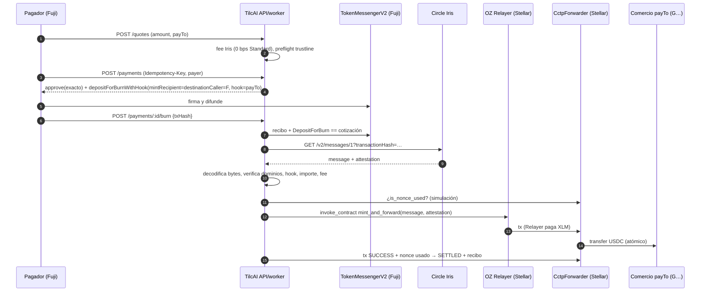
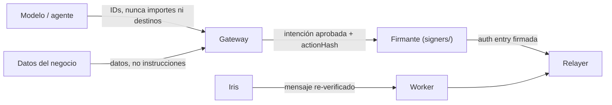
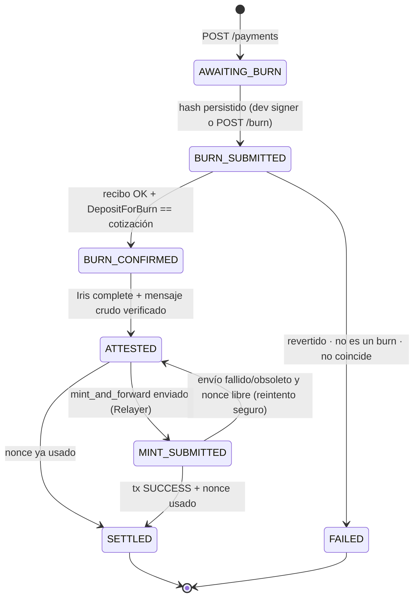
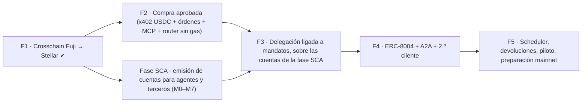

# TilcAI — plan y arquitectura del backend y la infraestructura

**Alcance:** todo lo necesario para llevar el backend y la infraestructura de TilcAI al 100 %: contratos (EVM y Soroban), x402, relayers, ERC-8004, transacciones crosschain, creación de cuentas abstractas (AA) y paymasters.
**Base:** [[TILCAI_NUEVO_RUMBO_COMERCIO_AGENTICO_2026-09-29|informe de producto 2.0]], `tilcai-core` (contratos compartidos, MCP, riel x402 probado), `tilcai-cctp-engine` (laboratorio CCTP verificado on-chain) y `tilcai-web` (arquitectura publicada).
**Código:** `tilcai-infrastructure/` (nuevo). La **fase 1** de este plan —pagos USDC de Avalanche a Stellar, con el gas de ambas redes pagado por el relayer— está implementada y **verificada con transferencias reales en testnet** (§14.6).
**Equipo:** Omar · Jhamil · Saul · Jose.
**Actualización 1.1 (2026-10-06):** se abre la **fase SCA**, que adelanta la fase 3 y añade la emisión de cuentas abstractas para agentes y terceros. Cambian ADR-06 y ADR-07, se añaden ADR-10 a ADR-13 y se ajustan §5 a §10, §12, §13, §15 y §17. El detalle, los hechos verificados y los hitos M0–M7 están en [[TILCAI_FASE_SCA_EMISION_DE_CUENTAS_2026-10-06|fase SCA]].

> Convenciones. **Implementado** = existe código con tests. **Verificado** = ejecutado contra la red o el servicio real. **Diseño** = decisión tomada, sin código. **Verificar** = dato que hay que confirmar on-chain o en la documentación de la versión fijada antes de implementarlo. Todo es **testnet** hasta el hito de §15.6.

## Índice

1. [[#1. Resumen ejecutivo]]
2. [[#2. Decisiones de arquitectura (ADR)]]
3. [[#3. Vista general del sistema]]
4. [[#4. Repositorios y responsabilidades]]
5. [[#5. Backend modular]]
6. [[#6. Persistencia y modelo de datos]]
7. [[#7. Rieles de pago]]
8. [[#8. Contratos]]
9. [[#9. Relayers]]
10. [[#10. Cuentas abstractas y paymasters]]
11. [[#11. Identidad y ERC-8004]]
12. [[#12. Interfaces externas: API, MCP y A2A]]
13. [[#13. Seguridad, claves y operación]]
14. [[#14. Fase 1 implementada — pagos crosschain Avalanche → Stellar]]
15. [[#15. Roadmap por fases]]
16. [[#16. Estrategia de pruebas]]
17. [[#17. Riesgos y preguntas abiertas]]
18. [[#18. Referencias]]

---

## 1. Resumen ejecutivo

TilcAI liquida en **Stellar** y acepta financiación desde **otras redes** con USDC nativo. El backend es un **monolito modular en TypeScript** con un **worker de conciliación**, desplegado **en el mismo host que el OpenZeppelin Relayer**, al que habla por `localhost`. El Relayer cumple tres funciones: facilitador x402, patrocinador de comisiones en Stellar y, más adelante, emisor de transacciones EVM.

| Pieza | Decisión | Estado |
| --- | --- | --- |
| Liquidación | Stellar Testnet, USDC (SAC `CBIELTK6…DAMA`) | Diseño (x402 se probó con XLM) |
| Pago directo | x402 v2 `exact` + plugin facilitador en OZ Relayer | Verificado con XLM (tilcai-core) |
| Pago crosschain | Circle CCTP V2: burn en Avalanche → `CctpForwarder.mint_and_forward` en Stellar | **Implementado y verificado (fase 1)** |
| Gas en Stellar | El Relayer firma y paga XLM (`mint_and_forward`, liquidaciones x402, despliegue de cuentas) | Implementado para el mint; x402 verificado |
| Gas en EVM | Router con EIP-3009 enviado por el Relayer EVM (**fase 1, desplegado y verificado**). Fase SCA: UserOps de tarifa cero que envía el propio Relayer, sin bundler externo ni paymaster (ADR-12) | Router ✔ / 4337 diseño |
| Cuentas | TilcAI emite y patrocina cuentas para agentes y terceros y nunca es firmante (ADR-10). Stellar: `tilcai_account` sobre OpenZeppelin `stellar-accounts` 0.7.2. EVM: cuenta ERC-4337 de OpenZeppelin Contracts 5.7.0 con passkey | Contrato base de Stellar implementado; el resto, diseño |
| Terceros | Tenants con claves propias, cuotas de patrocinio y `tenant_id` en cuentas y pagos (ADR-13) | Diseño |
| Identidad | Perfil nativo (raíz de confianza en el onboarding) + resolver ERC-8004 en EVM | Diseño |
| Interfaces | REST v1 (implementada para crosschain) → MCP (fase 2) → A2A (fase 4) | Parcial |
| Persistencia | SQLite WAL en la fase 1 y en la fase SCA → Postgres en la fase 2 | Implementado (SQLite) |

**Cambio respecto al informe 2.0.** El §8.5 del informe dejaba fuera del primer alcance los «bridges cross-chain». Este plan incorpora el pago crosschain con **CCTP**, que no es un bridge de liquidez: quema USDC nativo en origen y Circle, el propio emisor, lo acuña en destino. No hay wrappers, pools ni un tercero adicional (ADR-02). El resto de principios del informe se mantiene intacto: autoridad humana, idempotencia, conciliación antes de reintentar, evidencias separadas y nada de autonomía ilimitada.

## 2. Decisiones de arquitectura (ADR)

Cada ADR registra problema, decisión, motivo, riesgo y prueba de aceptación (informe §22.5).

### ADR-01 · Stellar es la red de liquidación; las demás redes son origen de fondos

- **Problema:** el comprador puede tener USDC en otra red y el negocio quiere cobrar en Stellar.
- **Decisión:** las órdenes, los recibos y el `payTo` del negocio viven en Stellar. Otras redes solo **financian** un pago hacia ese `payTo`.
- **Motivo:** un único destino de cobro verificado por negocio (§12.10 del informe) y una sola conciliación de llegada.
- **Riesgo:** las comisiones y la latencia dependen de la red de origen.
- **Aceptación:** un pago desde Fuji produce el mismo recibo de destino (`network`, `asset`, `txHash`, `payTo`) que un pago x402 directo.

### ADR-02 · CCTP V2 como único mecanismo crosschain

- **Decisión:** Circle CCTP V2 (`depositForBurnWithHook` + `CctpForwarder`). Avalanche Fuji → Stellar Testnet es la primera ruta.
- **Motivo:** USDC nativo en ambos extremos, sin pools ni wrappers. La única confianza añadida es Circle, que ya es el emisor. Está verificado on-chain en `tilcai-cctp-engine` (8 redes, 56 pares).
- **Riesgo:** dependencia de Iris (atestación). El Forwarding Service de Circle **no** soporta Stellar, así que el mint lo envía TilcAI (ADR-05). CCTP V1 se apaga el 2026-12-01; Stellar solo usa V2, así que no le afecta.
- **Aceptación:** un burn alterado (importe, destinatario, hook) no se mintea, y un mismo burn no paga dos órdenes.

### ADR-03 · Monolito modular + worker, mismo host que el Relayer

- **Decisión:** un servicio Node (API + worker, o procesos separados) con módulos de §5. El Relayer corre en el mismo host. `RELAYER_URL=http://localhost:8080` y la API escucha en `127.0.0.1`.
- **Motivo:** el informe §9.3 pide backend modular, no microservicios. La API key del Relayer nunca sale del host.
- **Riesgo:** punto único de fallo. Se mitiga con conciliación durable: un reinicio retoma cada pago desde su estado.
- **Aceptación:** matar el proceso entre «mint solicitado» y «mint persistido» no produce doble mint ni pérdida del pago (test unitario `crash after mint request`).

### ADR-04 · Persistencia: SQLite en la fase 1, Postgres desde la fase 2

- **Decisión:** `node:sqlite` en modo WAL, detrás de interfaces de repositorio. Postgres 16 cuando haya varios procesos escritores, presupuesto compartido o MCP multiusuario.
- **Motivo:** cero dependencias operativas para la ruta vertical. Las garantías que importan (índices únicos, bloqueo optimista, transacciones) existen en ambos motores.
- **Aceptación:** la suite de repositorio se ejecuta contra ambas implementaciones.
- **Nota 1.1:** la fase SCA sigue en SQLite. Hay un solo proceso escritor y sus tablas nuevas van detrás de las mismas interfaces de repositorio.

### ADR-05 · El Relayer patrocina el gas de destino en Stellar

- **Decisión:** `CctpForwarder.mint_and_forward` se envía por `POST /api/v1/relayers/{stellar}/transactions` en modo operaciones (`invoke_contract`, `auth: none`). La cuenta del Relayer es la fuente y paga el XLM. Como alternativa existe un submitter con clave de operador local.
- **Motivo:** el comercio y el comprador no necesitan XLM. `mint_and_forward` no exige autorización (el forwarder es `destinationCaller`), así que el Relayer no recibe ninguna autoridad sobre fondos.
- **Aceptación:** el pagador no tiene cuenta en Stellar y el comercio recibe el USDC.

### ADR-06 · Gas en EVM sin AVAX del pagador: EIP-3009 para todos, ERC-4337 para el agente

*Revisado el 2026-10-06.*

- **Decisión:** `TilcaiCctpRouter` recibe una autorización EIP-3009 (`receiveWithAuthorization`) firmada por el pagador y el Relayer EVM envía la transacción. En la fase SCA el router gana la variante con firma `bytes`, que el USDC comprueba por ERC-1271, y así una cuenta de contrato paga igual que una EOA. ERC-4337 se usa solo cuando paga la clave de un agente, porque sus límites por periodo necesitan escribir estado. Quién envía esas UserOps se decide en ADR-12.
- **Motivo:** EIP-3009 es el mismo mecanismo que usa x402 `exact` en EVM y no necesita bundler. El USDC de Fuji tiene la variante `bytes` (verificado el 2026-10-06). ERC-1271 es de solo lectura y no puede llevar la cuenta de lo gastado.
- **Riesgo:** los dos routers son código propio (auditoría y límites).
- **Aceptación:** pagador con 0 AVAX completa un pago, sea EOA o cuenta de contrato, y una firma reutilizada o con otro `paymentId` se rechaza.

### ADR-07 · Account abstraction en Stellar con OpenZeppelin smart accounts

- **Decisión:** `stellar-accounts` 0.7.2 de OpenZeppelin, fijada (reglas de contexto, firmantes, políticas). Es una librería: `tilcai_account` la expone como contrato sin añadir lógica de autorización y no es actualizable. Se suman la política de límite de OpenZeppelin y una política propia, `tilcai_spend_policy`. El agente es un firmante externo (verificador ed25519), no delegado.
- **Motivo:** el informe §12.8 lo fija como base de evaluación. Separa identidad del firmante, alcance y restricciones. OpenZeppelin auditó el RC v0.7.0 en marzo de 2026. Un firmante externo mantiene el pago en una sola entrada de autorización, que es lo que el facilitador x402 verifica.
- **Riesgo:** compatibilidad con el facilitador x402 (credenciales de dirección de contrato: §7.1.5). Hay que probarla antes de habilitar la delegación (informe §14.5, hito M0 de la fase SCA). Las políticas propias no están auditadas.
- **Aceptación:** una compra delegada se liquida en testnet y una prohibida falla antes de mover fondos.

### ADR-08 · ERC-8004 como capa de identidad interoperable, no como raíz de confianza única

- **Decisión:** registrar y resolver agentes en un Identity Registry ERC-8004 en un EVM testnet. La raíz de confianza para aceptar ofertas sigue siendo el onboarding (informe §15.3). ERC-8004 aporta descubrimiento, vínculo de dominio y señales.
- **Motivo:** ERC-8004 está en estado *Draft*. Su `agentWallet` es una dirección EVM y no cubre el `payTo` de Stellar.
- **Aceptación:** una oferta firmada con una clave que solo aparece en el registro, sin onboarding, se rechaza.

### ADR-09 · Importes atómicos y redes CAIP-2 en todo el sistema

- **Decisión:** importes como `bigint` y strings enteros canónicos, nunca floats. Redes en CAIP-2 (`eip155:43113`, `stellar:testnet`) y activos por contrato, nunca por la etiqueta `USDC`. Stellar USDC tiene 7 decimales; CCTP transporta 6. Solo se aceptan importes con ≤ 6 decimales en rutas CCTP.
- **Aceptación:** `1.0000001` se rechaza en una cotización crosschain (test `quote: exact amounts`).

### ADR-10 · TilcAI emite y patrocina cuentas, y nunca es firmante

- **Problema:** agentes y terceros como Optus necesitan cuentas con límites verificables, sin entregar la custodia a TilcAI.
- **Decisión:** TilcAI despliega la cuenta que el dueño definió, paga las comisiones y guarda el registro. El único firmante inicial es la credencial del dueño (passkey, ed25519 o EOA). La clave del agente la guarda el tercero, y la cuenta limita lo que esa clave puede hacer. TilcAI no aloja claves de agente hasta que existan los mandatos de la fase 2.
- **Motivo:** el informe §12 exige que el principal conserve la administración. Si TilcAI no tiene claves, comprometer a TilcAI no mueve fondos.
- **Riesgo:** una clave de agente filtrada en el tercero gasta hasta el límite de la regla. La recuperación depende de una segunda credencial del dueño.
- **Aceptación:** con todas las claves de TilcAI no se puede mover el saldo de una cuenta emitida.

### ADR-11 · La dirección de una cuenta compromete a su dueño

- **Problema:** una cuenta puede recibir fondos antes de existir. Quien la despliegue decide el dueño.
- **Decisión:** una factory por red deriva la dirección de la clave del dueño y de un salt (`sha256(tenantId ‖ externalRef ‖ índice)`). El Relayer invoca la factory. No se despliega con la cuenta del Relayer como origen fuera de las pruebas de M0.
- **Motivo:** la dirección deja de depender de la clave del Relayer y nadie puede desplegar otra configuración en una dirección ya fondeada.
- **Riesgo:** las factories son código propio.
- **Aceptación:** la dirección calculada antes del despliegue coincide con la desplegada, y un despliegue con otro dueño da otra dirección.

### ADR-12 · El Relayer envía las UserOps; sin bundler externo ni paymaster

- **Problema:** el Relayer no tiene función de bundler ERC-4337, y la versión 1.0 de este plan preveía un bundler aparte y `TilcaiPaymaster`.
- **Decisión:** el Relayer EVM llama a `EntryPoint.handleOps` como una transacción normal. Las UserOps llevan tarifa cero, el EntryPoint no exige depósito y el Relayer paga el gas. TilcAI solo envía operaciones ya simuladas de cuentas que emitió. `TilcaiPaymaster` queda aplazado hasta que haya que aceptar bundlers de terceros.
- **Motivo:** el patrocinio ya lo decide el backend de TilcAI. Un paymaster firmado por ese mismo backend no añade control y sí añade un contrato que auditar y un depósito que vigilar.
- **Riesgo:** una operación que falla on-chain cuesta gas al Relayer. Hay que confirmar la tarifa cero con EntryPoint v0.9 en Fuji (hito M0).
- **Aceptación:** una UserOp de una cuenta emitida se ejecuta con 0 AVAX en la cuenta y sin paymaster, y una de una cuenta ajena no se envía.

### ADR-13 · Terceros como tenants

- **Problema:** `TILCAI_API_KEYS` es una lista plana. No dice quién llama ni cuánto patrocinio consume.
- **Decisión:** tenants con claves guardadas como hash, permisos por clave, cuota diaria de cuentas y de operaciones patrocinadas, y `tenant_id` en cuentas, cotizaciones y pagos. Las claves actuales pasan a un tenant heredado.
- **Motivo:** aislar a un tercero de otro y poner tope a lo que paga el Relayer por cada uno.
- **Aceptación:** la clave de un tenant no lee ni opera cuentas de otro, y una cuota agotada rechaza la petición sin gastar.

## 3. Vista general del sistema

### 3.1 Componentes



### 3.2 Tres planos (del informe §9.2), aplicados

| Plano | Componentes | Lo que **no** puede hacer |
| --- | --- | --- |
| Comunicación | API, MCP, A2A, skill | Conceder autoridad financiera |
| Comercio y control | Comercio, identidad, política, presupuesto, autorización | Firmar o enviar transacciones |
| Financiero | Rieles, firmantes, Relayer, worker | Cambiar precio, destinatario o aprobación |

### 3.3 Topología de despliegue



- Solo el proxy expone puertos. El Relayer **no** se publica: hoy responde en `192.168.1.57:8080` dentro de la LAN para pruebas y en producción quedará atado a `127.0.0.1`.
- Webhooks del Relayer → `http://localhost:8787/v1/webhooks/relayer` (fase 2), firmados con `WEBHOOK_SIGNING_KEY`. Sustituye al receptor público de terceros actual (payment-rail-environment §8.4).
- Copias de seguridad: base de datos (cifrada), configuración del Relayer **sin** keystore. Los keystores se respaldan aparte (§13.2).

## 4. Repositorios y responsabilidades

| Repositorio | Contenido | Relación |
| --- | --- | --- |
| `tilcai-core` | Tipos y contratos compartidos (`tilcai-shared-v1`, `tilcai-mcp-v1`, intención/mandato), evaluador de política, prueba reproducible del riel x402 | Dependencia de `tilcai-infrastructure` (`file:../tilcai-core`). Se mantiene sin dependencias |
| `tilcai-infrastructure` | **Nuevo.** Backend, worker, CLI, contratos EVM/Soroban, tests de integración | Este plan |
| `tilcai-cctp-engine` | Laboratorio CCTP de 8 redes (V1/V2, forwarding, 2 saltos) | Fuente de direcciones, layouts y codificación. La fase 1 reutiliza su lógica para Fuji → Stellar con verificación y durabilidad añadidas |
| `tilcai-web` | Landing y arquitectura publicada | Roadmap y textos se actualizan solo con evidencia (§15.7) |
| Config del Relayer | `config.json`, plugin x402, keystores | Fuera de git. Versión fijada por digest |

## 5. Backend modular

### 5.1 Árbol de `tilcai-infrastructure`

```text
src/
  config/        env (zod) · networks (CAIP-2, direcciones verificadas)
  db/            sqlite + migraciones  (fase 2: postgres/)
  shared/        amount (atómicos exactos) · hex · ids (tilcai-shared-v1) · errors · log · clock
  modules/
    crosschain/  FASE 1 ✔  cctp/{encoding,message,iris} adapters/{evm,stellar} domain service verify repository
    relayer/     FASE 1 ✔  cliente OZ Relayer (tx Stellar, plugin x402, balances)
    payments/    puerto PaymentRail · fase 2: x402-stellar-exact
    commerce/    SignedQuote, Order, MerchantAdapter          (fase 2, Jhamil)
    businesses/  perfiles, claves de oferta, payTo versionado  (fase 2, Jhamil)
    identity/    raíz de confianza · resolver ERC-8004         (fase 2/4, Omar)
    policies/    PolicyEngine (envuelve evaluateIntent)        (fase 2, Omar)
    budgets/     BudgetStore atómico                           (fase 2–3, Jhamil)
    authorization/ aprobaciones y mandatos                     (fase 2–3, Jose + Omar)
    accounts/    emisión de cuentas: Stellar · ERC-4337        (fase SCA, Jose + Saul)
    tenants/     terceros, claves y cuotas de patrocinio       (fase SCA, Jhamil + Omar)
    signers/     frontera de firma                             (fase 3, Jose)
    principals/ agents/ receipts/
    connectors/{mcp,a2a}/                                       (fase 2 / 4, Omar)
    jobs/        conciliación ✔ · scheduler (fase 5)
  apps/          api · worker · all-in-one · cli/{crosschain-pay, relayer-check, sca-preflight}
contracts/evm/   Foundry: TilcaiCctpRouter ✔ · router v2, TilcaiAccount, factory, TilcaiSessionPolicy (fase SCA)
contracts/soroban/ Cargo: tilcai_account, verificadores, política de límite ✔ · factory, tilcai_spend_policy (fase SCA)
test/unit · test/integration
```

### 5.2 Reglas de dependencia

1. `modules/*` dependen de **puertos** (`ports.ts`), nunca de adaptadores concretos. El único lugar que conoce los adaptadores es `src/app-context.ts` (raíz de composición).
2. Los tipos de dominio compartidos se importan de `tilcai-core`. Ningún módulo redefine IDs, estados o errores.
3. Los estados internos de un riel (p. ej. `ATTESTED`) se proyectan siempre al `PaymentState` compartido, y cada transición proyectada se valida con `canTransition("payment", …)` de `tilcai-core`.
4. Las claves privadas solo existen en `signers/` y adaptadores de envío. Nunca llegan a la API, a los logs ni a MCP.
5. La verificación de evidencia on-chain es **pura** (`verify.ts`): recibe datos y devuelve discrepancias. Así se puede probar sin red.

### 5.3 Puertos (contratos de desarrollo paralelo)

| Puerto | Archivo | Responsable | Consumidores |
| --- | --- | --- | --- |
| `EvmCctpPort`, `StellarCctpPort`, `MintSubmitter`, `IrisPort` | `crosschain/ports.ts`, `cctp/iris.ts` | Saul | Servicio crosschain |
| `PaymentRail` | `payments/ports.ts` | Saul | Orquestador de órdenes |
| `MerchantAdapter`, `SignedQuote`, `Order` | `commerce/ports.ts` | Jhamil | Orquestador, agente vendedor |
| `IdentityResolver`, `Erc8004Resolver` | `identity/ports.ts` | Omar + Jhamil | Verificador de ofertas |
| `PolicyEngine` | `policies/ports.ts` | Omar | Gateway |
| `BudgetStore` | `budgets/ports.ts` | Jhamil | Orquestador |
| `AuthorizationProvider` | `authorization/ports.ts` | Jose + Omar | Gateway, interfaz de control |
| `SmartAccountProvider` (uno por red), `UserOperationSubmitter` | `accounts/ports.ts` | Jose + Saul | API de cuentas, riel |
| `TenantRegistry` | `tenants/ports.ts` | Jhamil + Omar | API |
| `SignerProvider` | `signers/ports.ts` | Jose | Rieles |
| `ReceiptStore` | `receipts/ports.ts` | Equipo | Control y auditoría |

### 5.4 Orquestación de una compra completa (objetivo de la fase 2)



## 6. Persistencia y modelo de datos

### 6.1 Fase 1 (implementado, SQLite)

| Tabla | Propósito | Garantías |
| --- | --- | --- |
| `route_quotes` | Cotización de ruta crosschain (importes, fee, objetivo CCTP, preflight, vencimiento) | Inmutable |
| `crosschain_payments` | Intento de pago crosschain (`payment_attempt_*`) | `idempotency_key` único · **burn único por red** · **nonce CCTP único** · **una cotización → un intento** · `version` para bloqueo optimista |
| `payment_events` | Bitácora de transiciones (de, a, nota, datos) | Solo inserción, en la misma transacción que el cambio de estado |
| `payment_receipts` | Recibo de pago con evidencia de origen, CCTP y destino | Uno por intento |

### 6.2 Fase 2+ (Postgres)

Se añaden, con la misma disciplina (ID `tilcai-shared-v1`, UTC, importes como `numeric(78,0)`/texto):

`principals`, `agents`, `businesses`, `business_offer_keys`, `business_payout_destinations` (versionado), `services`, `quotes` (firmadas), `orders`, `intents`, `mandates` (revisiones), `approvals`, `budgets`, `budget_reservations`, `payment_attempts` (genérica, con `rail` = `x402-stellar-exact` | `cctp-v2`), `decision_receipts`, `fulfillment_receipts`, `idempotency_keys` (principal + agente + herramienta + hash), `relayer_webhooks` (deduplicación), `erc8004_links`, `audit_log`.

La fase SCA adelanta, como migración 3 de SQLite, `tenants`, `tenant_api_keys`, `tenant_usage`, `smart_accounts`, `account_delegations` y `account_events`, y añade `tenant_id` a `route_quotes` y `crosschain_payments` ([[TILCAI_FASE_SCA_EMISION_DE_CUENTAS_2026-10-06#7. Backend: terceros, datos y API|fase SCA §7]]).

Reglas:

- **Presupuesto atómico:** `UPDATE budgets SET held = held + $1 WHERE id = $2 AND limit - consumed - held >= $1` dentro de la transacción que crea la reserva (informe §13.4).
- **Intento antes de enviar:** fila `PREPARED` con el hash/nonce previsto antes de llamar a `/settle` o de difundir un burn (payment-rail-environment §6.2).
- **Outbox:** eventos a webhooks/notificaciones salen de una tabla outbox procesada por el worker, nunca en línea con la transacción de negocio.

## 7. Rieles de pago

Un pago siempre va hacia el `payTo` Stellar del negocio con el SAC de USDC. Cambia **de dónde** sale el dinero y **quién** firma.

| Riel | Origen | Firma del pagador | Envío | Estado |
| --- | --- | --- | --- | --- |
| `x402-stellar-exact` | Cuenta Stellar G… (fase 2) o smart account C… (fase SCA) | Auth entry Soroban de `transfer` | Plugin x402 del Relayer (`/verify`, `/settle`) | Verificado con XLM |
| `cctp-v2` (externo) | EOA en Avalanche Fuji | `approve` + `depositForBurnWithHook` (paga AVAX) | Wallet del pagador; el mint lo envía el Relayer | **Implementado** |
| `cctp-v2` (sin gas) | EOA en Fuji | EIP-712 `ReceiveWithAuthorization` | Relayer EVM → `TilcaiCctpRouter` | **Implementado y verificado** |
| `cctp-v2` (cuenta, firma el dueño) | Smart account EVM | EIP-712 `ReceiveWithAuthorization` con firma ERC-1271 | Relayer EVM → `TilcaiCctpRouterV2` | Fase SCA (M4) |
| `cctp-v2` (cuenta, firma el agente) | Smart account EVM | UserOperation de la clave de sesión | Relayer EVM → `EntryPoint.handleOps` (ADR-12) | Fase SCA (M5) |

### 7.1 x402 sobre Stellar (riel directo)

Base verificada en `tilcai-core/docs/payment-rail-environment.md`: x402 v2, esquema `exact`, plugin `@rodacio/relayer-plugin-x402-facilitator` 0.6.0 y comisiones patrocinadas (`areFeesSponsored: true`).

**Trabajo para habilitarlo con órdenes reales (fase 2, Saul):**

1. **Activo USDC.** Añadir el SAC de USDC `CBIELTK6YBZJU5UP2WWQEUCYKLPU6AUNZ2BQ4WWFEIE3USCIHMXQDAMA` a `assets` del plugin y repetir las 18 comprobaciones de `scripts/payment-rail` con `ASSET=<SAC USDC>`.
2. **Timeouts.** Alinear `timeout` del plugin (30 s) con `maxTimeoutSeconds` (60 s): `maxTimeoutSeconds ≤ 25` o `timeout ≥ 65` (§8.1 del documento del riel).
3. **Adaptador `X402StellarRail`** (`payments/x402-stellar.ts`):
   - `prepare`: construye `paymentRequirements` desde la cotización verificada (nunca desde el modelo) y el `transfer(from, payTo, amount)` sin firmar con la expiración correcta (≤ `ceil(maxTimeout/5)` ledgers). Calcula `actionHash = sha256(XDR de la invocación)` para la aprobación (contrato con Jose).
   - `submit`: persiste el intento (`PREPARED`) con el nonce de la auth entry y su `signatureExpirationLedger`, llama `/verify` y luego `/settle`, y persiste el hash **antes** de interpretar el resultado.
   - `reconcile`: aplica la tabla 6.2 del documento del riel (`success:false` + hash → `UNCERTAIN`, 504 → `UNCERTAIN`, `NOT_FOUND` solo es fallo cuando la auth entry ya expiró).
4. **Servidor de recurso x402** para negocios que exponen su API por HTTP: middleware que responde `402` con `accepts` construido por TilcAI. El cliente `@x402/fetch` queda como cliente de compatibilidad (no probado aún, §8.9 del documento del riel).
5. **Smart accounts como pagador** (fase SCA): la auth entry de un `C…` usa credenciales de dirección con `__check_auth`. El plugin 0.6.0 acepta credenciales de dirección, clásicas y V2, rechaza las delegadas y las subinvocaciones, y vuelve a simular la transacción (leído en su código el 2026-10-06). Por eso el agente es un firmante externo. Falta la prueba real, que es el hito M0. Si el plugin no la acepta, se contribuye el soporte o se usa la ruta de §10.1.4.

### 7.2 Crosschain CCTP V2 (Avalanche → Stellar)

Implementado en la fase 1. Detalle en §14.



**Rutas siguientes** (misma implementación con otra entrada en `config/networks.ts`): Ethereum Sepolia, Base Sepolia, Arbitrum Sepolia y Arc (V2 directo). Solana necesita un adaptador de burn Anchor (ya existe en `tilcai-cctp-engine/src/cctp/solana.ts`). Stellar → EVM (reembolsos crosschain) usa `deposit_for_burn` en Stellar y `receiveMessage` en EVM, y se diseña junto con devoluciones (fase 5).

### 7.3 x402 crosschain: un mismo 402, varios orígenes

Fase 2. Un recurso x402 de un negocio puede anunciar varias formas de pagar **la misma** cotización:

```json
{
  "x402Version": 2,
  "accepts": [
    { "scheme": "exact", "network": "stellar:testnet", "asset": "CBIELTK6…DAMA",
      "amount": "12500000", "payTo": "G…MERCHANT", "maxTimeoutSeconds": 25,
      "extra": { "areFeesSponsored": true } },
    { "scheme": "cctp-exact", "network": "eip155:43113", "asset": "0x5425…Bc65",
      "amount": "1250000", "payTo": "G…MERCHANT", "maxTimeoutSeconds": 900,
      "extra": { "destinationNetwork": "stellar:testnet", "cctpDomain": 27,
                 "mintRecipient": "0x3de8…b93e", "destinationCaller": "0x3de8…b93e",
                 "hookData": "0x…", "routeQuoteId": "route_quote_…" } }
  ]
}
```

- `cctp-exact` es un **esquema propio de TilcAI** (no estándar x402). El `X-PAYMENT` contiene el hash del burn o, con el router de la fase 2, la autorización EIP-3009 firmada.
- El «facilitador» de `cctp-exact` es el servicio crosschain de la fase 1: `verify` = recibo + evento + (opcional) atestación; `settle` = mint vía Relayer. Para x402 la respuesta es asíncrona: devuelve `202` con el `paymentAttemptId` y el recurso se entrega cuando el pago queda `SETTLED`.
- Si x402 estandariza un esquema crosschain, se migra a él sin cambiar el riel.

### 7.4 Estados y conciliación comunes

Todos los rieles proyectan a `PaymentState` de `tilcai-shared-v1` (`NOT_ATTEMPTED → PREPARED → SENT → SETTLED | FAILED | UNCERTAIN`) y aplican `budgetResolution` (`CONSUME` / `RELEASE` / `KEEP_HELD`). Reglas:

| Situación | Conducta |
| --- | --- |
| Timeout después de enviar | `UNCERTAIN`; se concilia el **mismo** intento y se mantiene la retención |
| Payload/burn rechazado antes de enviar | `PREPARED` hasta que expire la autoridad firmada; luego `FAILED` y `RELEASE` |
| x402: auth entry firmada no liquidada | Ejecutable hasta `signatureExpirationLedger`; no se libera presupuesto antes |
| CCTP: burn confirmado | Los fondos ya salieron. El pago nunca vuelve a `FAILED` por un problema de mint: el mint se reintenta (idempotente por nonce) |
| CCTP: burn no encontrado | `UNCERTAIN` tras 30 min. Nunca `FAILED` sin evidencia |

## 8. Contratos

### 8.1 EVM (Foundry, `contracts/evm`)

#### `TilcaiCctpRouter` (fase 1 · Saul, revisión Jose) — desplegado en Fuji `0x297ce6a2787484db4bB18A96a8F28A9881Fc163C`

Objetivo: el pagador firma un mensaje EIP-712 (sin gas) y el Relayer EVM ejecuta burn + hook en una transacción.

```solidity
// Interfaz de diseño (no desplegado)
function payWithAuthorization(
    bytes32 paymentId,            // = nonce EIP-3009: liga la firma a un único intento TilcAI
    address payer,
    uint256 amount,
    uint256 validAfter,
    uint256 validBefore,
    uint32  destinationDomain,    // 27 (Stellar)
    bytes32 mintRecipient,        // CctpForwarder
    bytes32 destinationCaller,    // CctpForwarder
    uint256 maxFee,
    bytes   calldata hookData,    // strkey del payTo
    uint8 v, bytes32 r, bytes32 s
) external;
```

- Usa `USDC.receiveWithAuthorization(payer, address(this), amount, validAfter, validBefore, nonce=paymentId, v, r, s)`. `receive…` (no `transfer…`) impide que un tercero adelante la autorización hacia otro destino (front-running del `to`).
- **Problema de vinculación:** EIP-3009 firma `(from, to, value, validAfter, validBefore, nonce)`, no el destino CCTP. Si el router aceptara cualquier `hookData`, el Relayer podría redirigir el pago. Solución: `nonce = keccak256(abi.encode(paymentId, destinationDomain, mintRecipient, destinationCaller, maxFee, keccak256(hookData)))`, y el router recalcula y exige ese `nonce`. La firma del pagador cubre así el destino exacto.
- Sin `owner` con poder sobre fondos, sin upgrades en testnet, sin saldo residual (`balanceOf(router) == 0` tras cada llamada), y `approve` exacto al TokenMessenger dentro de la misma llamada.
- Eventos: `CrosschainPayment(paymentId, payer, amount, destinationDomain, mintRecipient, hookDataHash)`.
- Verificado on-chain: Fuji USDC (`name` «USD Coin», `version` 2) implementa `receiveWithAuthorization` y `authorizationState`. El nonce de TypeScript coincide con `authorizationNonce` del contrato desplegado y el dominio EIP-712 coincide con el `DOMAIN_SEPARATOR` del USDC (`test/integration/router.test.ts`).
- Diferencia respecto al diseño inicial: el `depositor` del evento CCTP y el `messageSender` del mensaje son **el router**, no el pagador. El pagador se acredita con el evento `CrosschainPayment(paymentId, payer, …)` del router, que el worker exige (exactamente uno, con el `paymentId` y el importe del pago).

#### Contratos de la fase SCA (Saul + Jose)

Detalle en [[TILCAI_FASE_SCA_EMISION_DE_CUENTAS_2026-10-06#6. Cuenta en EVM|fase SCA §6]]. Todos sobre OpenZeppelin Contracts 5.7.0 y EntryPoint v0.9.

| Contrato | Diseño |
| --- | --- |
| `TilcaiCctpRouterV2` | El router actual con la variante `bytes signature` de EIP-3009. El USDC comprueba la firma con `isValidSignature` de la cuenta. Mismo nonce ligado a la ruta y mismo evento `CrosschainPayment` |
| `TilcaiAccount` | `Account` de OpenZeppelin con ERC-7739 (firmas ERC-1271 no reutilizables entre cuentas) y ERC-7821 (ejecución en lote). Dueño con passkey (`SignerWebAuthn`, precompilado P-256) o EOA |
| `TilcaiAccountFactory` | CREATE2 con el salt derivado de la clave del dueño (ADR-11). Despliega al crear la cuenta, porque ERC-1271 necesita código |
| `TilcaiSessionPolicy` | Límites de la clave del agente: solo el lote `USDC.approve(TokenMessengerV2, x)` + `depositForBurnWithHook(…)` hacia el forwarder, `payTo` en lista, tope por llamada y por periodo, vencimiento |

#### `TilcaiPaymaster` (aplazado, ADR-12)

- No hace falta mientras el Relayer envíe las UserOps con tarifa cero.
- Vuelve si hay que aceptar bundlers de terceros. Base: `PaymasterSigner` de OpenZeppelin Contracts. Firmaría solo el lote permitido, con `validUntil` corto y cupo por tenant.

#### ERC-8004 (fase 4 · Omar)

No se escriben contratos propios si existe un despliegue reconocido en el testnet elegido. Si no lo hay, se despliegan las implementaciones de referencia sin modificar y se documentan las direcciones.

### 8.2 Soroban (`contracts/soroban`)

| Contrato | Fase | Diseño |
| --- | --- | --- |
| `tilcai_account` | SCA · **implementado** (2 tests), sin desplegar | Envoltorio de `stellar_accounts::smart_account` 0.7.2. El constructor crea la regla `owner` (`Default`) con los firmantes del dueño: passkey o ed25519, como firmantes externos. No actualizable |
| `tilcai_ed25519_verifier`, `tilcai_webauthn_verifier` | SCA · compilan | Verificadores de OpenZeppelin, sin estado. Uno por red, compartidos por todas las cuentas |
| `tilcai_spending_limit_policy` | SCA · compila | Política de límite de OpenZeppelin: ventana móvil en ledgers. Solo en reglas `CallContract(<token>)` |
| `tilcai_account_factory` | SCA · M2 | Despliega cuentas en una dirección derivada de la clave del dueño (ADR-11) |
| `tilcai_spend_policy` | SCA · M3 | Política propia en la regla del agente. Permite **solo** `transfer` del SAC configurado hacia `payTo` en lista, con tope por llamada. El tope por periodo lo pone la política de límite y el vencimiento, `valid_until` de la regla. La regla es `CallContract(<SAC>)`, así que el agente no puede llamar a la cuenta para cambiar firmantes o reglas ni a ningún otro contrato |
| `tilcai_budget` | 3–5 | Opcional. Presupuesto raíz on-chain compartido por varias cuentas o mandatos: `hold(order, amount)`, `consume`, `release` con autorización del gateway. Solo se despliega si el presupuesto off-chain atómico no basta (informe §21.4) |

Pruebas obligatorias (Rust `soroban-sdk` testutils): camino positivo, monto excedido, destinatario fuera de lista, periodo agotado, expiración, invocación anidada maliciosa, intento de administración con la clave del agente y revocación por el dueño.

### 8.3 Contratos de terceros usados (sin modificar)

| Red | Contrato | Dirección testnet (verificada 2026-10-02) |
| --- | --- | --- |
| Fuji | USDC | `0x5425890298aed601595a70AB815c96711a31Bc65` |
| Fuji | TokenMessengerV2 / MessageTransmitterV2 | `0x8FE6B999…2DAA` / `0xE737e5cE…E275` |
| Fuji | EntryPoint v0.9 (ERC-4337) | `0x433709009B8330FDa32311DF1C2AFA402eD8D009` (verificada 2026-10-06) |
| Fuji | Precompilado P-256 (secp256r1) | `0x0000000000000000000000000000000000000100` (verificada 2026-10-06) |
| Stellar | USDC SAC / emisor | `CBIELTK6…DAMA` / `GBBD47IF…FLA5` |
| Stellar | TokenMessengerMinter / MessageTransmitter / CctpForwarder | `CDNG7HXA…RTHP` / `CBJ6MTCK…VVJY` / `CA66Q2WF…VSZ` |
| Stellar | SAC XLM nativo (riel x402 probado) | `CDLZFC3S…CYSC` |

## 9. Relayers

### 9.1 Roles del OpenZeppelin Relayer en TilcAI

| Relayer (id) | Red | Uso | Fase |
| --- | --- | --- | --- |
| `stellar-example` (renombrar `stellar-testnet`) | Stellar Testnet | Plugin x402 (`/verify`, `/settle`) · `mint_and_forward` CCTP · despliegue de cuentas (`upload_wasm`, `create_contract`, factory) y envío de reglas y pagos firmados (`auth: xdr`) | 1 ✔ / 2 / SCA |
| `avalanche-fuji-relayer` | Fuji | Envío de `TilcaiCctpRouter.payWithAuthorization` (cuenta `0xcc0bbfaf…d6f5`) · despliegue de cuentas por la factory · `EntryPoint.handleOps` con UserOps de tarifa cero (ADR-12) · escrituras ERC-8004 si se elige Fuji | 1 ✔ / SCA / 4 |
| *(bundler)* | Fuji | El Relayer **no** tiene función de bundler 4337. No se usa uno externo mientras rija ADR-12 | — |

### 9.2 Contrato de integración (implementado en `modules/relayer/client.ts`)

- `GET /api/v1/health` (sin auth) · `GET /api/v1/relayers` · `GET /api/v1/relayers/{id}` · `GET /api/v1/relayers/{id}/balance`.
- `POST /api/v1/relayers/{id}/transactions` con `{ network, operations: [{ type: "invoke_contract", contract_address, function_name, args: [{ bytes }], auth: { type: "none" } }] }`, o `transaction_xdr` (+ `fee_bump`) cuando TilcAI construye el XDR.
- `GET /api/v1/relayers/{id}/transactions/{txId}` → `status` ∈ `pending | sent | submitted | mined | confirmed | failed | expired | canceled`, `hash`, `status_reason`.
- `POST /api/v1/plugins/x402/call/{supported|verify|settle}` (cuerpo crudo; respuesta sin envoltorio por `raw_response: true`).
- Respuestas de la API general envueltas en `{ success, data, error }`. Un 4xx al enviar se trata como **rechazado** (nada enviado) y un timeout/5xx como **ambiguo** (puede estar en vuelo). Esa distinción gobierna el reintento (§14.4).

### 9.3 Endurecimiento del Relayer (antes de la fase 2)

Pendientes heredados de `payment-rail-environment.md` §8, con responsable Saul:

1. Imagen fijada por digest y registro del digest nuevo en cada actualización.
2. `REPOSITORY_STORAGE_TYPE=redis` con clave de cifrado de almacenamiento: el registro de transacciones sobrevive a reinicios (hoy es en memoria, y la conciliación de último recurso depende de él).
3. Deshabilitar los relayers de **mainnet** (`base`, `avalanche`, `arbitrum`, `arc-mainnet`) que comparten `local-signer`. Firmantes **distintos** por red y entorno.
4. Webhook propio (`localhost:8787/v1/webhooks/relayer`) en lugar de `webhook.site`, con verificación HMAC y deduplicación.
5. `LOG_LEVEL=info` y sin argumentos completos en logs con datos reales.
6. Node del contenedor según el requisito del plugin (≥ 22.18).
7. `API_KEY` rotada y entregada solo a `tilcai-infrastructure` por `EnvironmentFile` con permisos 600. El Relayer escucha en `127.0.0.1` cuando se una al host de TilcAI.
8. `npm run relayer:check` forma parte del arranque y de la monitorización: falla si aparece un relayer de mainnet habilitado.

### 9.4 Fondos operativos y alertas

| Cuenta | Necesita | Alerta |
| --- | --- | --- |
| Firmante Stellar del Relayer | XLM para comisiones (≈ 0,002 XLM por liquidación x402; el mint CCTP cuesta más recursos Soroban) | Saldo < 50 XLM en testnet |
| Firmante EVM del Relayer (Fuji) | AVAX para el router | Saldo < 0,5 AVAX |
| Depósito del paymaster en EntryPoint | No aplica mientras rija ADR-12: el gas de las UserOps sale del firmante EVM del Relayer | — |
| Clave de desarrollo (`DEV_EVM_PAYER_PRIVATE_KEY`) | USDC + AVAX de Fuji | Solo testnet. Nunca en producción |

## 10. Cuentas abstractas y paymasters

> **Actualización 1.1.** Esta sección se construye en la fase SCA: [[TILCAI_FASE_SCA_EMISION_DE_CUENTAS_2026-10-06]]. TilcAI emite las cuentas también para terceros, así que la interfaz donde el dueño registra su passkey y firma puede ser la del tercero. TilcAI recibe solo claves públicas y firmas (ADR-10).

### 10.1 Stellar: smart account del principal (fase SCA · Jose)

#### 10.1.1 Creación

1. El usuario se autentica en la interfaz de control y registra una **passkey** (WebAuthn, secp256r1) o una clave ed25519 propia. TilcAI nunca ve la semilla.
2. TilcAI construye el despliegue de `tilcai_account` con la credencial del usuario como único firmante. La factory deriva la dirección `C…` de esa credencial y de `salt = sha256(tenantId ‖ externalRef ‖ índice)` (ADR-11).
3. El **Relayer** envía y paga el despliegue (patrocinio de comisiones). El usuario no necesita XLM.
4. Trustline: una cuenta de contrato **no** necesita trustline para mantener USDC vía SAC. El fondeo es una acción separada y autorizada (informe §12.9.7).
5. TilcAI guarda la cuenta en `smart_accounts`: tenant, referencia del tercero, dirección, dueño, hash del wasm y envío del despliegue.

#### 10.1.2 Delegación limitada

1. El usuario crea un mandato en la interfaz (informe §16.3).
2. TilcAI traduce lo que la cuenta **puede** verificar on-chain a una regla de contexto: SAC USDC, `payTo` en lista, límite por llamada y por periodo, vencimiento. Lo comercial (servicio, negocio) se queda en el gateway (informe §12.6).
3. El usuario firma con su passkey la transacción `add_context_rule` / política. El Relayer la envía.
4. La clave del agente la guarda el tercero (ADR-10) y entra en la regla como firmante externo. Cuando existan los mandatos de la fase 2, TilcAI podrá alojar esa clave en `signers/`, separada de la API y del modelo, para firmar solo auth entries cuyo `actionHash` coincida con una intención aprobada por política.

#### 10.1.3 Revocación y recuperación

- Revocar en la interfaz bloquea las firmas **en el gateway** al instante. La transacción `remove_context_rule` (firmada por el admin) lo hace efectivo on-chain.
- Auth entries ya firmadas siguen siendo ejecutables hasta su expiración (≤ 12 ledgers con 60 s). La interfaz las muestra como «en vuelo» (informe §12.12).
- Recuperación: segunda credencial admin (otra passkey o una clave de recuperación custodiada por el usuario). TilcAI nunca es admin de la cuenta del usuario.

#### 10.1.4 Pago desde la smart account

- **Vía x402** si el plugin acepta credenciales de dirección de contrato (§7.1.5).
- **Vía directa** si no las acepta: TilcAI construye `transfer(C…, payTo, amount)`, el agente firma la auth entry y el Relayer la envía con su cuenta como fuente. El Relayer 1.8.0 tiene para ello el modo operaciones con `auth: xdr` y el modo `transaction_xdr` con `signed_auth_entry` (leído en su código; la prueba real es el hito M0). Se concilia igual que x402.

### 10.2 EVM: pagador sin AVAX y smart account ERC-4337 (fase SCA)

| Opción | Cuándo | Cómo |
| --- | --- | --- |
| EOA + EIP-3009 + Router | Fase 1 ✔, cualquier wallet | El pagador firma `ReceiveWithAuthorization` (EIP-712). El Relayer EVM llama `TilcaiCctpRouter` (§8.1) |
| Smart account, firma el dueño | Fase SCA (M4) | El dueño firma el mismo `ReceiveWithAuthorization` con su passkey. `TilcaiCctpRouterV2` lo presenta con firma `bytes` y el USDC la comprueba por ERC-1271 |
| Smart account, firma el agente | Fase SCA (M5) | UserOp de la clave de sesión con el lote `approve + depositForBurnWithHook`. `TilcaiSessionPolicy` aplica los límites. El Relayer la envía por `EntryPoint.handleOps` (ADR-12) |
| EIP-7702 | Descartado por ahora | Avalanche no lo tiene: ACP-209 figura como propuesta (consultado el 2026-10-06) |

**Creación de la cuenta:** la factory calcula la dirección a partir de la clave del dueño (`SmartAccountProvider.addressFor`) y el Relayer la despliega al crearla, con una transacción normal. No se deja para la primera UserOp porque el USDC solo puede comprobar una firma ERC-1271 si la cuenta ya tiene código. La clave del dueño es del usuario: passkey verificada con el precompilado P-256 de Fuji, o EOA.

**Patrocinio:** lo decide el backend antes de enviar: cuenta emitida por TilcAI, operación simulada, lote permitido y tenant con cupo. No hay paymaster mientras rija ADR-12.

### 10.3 Patrocinio de comisiones en Stellar

El «paymaster» de Stellar es el Relayer. Hay tres modos:

1. **Operaciones** (`invoke_contract`): el Relayer es fuente y firma. Sirve para llamadas sin autorización del usuario (`mint_and_forward`) o con auth entries ya firmadas (`auth: xdr`). Usado en la fase 1.
2. **Fee-bump** (`transaction_xdr` firmado + `fee_bump: true`): el usuario firma su transacción y el Relayer paga envolviéndola.
3. **x402 `areFeesSponsored`**: el plugin reconstruye la transacción con el Relayer como fuente.

Límites del patrocinio: tope de comisión por transacción (`max_fee`), cuota diaria por tenant (ADR-13) y por principal en el backend, y alerta de saldo (§9.4). Patrocinar no da al Relayer autoridad sobre el saldo del usuario (informe §12.11).

## 11. Identidad y ERC-8004

### 11.1 Capas

| Capa | Fuente | Uso | Fase |
| --- | --- | --- | --- |
| Perfil operativo Stellar | Onboarding del negocio: dominio verificado, claves de oferta, `payTo` versionado | **Raíz de confianza** para aceptar ofertas y destinos | 2 |
| Registro ERC-8004 | Identity Registry (ERC-721 + `agentURI`) en un EVM testnet | Descubrimiento, vínculo con dominio, señales de reputación/validación | 4 |
| Agent Card A2A | `services` del archivo de registro | Endpoint A2A/MCP del agente vendedor | 4 |

### 11.2 Registro de agentes TilcAI en ERC-8004

ERC-8004 está en estado **Draft**. Las firmas de funciones se fijan con la versión de contrato desplegada que se elija.

- **Identity Registry:** `register(agentURI, metadata[])` acuña el `agentId`. `agentURI` apunta a un archivo de registro con `type`, `name`, `description`, `image`, `services` (endpoints MCP/A2A), `registrations`, `active`, `x402Support: true` y `supportedTrust`.
- **Pago en Stellar:** `agentWallet` de ERC-8004 es una dirección **EVM**. El `payTo` de Stellar se publica como metadato propio (`tilcai:stellarPayTo`) **y** se valida contra el perfil del onboarding. Un `payTo` que solo aparece en el registro **no** se acepta como destino.
- **Dominio:** el negocio publica `https://{dominio}/.well-known/agent-registration.json` con la entrada `registrations` que coincide con el registro on-chain. `Erc8004Resolver.linkProof` lo comprueba.
- **Escrituras:** registro, `setAgentURI` y `setAgentWallet` las firma el **owner** del agente (el negocio). TilcAI puede patrocinar el gas con el Relayer EVM (fase 4), sin custodiar la identidad.

### 11.3 Reputación y validación

- **Feedback** (`giveFeedback`) solo después de un pago `SETTLED` y un cumplimiento `CONFIRMED` de la misma orden. TilcAI incluye en el feedback la referencia del recibo y nunca publica datos personales (informe §20.3).
- **Validación** (`validationRequest` / `validationResponse`): propiedades concretas (p. ej. «la referencia de reserva existe en el sistema del negocio»). El validador se documenta. Una clave del mismo equipo no acredita independencia (informe §15.5).
- La reputación **informa** la política (p. ej. exigir aprobación humana a proveedores sin historial), pero nunca autoriza un pago fuera de política.

## 12. Interfaces externas: API, MCP y A2A

### 12.1 REST v1

Implementado (crosschain): §14.5. Fase 2 añade, con la misma convención (`Idempotency-Key` en mutaciones, errores `tilcai-shared-v1`, importes atómicos como string):

`/v1/businesses`, `/v1/services/{id}/availability`, `/v1/quotes`, `/v1/intents`, `/v1/intents/{id}/prepare`, `/v1/approvals` (superficie de la persona), `/v1/purchases`, `/v1/orders/{id}`, `/v1/orders/{id}/cancel`, `/v1/budgets/{ref}`, `/v1/receipts?orderId=`, `/v1/mandates` (crear/pausar/revocar), `/v1/webhooks/relayer`. La fase SCA añade `/v1/accounts` y `/v1/accounts/{id}/delegations` para las dos redes ([[TILCAI_FASE_SCA_EMISION_DE_CUENTAS_2026-10-06#7. Backend: terceros, datos y API|fase SCA §7.3]]).

Autenticación: fase 1 con claves de servicio (Bearer). Fase SCA con claves por tenant, permisos y cuotas (ADR-13). Fase 2 con OAuth 2.1/OIDC para personas y clientes MCP. Tokens con `aud` = TilcAI y scopes `tilcai:*` (`tilcai-core/docs/mcp-intent-mandate.md`). Sin reenvío de tokens a terceros.

### 12.2 MCP (fase 2 · Omar)

- Transporte Streamable HTTP. Las doce herramientas de `tilcai-mcp-v1` llaman a los mismos servicios que la API.
- `request_purchase` elige el riel según la fuente de fondos registrada del principal: cuenta Stellar → x402; EOA en Fuji → CCTP (devuelve las llamadas o la solicitud EIP-712 que la wallet debe firmar).
- No existe ninguna herramienta «enviar dinero a una dirección». El modelo maneja IDs de cotización y orden.

### 12.3 A2A (fase 4 · Omar + Jhamil)

Agent Card por agente vendedor y tareas A2A que mapean a `quote → order → status`. Los mensajes llevan `quoteId`/`orderId`/`taskId` y nunca autoridad de pago.

## 13. Seguridad, claves y operación

### 13.1 Fronteras de confianza



- La salida de Iris, del Relayer y del negocio es **entrada a verificar**, no verdad. El worker decodifica el mensaje CCTP crudo, compara el evento `DepositForBurn` con la cotización y confirma `is_nonce_used` on-chain antes de declarar `SETTLED`.
- Secretos fuera de prompts, logs, frontend y repositorios. La API de Fastify redacta `authorization` e `idempotency-key`.

### 13.2 Inventario de claves

| Clave | Dónde | Poder | Rotación / compromiso |
| --- | --- | --- | --- |
| API key del Relayer | `.env` de tilcai (600) | Enviar transacciones con las cuentas del Relayer | Rotar y reiniciar ambos servicios |
| Keystore Stellar del Relayer | Host del Relayer | Pagar comisiones. Sin poder sobre fondos de usuarios | Nueva cuenta + friendbot/fondeo; actualizar `signers` |
| Keystore EVM del Relayer | Host del Relayer | Gas del router, de los despliegues de cuentas y de las UserOps; escrituras ERC-8004 patrocinadas | Firmante distinto del de mainnet (§9.3) |
| Firmante de política del paymaster | No existe mientras rija ADR-12 | — | — |
| Credencial del dueño de una cuenta | Dispositivo del usuario (passkey) o su wallet. TilcAI solo tiene la clave pública | Todo sobre su cuenta | Segunda credencial registrada por el dueño |
| Clave del agente (Stellar y EVM) | El tercero, en su backend (ADR-10) | Gastar dentro de la regla on-chain que firmó el dueño | El dueño revoca la regla; TilcAI bloquea en el gateway |
| Claves de API de tenants | El tercero. TilcAI guarda el hash | Pedir cuentas y pagos dentro de su cuota | Revocar la clave; la cuota limita el gasto del Relayer |
| `DEV_EVM_PAYER_PRIVATE_KEY` | `.env` de desarrollo | Fondos de testnet del equipo | Solo testnet. Prohibida en producción (la config solo admite `testnet`) |
| Claves de oferta de negocios | Del negocio | Firmar cotizaciones | Revocación en el perfil; ofertas con la clave revocada se rechazan |

### 13.3 Observabilidad

- Logs estructurados con `paymentId`, `orderId`, estado y hashes, nunca secretos.
- Métricas (fase 2, Prometheus): pagos por estado, tiempo burn→attest→mint, pagos `UNCERTAIN`, `ATTESTED` con antigüedad > 10 min, intentos de mint, saldo de las cuentas del Relayer, errores de Iris/RPC.
- `payment_events` es la bitácora auditable de cada transición.

### 13.4 Runbooks

| Incidente | Señal | Acción |
| --- | --- | --- |
| Relayer caído | `/health` relayer `down`, pagos acumulados en `ATTESTED` | Los pagos esperan sin perder estado. Al volver, el worker reenvía (idempotente por nonce). Alternativa temporal: `STELLAR_MINT_SUBMITTER=local` con cuenta de operador |
| Iris lento | `BURN_CONFIRMED` > 20 min | Esperar. No hay acción financiera posible sin atestación |
| Pago `UNCERTAIN` | Bandera en la API | Revisar `lastError`: burn no encontrado (¿se difundió?), atestación discordante (no mintear y escalar), estado de mint inconsistente (consultar `is_nonce_used` y el explorador) |
| `payTo` sin trustline tras el burn | `PAYTO_TRUSTLINE_MISSING` | Pedir al negocio la trustline. El mensaje sigue atestado y el mint se reintenta solo |
| Compromiso de la API key | Uso anómalo | Rotar la key, pausar relayers, conciliar pagos en vuelo |

## 14. Fase 1 implementada — pagos crosschain Avalanche → Stellar

### 14.1 Qué incluye

`tilcai-infrastructure/` con:

- **Configuración** de Fuji y Stellar Testnet con las direcciones verificadas por `tilcai-cctp-engine` (§8.3).
- **CCTP**: codificación bytes32, `hookData` del `CctpForwarder` (codificar y decodificar), decodificador del mensaje V2 (148 bytes de header + BurnMessageV2), cliente Iris.
- **Adaptadores**: viem (llamadas `approve` exacto + `depositForBurnWithHook`, envío con clave de desarrollo, inspección del recibo y del evento `DepositForBurn`), Soroban (estado de trustline por Horizon, `is_nonce_used` por simulación, estado de transacción), submitters del mint (**OZ Relayer** y clave local).
- **Servicio** `CrosschainPaymentService` con máquina de estados, idempotencia, bloqueo optimista, verificación independiente y recibos.
- **Persistencia** SQLite (WAL) con índices únicos de seguridad.
- **API** Fastify, **worker**, proceso **all-in-one** y CLI (`xpay`, `relayer:check`).
- **`TilcaiCctpRouter`** (Solidity, 4 tests Foundry con fuzz) desplegado en Fuji, y el modo gasless: el pagador firma EIP-3009 y el relayer EVM envía el burn.
- **25 tests unitarios** (sin red) y 5 de integración (relayer, router on-chain, e2e) que se omiten sin credenciales.

### 14.2 Estados



| Estado interno | `PaymentState` compartido |
| --- | --- |
| `AWAITING_BURN` | `PREPARED` |
| `BURN_SUBMITTED`, `BURN_CONFIRMED`, `ATTESTED`, `MINT_SUBMITTED` | `SENT` (o `UNCERTAIN` si está marcado) |
| `SETTLED` / `FAILED` | `SETTLED` / `FAILED` |

`uncertain` es una bandera persistente hasta un estado terminal, porque el grafo compartido no permite `UNCERTAIN → SENT`. Un test recorre los eventos de cada escenario y comprueba que todas las transiciones proyectadas son válidas en `tilcai-core`.

### 14.3 Verificaciones antes de mover dinero

**Al crear el pago:**

- La cotización no ha vencido.
- El `payTo` existe y tiene trustline USDC autorizada (si no, `RECIPIENT`).
- Una repetición con la misma `Idempotency-Key` y otros argumentos → `IDEMPOTENCY_CONFLICT`. Una cotización solo admite un intento de pago (`DUPLICATE`).

**Burn (evento `DepositForBurn`, emitido por el TokenMessengerV2 configurado):** `burnToken`, `amount`, `destinationDomain = 27`, `mintRecipient` y `destinationCaller` = forwarder, `maxFee ≤ cotizado`, `minFinalityThreshold`, `hookData` exacto y `depositor = payer`. Debe haber exactamente un burn en la transacción.

**Mensaje atestado (bytes crudos, no `decodedMessage` de Iris):** dominios 1 → 27, `destinationCaller`, `burnToken`, `mintRecipient`, `amount`, `feeExecuted ≤ maxFee ≤ cotizado`, `messageSender = payer`, recipient del hook = `payTo` y `(amount − feeExecuted) × 10 ≥ importe cotizado`.

**Liquidación:** la tx Stellar en `SUCCESS` **y** `is_nonce_used(nonce) = true` en el MessageTransmitter.

### 14.4 Recuperación e idempotencia

| Fallo | Conducta implementada | Test |
| --- | --- | --- |
| Misma `Idempotency-Key`, mismos datos | Devuelve el mismo pago (y recalcula las llamadas si sigue esperando el burn) | `external wallet…` |
| Mismo burn para otro pago | `DUPLICATE` (y además índice único) | `external wallet…` |
| Burn que no coincide | `FAILED/BURN_MISMATCH` con los campos discordantes. Sin mint | `burn that does not match…` |
| Burn revertido / no encontrado | `FAILED/BURN_REVERTED` / `UNCERTAIN` tras 30 min | `reverted burn fails…` |
| Atestación discordante | `UNCERTAIN`, nunca se mintea | `attested message that disagrees…` |
| Relayer rechaza (4xx) | Reintento con backoff exponencial (≤ 10 min) | `rejected mint submit…` |
| Relayer timeout (ambiguo) | Guarda de 60 s antes de reenviar; antes se consulta el nonce | `ambiguous mint submit…` |
| Caída tras pedir el mint | `mintRequestedAt` persistido antes de la llamada; recuperación por nonce | `crash after mint request…` |
| Mint fallido, nonce libre | Vuelve a `ATTESTED` y reenvía | `failed mint with unused nonce…` |
| Mint de otro actor | Nonce usado → `SETTLED` sin enviar | `nonce already used…` |
| Envío colgado > 15 min | Reenvío (seguro por nonce) | — |

Nunca se crea un segundo burn para un pago existente.

### 14.5 API

| Método | Ruta |
| --- | --- |
| GET | `/health`, `/v1/routes`, `/v1/relayer/status` |
| POST / GET | `/v1/crosschain/quotes`, `/v1/crosschain/quotes/:id` |
| POST | `/v1/crosschain/payments` (`Idempotency-Key`) → pago + `unsignedCalls` |
| POST | `/v1/crosschain/payments/:id/burn` · `/v1/crosschain/payments/:id/reconcile` |
| GET | `/v1/crosschain/payments/:id` → estado, `paymentState`, enlaces a exploradores, eventos y recibo |

### 14.6 Qué se verificó (2026-10-02, testnet)

| Comprobación | Resultado |
| --- | --- |
| `npm test` (25 tests), `npm run typecheck`, `forge test` (4 tests) | ✔ |
| `relayer:check` contra el Relayer (192.168.1.57:8080) con API key | ✔ health, x402 `/supported`, 9 relayers, cuenta Stellar del relayer con saldo. Marca ✖ «no mainnet relayers»: `arc`, `base`, `arbitrum`, `avalanche` (mainnet) siguen habilitados — pendiente §9.3 |
| Pago real **no gasless** Fuji → Stellar (0,1 USDC) | ✔ `SETTLED`. Burn con la clave de desarrollo; mint enviado por el relayer (tx Stellar `d06ab1f6…ef5cd`: `fee_account` = firmante del relayer) |
| Pago real **gasless** por CLI (0,1 USDC) | ✔ `SETTLED`. Burn `0x1bd5e5d3…1fbf71`: `from` = cuenta del relayer (`0xcc0b…d6f5`), `to` = router; mint `6a66ee17…c02b`. Saldo de AVAX del pagador **sin cambios**; el del relayer bajó |
| Pago real **gasless** por HTTP (`gasless`: typed data → firma externa → `/authorization`) | ✔ `SETTLED`. Burn `0x864e5e66…f241e`, mint `0ce33e16…8ba0` |
| Router: nonce de TS == `authorizationNonce` on-chain; dominio EIP-712 == `DOMAIN_SEPARATOR` del USDC; cableado a USDC y TokenMessengerV2 | ✔ |
| x402 con XLM nativo (`tilcai-core/scripts/payment-rail`) reproducido desde esta máquina contra el relayer LAN | ✔ 18/18 (liquidación, replay sin doble pago, comisión patrocinada) |
| x402 con **USDC** (SAC `CBIELTK6…DAMA`) | ✖ `unsupported_asset`: el plugin del relayer no lista el SAC de USDC en `assets`. Cambio de configuración pendiente en el host del relayer (§7.1.1) |
| Formato `args: [{bytes: hex}]` del Relayer para `invoke_contract` | ✔ aceptado (mint real) |

Fases pendientes de cierre: reproducción por un segundo integrante, y el cambio de `assets` del plugin x402 para habilitar USDC en el riel directo.

## 15. Roadmap por fases

Relación con el informe 2.0: la fase 1 de este plan es nueva (crosschain). Las fases 2–5 corresponden a las fases 1–5 del informe, reagrupadas por dependencias técnicas. La **fase SCA** (2026-10-06) adelanta la account abstraction de la fase 3 y le suma la emisión para terceros. No depende de la fase 2.



### 15.1 Fase 1 — Crosschain Avalanche → Stellar (implementada)

| Entregable | Responsable | Estado |
| --- | --- | --- |
| Motor CCTP V2 Fuji → Stellar con verificación, durabilidad y API | Saul | ✔ código + tests |
| Envío del mint vía OZ Relayer | Saul | ✔ código; ejecución real pendiente de API key |
| Ejecución real (directa y gasless, CLI y HTTP) | Saul | ✔ |
| Reproducción por un segundo integrante | Saul + Jose | Pendiente |

### 15.2 Fase 2 — Compra con aprobación por compra

| Entregable | Responsable | Criterio de aceptación |
| --- | --- | --- |
| Postgres + migraciones + suite de repositorio doble | Jhamil | Mismos tests en SQLite y Postgres |
| `SignedQuote`, verificador, perfiles, `payTo` versionado | Jhamil + Omar | Oferta alterada, vencida o con clave no reconocida → rechazada |
| `MerchantAdapter` de referencia (servicio digital) | Jhamil | Disponibilidad y confirmación vienen del sistema del negocio |
| Política + presupuesto atómico + `budgetResolution` | Omar + Jhamil | Dos agentes concurrentes no superan el total |
| Aprobación exacta (`actionHash`) en interfaz de control | Jose + Omar | Cambiar importe/destino invalida la aprobación |
| Riel `x402-stellar-exact` con USDC (§7.1) | Saul | 18 comprobaciones del riel con USDC + orden real `SETTLED` + recibos separados |
| Orquestador de órdenes que usa `PaymentRail` (x402 y CCTP) | Omar | La misma orden se paga por cualquiera de los dos rieles |
| Servidor MCP (doce herramientas) | Omar | Un cliente MCP completa la compra con aprobación |
| ~~`TilcaiCctpRouter` (EIP-3009) + Relayer EVM~~ (adelantado a la fase 1 ✔) | Saul + Jose | Auditoría de revisión cruzada pendiente |
| Webhook del Relayer + endurecimiento §9.3 | Saul | Webhook falso rechazado; reinicio del Relayer no pierde el registro |

### 15.3 Fase 3 — Account abstraction y delegación (adelantada como fase SCA)

La emisión de cuentas, la delegación on-chain y el envío de UserOps se construyen en la fase SCA. Hitos, criterios de aceptación y responsables: [[TILCAI_FASE_SCA_EMISION_DE_CUENTAS_2026-10-06#8. Hitos|fase SCA §8]].

| Entregable | Dónde queda |
| --- | --- |
| Compatibilidad x402 ↔ smart account (o ruta directa §10.1.4) | Fase SCA, M0 |
| Terceros: tenants, claves y cuotas | Fase SCA, M1 |
| Smart account Stellar (passkey) creada con fee sponsor | Fase SCA, M2 |
| `tilcai_spend_policy` + clave del agente | Fase SCA, M3 |
| ERC-4337 en Fuji: cuenta, router v2 y envío de UserOps, sin bundler externo ni paymaster (ADR-12) | Fase SCA, M4 y M5 |
| Revocación con pagos en vuelo y ejercicio de recuperación | Fase SCA, M3 y M5 |
| Piloto con Optus | Fase SCA, M6 |
| Delegación ligada a mandatos: firmante alojado en `signers/`, `actionHash`, presupuesto | Fase 3, después de la fase 2 (Jose + Omar) |

### 15.4 Fase 4 — Identidad interoperable y A2A

| Entregable | Responsable | Criterio |
| --- | --- | --- |
| Selección o despliegue de registros ERC-8004 en testnet | Omar | Direcciones y versión documentadas |
| `Erc8004Resolver` + vínculo de dominio + metadato `tilcai:stellarPayTo` | Omar + Jhamil | Registro sin onboarding no habilita pagos |
| Feedback ligado a órdenes `SETTLED` + `CONFIRMED` | Jhamil | Feedback sin recibo imposible desde TilcAI |
| A2A (Agent Cards, tareas) + segundo cliente MCP | Omar + Jhamil | La misma operación funciona desde dos clientes con idénticas reglas |
| Nuevas rutas CCTP (Base, Arbitrum, Ethereum, Arc; Solana con adaptador Anchor) | Saul | Una ruta nueva = configuración + test de integración |

### 15.5 Fase 5 — Operación continuada

Scheduler idempotente bajo mandato, devoluciones (incluida Stellar → EVM por CCTP), cancelaciones con trazabilidad, notificaciones, métricas de §24.4 del informe y piloto con un negocio.

### 15.6 Preparación para mainnet (puerta, no fase)

Auditoría de `TilcaiCctpRouter` y de los contratos propios de la fase SCA (router v2, `TilcaiAccount`, factories, `TilcaiSessionPolicy`, `tilcai_spend_policy`); claves en KMS/HSM; firmantes separados por entorno; revisión legal de custodia (informe §12.16); límites operativos; runbooks ensayados en testnet (caída del Relayer, compromiso de clave de negocio, revocación con pago en vuelo). `TILCAI_ENV` solo admite `mainnet` cuando todo esto esté cerrado.

### 15.7 Actualización de `tilcai-web`

El roadmap público (`src/lib/content/roadmap.ts`) solo cambia con evidencia. Tras la ejecución real de la fase 1 se puede añadir «Pagos USDC desde Avalanche hacia Stellar (Testnet)» como componente disponible, con el hash de la transferencia y la aclaración de que no está conectado a órdenes hasta la fase 2.

## 16. Estrategia de pruebas

| Nivel | Herramienta | Contenido |
| --- | --- | --- |
| Unitario | `node:test` + `tsx`, fakes de puertos, reloj controlado | Importes, codificación, decodificador con mensaje real, verificación, máquina de estados, idempotencia, recuperación (20 tests hoy) |
| Contrato compartido | Grafo de `tilcai-core` | Toda transición proyectada respeta `tilcai-shared-v1` |
| Integración testnet | `npm run test:integration` (se omite sin credenciales) | Relayer autenticado; transferencia real Fuji → Stellar |
| Contratos | `forge test` (fuzz e invariantes) · `soroban-sdk` testutils | Router: nonce ligado al destino, saldo residual cero. Política: casos de §8.2 |
| Adversarial | Escenarios del informe §20.2 | Prompt injection, oferta y clave falsas, replay, concurrencia, invocación anidada, SSRF, token ajeno |
| Caos | Matar worker/API/Relayer en cada transición | Sin doble cobro ni pago perdido; un `UNCERTAIN` termina conciliado |
| Reproducibilidad | Segundo integrante | Fase cerrada solo si otra persona la reproduce con la documentación |

## 17. Riesgos y preguntas abiertas

| # | Riesgo / pregunta | Mitigación / decisión pendiente | Responsable |
| --- | --- | --- | --- |
| 1 | ~~Formato de `args` ScVal del Relayer para `bytes`~~ | Resuelto: `{bytes: hex}` aceptado en el mint real | Saul |
| 2 | El plugin x402 rechaza credenciales de smart account | Su código acepta credenciales de dirección; falta la prueba real (fase SCA, M0). Alternativa: ruta directa §10.1.4 o contribución al plugin | Saul + Jose |
| 3 | El router es código propio sin auditar | Revisión cruzada + fuzz/invariantes antes de cualquier uso con valor; sin owner ni upgrades | Saul + Jose |
| 4 | Registros ERC-8004: ¿hay un despliegue canónico en testnet? | Si no, desplegar la referencia sin cambios | Omar |
| 5 | ~~Bundler 4337 propio o de proveedor~~ | Resuelto por ADR-12: el Relayer envía `handleOps`. Falta confirmar la tarifa cero en Fuji (fase SCA, M0) | Saul |
| 6 | Un solo host = un punto de fallo | Durabilidad y conciliación; réplica fría de la base de datos | Equipo |
| 7 | Cambios de política de Circle (fees, límites, deny list) | Fee consultada por cotización; burns con `maxFee` y verificación del importe recibido | Saul |
| 8 | Custodia: qué puede hacer TilcAI sobre una cuenta emitida (ADR-10) y, más adelante, el firmante alojado | Documentar poderes reales antes de fondos reales (informe §12.16) | Jose |
| 9 | El comercio elimina la trustline del `payTo` después del burn | El mint espera y reintenta; alerta `PAYTO_TRUSTLINE_MISSING` | Saul |
| 10 | Las políticas, las factories y el router v2 de la fase SCA son código propio sin auditar | Revisión cruzada, fuzz y auditoría antes de mainnet (§15.6) | Saul + Jose |
| 11 | Archivado de estado en Soroban: una cuenta sin uso hay que restaurarla antes de operar | El worker extiende el TTL o el Relayer restaura. Diseñar en el hito M2 | Jose |
| 12 | Una UserOp que falla on-chain cuesta gas al Relayer | Simulación previa, solo cuentas emitidas por TilcAI, cuota por tenant | Saul |

## 18. Referencias

- Informe de producto: [[TILCAI_NUEVO_RUMBO_COMERCIO_AGENTICO_2026-09-29]].
- Fase SCA (emisión de cuentas, hechos verificados e hitos): [[TILCAI_FASE_SCA_EMISION_DE_CUENTAS_2026-10-06]].
- `tilcai-core`: `docs/shared-contracts.md`, `docs/mcp-intent-mandate.md`, `docs/payment-rail-environment.md`, `docs/payment-rail-reproducibility.md`.
- `tilcai-cctp-engine`: `docs/CROSSCHAIN-USDC.md` (contratos, layouts, fees y flujos verificados).
- `tilcai-infrastructure`: `README.md` y código de la fase 1.
- Circle CCTP: https://developers.circle.com/cctp · contratos Stellar: https://developers.circle.com/cctp/references/stellar-contracts · `circlefin/stellar-cctp` (`MessageTransmitter.is_nonce_used(BytesN<32>)`, `CctpForwarder.mint_and_forward(message, attestation)` sin auth).
- OpenZeppelin Relayer: https://docs.openzeppelin.com/relayer · modelos Stellar en `OpenZeppelin/openzeppelin-relayer` (`src/models/transaction/request/stellar.rs`, `…/stellar/operation.rs`).
- x402 en Stellar: https://developers.stellar.org/docs/build/agentic-payments/x402 · facilitador OZ: https://docs.openzeppelin.com/relayer/1.5.x/guides/stellar-x402-facilitator-guide.
- Smart accounts: https://docs.openzeppelin.com/stellar-contracts/accounts/smart-account · https://developers.stellar.org/docs/build/guides/contract-accounts · auditoría del RC v0.7.0: https://www.openzeppelin.com/news/stellar-contracts-rc-v0.7.0-audit · cuentas en OpenZeppelin Contracts: https://docs.openzeppelin.com/contracts/5.x/accounts.
- ERC-8004 (Draft): https://eips.ethereum.org/EIPS/eip-8004 · ERC-4337: https://eips.ethereum.org/EIPS/eip-4337 · EIP-3009: https://eips.ethereum.org/EIPS/eip-3009.
