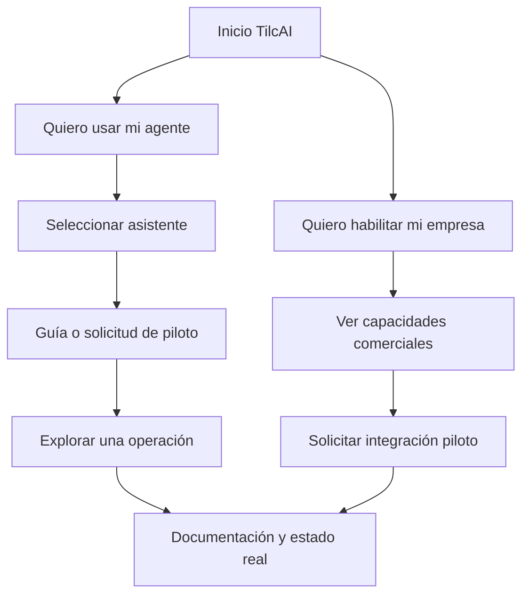
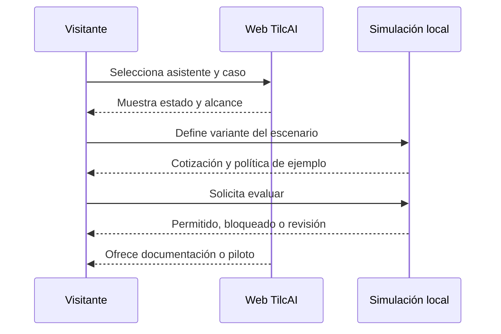

# TilcAI — implementación web y marca · Fase 1

> **Vigencia:** esta es la dirección visual original del 29/09. Para ordenar el relato del pitch y distinguir simulación de evidencia viva, ver el [contexto oficial](0-OFICIAL/CONTEXTO_OFICIAL_TILCAI.md) y la [infraestructura integrada](2-ARQUITECTURA/TILCAI_FLUJO_INTEGRADO_Y_DEMO_2026-10-08.md).

**Documento de diseño, contenido e implementación.**  
**Equipo:** Omar · Jhamil · Saul · Jose.  
**Proyecto que se actualizará:** `1_PROYECTO/IDEA-PROJECT/TilcAI/tilcai-web/`.  
**Repositorio existente:** [TilcAI/tilcai-web](https://github.com/TilcAI/tilcai-web).  
**Base de producto:** [[TILCAI_NUEVO_RUMBO_COMERCIO_AGENTICO_2026-09-29]].

La Fase 1 convierte la web existente en la presentación pública del nuevo rumbo de TilcAI: infraestructura para conectar agentes de personas y empresas con condiciones verificables, autoridad limitada y pagos sobre Stellar.

Este plan define una página impactante y dinámica, pero comprensible y profesional. El diseño debe demostrar cómo se conecta el ecosistema, dar presencia a las empresas participantes y hacer tangible el control humano. No debe confundirse con un marketplace de agentes ni con una agencia de desarrollo de páginas web.

El alcance de este documento es la implementación de la web y su sistema visual. Los servicios de diseño web o chatbots independientes para empresas siguen siendo trabajos externos a TilcAI.

## Índice

1. [[#1. Objetivo y alcance de la Fase 1]]
2. [[#2. Base existente y estrategia de actualización]]
3. [[#3. Dirección creativa y experiencia]]
4. [[#4. Marca TilcAI y rediseño del Tilcayo]]
5. [[#5. Brand kit propuesto]]
6. [[#6. Arquitectura de información y navegación]]
7. [[#7. Estructura completa de la página principal]]
8. [[#8. Cards premium de empresas]]
9. [[#9. Selector de agentes y catálogo extensible]]
10. [[#10. Stickers, GIF y lenguaje de personajes]]
11. [[#11. Sistema de movimiento y scroll]]
12. [[#12. Plan de imágenes, vídeo y recursos 3D]]
13. [[#13. Recorridos y demostración interactiva]]
14. [[#14. Organización técnica en tilcai-web]]
15. [[#15. Contenido, estados y reglas de publicación]]
16. [[#16. Responsive, accesibilidad y rendimiento]]
17. [[#17. Tareas y responsabilidades del equipo]]
18. [[#18. Roadmap de implementación]]
19. [[#19. Criterios de aceptación]]
20. [[#20. Entregables y referencias]]

## 1. Objetivo y alcance de la Fase 1

### 1.1 Objetivo general

Presentar TilcAI como una infraestructura de comercio entre agentes que comienza en Stellar, con una experiencia visual memorable y dos puertas de entrada: personas que quieren utilizar su agente y empresas que quieren habilitar sus capacidades comerciales.

La persona debe comprender en la primera pantalla:

- Qué conecta TilcAI.
- Por qué hace falta control al delegar compras.
- Qué puede explorar ahora.
- Qué está en construcción y qué corresponde a una integración operativa.

### 1.2 Resultado esperado

Una actualización completa de la web existente con:

1. Nueva identidad visual, conservando el nombre TilcAI.
2. Hero con una composición animada de comprador, infraestructura y empresa.
3. Cards premium de empresas y servicios, con estados precisos.
4. Selector de asistentes con recursos visuales y guías por cliente.
5. Explicación visual del flujo comercial y financiero.
6. Simulación interactiva de tres casos de uso.
7. Explicación sencilla de permisos, presupuesto y wallet.
8. Arquitectura, avance de construcción y documentación.
9. Navegación bilingüe ES/EN, responsive y accesible.
10. Recursos optimizados y tareas repartibles entre los cuatro integrantes.

### 1.3 Qué significa Fase 1

Esta fase es una web de presentación, exploración y preparación de pilotos. Puede incluir una simulación funcional en el navegador y un formulario operativo de contacto. La integración real de un asistente, la firma de una compra y la liquidación en Stellar necesitan sus propios criterios de aceptación.

Una página atractiva no convierte automáticamente un conector en operativo. La web reflejará el avance real de cada módulo, sin usar una advertencia extensa en cada tarjeta.

### 1.4 Prioridades

**P0 — indispensables:** mensaje, marca usable, hero, empresas, agentes, flujo, simulación, documentación, móvil y estados correctos.

**P1 — valor visual:** scroll narrativo, stickers originales, recursos prerenderizados, detalles de interacción, perfiles de empresas y guías de conexión.

**P2 — extensiones:** escena 3D interactiva, catálogo de búsqueda más amplio, cuenta de usuario, dashboard o conexión financiera en vivo. No deben retrasar el lanzamiento P0.

## 2. Base existente y estrategia de actualización

### 2.1 Lo que se conserva

El proyecto local ya contiene:

| Pieza | Base actual | Decisión |
| --- | --- | --- |
| Framework | Next.js con App Router, React y TypeScript | Mantener |
| Estilos | Tailwind CSS v4 y CSS semántico en `globals.css` | Evolucionar tokens y componentes |
| Idiomas | `/en` y `/es`, diccionarios tipados | Mantener ambos idiomas |
| Documentación | `/[lang]/docs` | Actualizar al nuevo rumbo |
| Header y footer | Componentes compartidos | Rediseñar sin perder accesibilidad |
| Animación de entrada | `RevealObserver.tsx` | Reutilizar para revelados simples |
| Simulación | `PolicyDemo.tsx` | Ampliar o integrar en el nuevo escenario |
| Metadatos | `metadata.ts`, `site.ts`, Open Graph | Actualizar mensaje y recursos |
| Recursos | Logo WebP, favicon y social image | Conservar originales y añadir nueva familia |
| Dependencias | `pnpm-lock.yaml` existente | Mantener resolución reproducible |

El origen Git existente es `git@github.com:TilcAI/tilcai-web.git`. No crear otro repositorio ni otro proyecto Next.js para este rediseño.

### 2.2 Lo que cambia

El foco anterior era principalmente SDK/gateway, políticas y pago. La nueva página abre con **la interacción comercial entre personas y empresas mediante agentes**, y después explica qué aporta la infraestructura.

Cambiar:

- Mensaje del hero y navegación.
- Orden de secciones.
- Identidad visual del Tilcayo.
- Comparaciones largas por un relato visual más directo.
- Cronología ligada a eventos por un roadmap de capacidades.
- Demo aislada por un recorrido que distingue cotización, autorización, pago y entrega.
- Texto de documentación para alinearlo con el informe de infraestructura.

La lógica de políticas sigue siendo central; cambia su posición narrativa, no su importancia.

### 2.3 Regla de desarrollo

Inspeccionar y reutilizar antes de reemplazar. Extraer secciones de `HomePage.tsx` a componentes pequeños, evitar duplicar diccionarios y conservar rutas públicas cuando sea posible.

`package.json` usa `latest` en varias dependencias. Para esta implementación, acordar versiones explícitas compatibles y mantener el lockfile; no actualizar todo el stack como parte automática del rediseño.

## 3. Dirección creativa y experiencia

### 3.1 Concepto

**“Tu agente. Sus servicios. Una conexión con control.”**

TilcAI aparece como la capa que hace posible una compra coordinada. La página comienza con una representación sencilla de dos lados y construye progresivamente el sistema.

El diseño debe combinar:

- Claridad de una herramienta fintech.
- Precisión de una infraestructura para desarrolladores.
- Cercanía de una marca boliviana con identidad propia.
- Movimiento deliberado, no una colección de efectos.

### 3.2 Personalidad

Segura, inteligente, cercana y sofisticada. El Tilcayo representa atención y agilidad; no debe verse agresivo ni infantil.

Evitar casinos visuales, estética de trading, neón excesivo, interfaces espaciales ilegibles y falsas terminales llenas de código.

### 3.3 Jerarquía de experiencia

1. **Entender:** agentes de personas y empresas conectados.
2. **Reconocer:** negocios y asistentes familiares.
3. **Explorar:** un caso y sus controles.
4. **Confiar:** permisos, condiciones y evidencia.
5. **Actuar:** solicitar un piloto o consultar documentación.

### 3.4 Elementos memorables

- El nuevo símbolo del Tilcayo.
- La escena comprador → TilcAI → empresa.
- El selector de agentes animado.
- Las cards empresariales con identidad propia.
- La pausa visual de aprobación humana.
- Un recibo final que distingue decisión, pago y entrega.

Solo dos o tres recursos dominantes por pantalla. El impacto viene de composición, contraste y ritmo, no de hacer que todo se mueva.

## 4. Marca TilcAI y rediseño del Tilcayo

### 4.1 Dirección recomendada

Conservar **TilcAI** como nombre y desarrollar un **isotipo felino geométrico** acompañado de un wordmark sobrio.

La referencia del oso aporta una dirección útil: símbolo compacto, silueta clara, pocos detalles y una versión de un solo color. Se toma ese principio, no la forma exacta del oso ni su contenedor.

El resultado debe pasar de ilustración de mascota a una marca que funcione en una barra de navegación, favicon, interfaz, documentación y presentación.

### 4.2 Rasgos que debe conservar el felino

- Orejas claramente felinas.
- Perfil o rostro identificable sin depender de manchas pequeñas.
- Hocico y mirada atentos.
- Algún detalle distintivo de la mascota original.
- Relación equilibrada con el nombre TilcAI.

Tilcayo es la identidad de la mascota. El diseño no necesita realizar afirmaciones zoológicas para funcionar como marca.

### 4.3 Tres rutas de exploración

| Ruta | Descripción | Ventaja | Riesgo |
| --- | --- | --- | --- |
| A — perfil felino | Cabeza de perfil con orejas y hocico definidos, contenedor abierto propio | Cercana a la contundencia de la referencia | Evitar que parezca un zorro o copiar el oso |
| B — rostro simétrico | Cara frontal con dos orejas, ojos en negativo y pocos planos | Mayor continuidad con la mascota actual | Demasiados detalles reducen legibilidad |
| C — monograma felino | Una T abstracta con orejas y una abertura que sugiere hocico | Compacto para producto e interfaz | Puede perder personalidad animal |

**Recomendación:** explorar A y B; elegir por pruebas de reconocimiento y reducción, no solo por la versión grande.

### 4.4 Brief para producir la marca

> Diseñar un isotipo original para TilcAI, infraestructura de comercio entre agentes sobre Stellar. Representar un felino inspirado en la mascota Tilcayo mediante una silueta geométrica limpia, inteligente y cercana. Debe funcionar en un solo color, en negativo y a 24 px. Conservar orejas y hocico claramente felinos. Crear un contorno propio, con espacio negativo y equilibrio visual. Evitar pelaje detallado, render 3D, ojos realistas, aspecto agresivo y la copia de la silueta o marco del oso de referencia. Acompañar con el nombre TilcAI en una sans-serif limpia; no alterar la escritura.

Este brief sirve para bocetar. El archivo maestro se construirá como vector limpio; no basta con guardar un PNG dentro de un SVG ni con hacer un trazado automático sin revisión.

### 4.5 Sistema de versiones

- Isotipo solo.
- Wordmark solo.
- Composición horizontal: isotipo + TilcAI.
- Composición vertical para portadas.
- Versión blanca sobre oscuro.
- Versión oscura sobre claro.
- Versión cian sobre oscuro.
- Versión monocromática para documentos.
- Variante de tamaño pequeño, con detalles simplificados.
- Mascota expresiva separada del logo principal.

El logo institucional permanece estable. Los stickers y la mascota animada pueden ser expresivos; no deben deformar el isotipo en cada interacción.

### 4.6 Especificaciones de entrega

| Archivo propuesto | Uso |
| --- | --- |
| `tilcai-symbol.svg` | Interfaz y favicon vectorial |
| `tilcai-lockup-light.svg` | Fondo oscuro |
| `tilcai-lockup-dark.svg` | Fondo claro |
| `tilcai-wordmark.svg` | Lugares sin espacio para símbolo |
| `tilcai-symbol-small.svg` | Reducción |
| `tilcai-brand-sheet.pdf` | Guía visual para el equipo |
| `tilcai-logo-1024.png` | Material raster |
| Favicon y apple-touch-icon | Navegador y móvil |
| Portada social 1200 × 630 | Compartir enlaces |

La hoja de marca define proporción, área de protección y tamaño mínimo después de las pruebas. Como punto de partida, reservar alrededor del símbolo un margen equivalente a un cuarto de su altura.

### 4.7 Pruebas de aprobación

Evaluar a 16, 24, 32, 64 y 256 px, en blanco y negro y sobre ambos fondos. A 16 px puede utilizarse la variante simplificada. El felino debe seguir siendo reconocible sin texto y no confundirse con el logo de un tercero.

No sustituir los originales existentes hasta aprobar la nueva marca y sus versiones.

## 5. Brand kit propuesto

### 5.1 Paleta principal

Dirección recomendada: **obsidiana + cian glacial + blanco**, con ámbar muy dosificado como continuidad con la identidad anterior.

| Token | Color | Uso |
| --- | --- | --- |
| `background` | `#080C12` | Fondo general |
| `background-alt` | `#0C131D` | Alternancia de secciones |
| `surface` | `#121C29` | Cards y paneles |
| `surface-raised` | `#192638` | Panel seleccionado |
| `text-primary` | `#F4F8FC` | Títulos y texto principal |
| `text-secondary` | `#B7C6D8` | Texto explicativo |
| `text-muted` | `#91A3B8` | Metadatos |
| `brand` | `#35D6ED` | Conexión, selección y acciones |
| `brand-deep` | `#127FA0` | Recursos decorativos y profundidad |
| `heritage-amber` | `#DCAA66` | Firma de marca o foco puntual |
| `positive` | `#74D6B0` | Permitido o confirmado |
| `attention` | `#E7C37D` | Requiere revisión |
| `negative` | `#EE969F` | Bloqueo o error |

Distribución orientativa: 75 % superficies oscuras, 18 % texto y elementos neutros, 6 % cian y 1 % ámbar. No convertir todos los bordes en neón.

El texto del CTA principal será oscuro sobre fondo cian. `brand-deep` es decorativo; no usarlo como texto pequeño sobre oscuro. Los contrastes se comprobarán en las combinaciones reales.

Estos son colores propios de TilcAI, no una declaración de pertenencia a la identidad oficial de Stellar.

### 5.2 Tipografía

Mantener **Geist Sans** y **Geist Mono**, ya presentes en el proyecto.

- Sans: titulares, navegación, contenido y cards.
- Mono: montos, identificadores abreviados, estados técnicos y fragmentos de configuración.
- No usar mono para todos los párrafos.
- Wordmark: tratamiento gráfico propio, sin deformar una tipografía al azar.

Escala inicial:

| Elemento | Escritorio | Móvil |
| --- | --- | --- |
| Hero | 64–76 px | 38–46 px |
| Título de sección | 38–48 px | 28–34 px |
| Título de card | 20–24 px | 20–22 px |
| Texto principal | 18–20 px | 17–18 px |
| Texto secundario | 15–16 px | 15–16 px |
| Etiquetas | 12–14 px | 12–14 px |

Limitar titulares a unas 10–14 palabras y párrafos de introducción a unas 35–50. La documentación conserva el detalle técnico.

### 5.3 Superficies y composición

- Contenedor: aproximadamente 1200–1280 px.
- Espaciado base: múltiplos de 4 y 8.
- Cards: radio 20–24 px; botones 12–14 px.
- Bordes: 1 px, blanco con 10–16 % de opacidad.
- Glow: localizado y de baja opacidad.
- Sombra: suave, no un halo permanente.
- Separación de secciones: 88–120 px en escritorio; 56–80 px en móvil.
- Iconos: una sola familia lineal, trazo consistente.
- Panel claro opcional para contraste editorial; no mezclar múltiples temas.

### 5.4 Voz de marca

Directa, humana y concreta.

Usar: “Conecta”, “Explora”, “Define un límite”, “Revisa la oferta”, “Solicita un piloto”.

Evitar: “revolucionario”, “sin riesgos”, “confianza garantizada”, “cualquier agente puede comprar cualquier cosa” y “pagos totalmente autónomos” como promesa general.

## 6. Arquitectura de información y navegación

### 6.1 Sitio inicial

```text
/en y /es
├── Inicio
│   ├── Cómo funciona
│   ├── Empresas
│   ├── Agentes
│   ├── Explorar escenario
│   ├── Control
│   └── Estado de construcción
├── /docs
│   ├── Arquitectura
│   ├── Integración empresarial
│   ├── MCP y asistentes
│   └── Permisos y pagos
├── /agents/[slug]       si hay guía suficiente
├── /businesses/[slug]   solo perfiles aprobados
├── /contact            si el contacto necesita ruta propia
└── Privacidad / condiciones según funciones publicadas
```

Las rutas nuevas son propuestas. Las rutas actuales `/en`, `/es` y `/[lang]/docs` se mantienen.

### 6.2 Navegación principal

**Cómo funciona · Empresas · Agentes · Docs**

CTA destacado: **Solicitar piloto**. Selector ES/EN visible. Header sticky discreto con fondo translúcido.

No colocar siete u ocho enlaces en el header. Seguridad, roadmap y equipo pueden quedar en anchors secundarios o footer.

### 6.3 Dos recorridos



El selector no es una autorización financiera y el formulario no es un alta automática como proveedor habilitado.

## 7. Estructura completa de la página principal

### 7.1 Sección 01 — hero

**Eyebrow:** “Infraestructura de comercio entre agentes · Stellar”.

**Titular recomendado:**  
“Tu agente compra. Tu empresa responde. Tú mantienes el control.”

**Texto:**  
“Construimos la conexión entre agentes de personas y empresas para consultar, reservar y comprar con condiciones verificables, permisos limitados y pagos sobre Stellar.”

**CTA principal:** “Explorar cómo funciona”.  
**CTA secundario:** “Habilitar mi empresa”.

El CTA secundario lleva al recorrido de piloto, no a una herramienta de pagos inexistente.

**Composición:**

- Columna de texto clara.
- Escena principal con tres nodos: asistente comprador, TilcAI, agente empresarial.
- Mensaje de ejemplo: “Dos entradas para el miércoles, hasta 12 USDC”.
- Tarjeta empresarial con disponibilidad y cotización.
- Capa visible de control: “Requiere tu aprobación”.
- Ilustración/escena marcada discretamente como “Flujo ilustrativo”.

**Movimiento:** aparición de nodos y conexión progresiva; una pulsación de estado, no mensajes infinitos ni pago automático simulado como real.

En móvil: texto arriba, composición compacta debajo. No ocultar el titular para favorecer el vídeo.

### 7.2 Sección 02 — qué es TilcAI

**Titular:** “Una conexión entre tu intención y la operación del negocio.”

Tres bloques:

1. **Tu agente:** interpreta la solicitud.
2. **TilcAI:** coordina condiciones, permisos y operación.
3. **La empresa:** ofrece capacidades reales y cumple el servicio.

Texto de cierre: “No necesitas comprar otro agente. Necesitas conectar el que utilizas con servicios preparados para interactuar.”

Aclarar en apoyo: “La disponibilidad depende del asistente y de la integración del negocio.”

### 7.3 Sección 03 — empresas participantes

**Titular:** “Empresas preparándose para atender a tus agentes.”

Cuadrícula premium de empresas, cuatro por fila en pantallas amplias, con banners, identidad y servicio. La sección puede evolucionar a “Empresas conectadas” cuando haya conexiones operativas.

Filtros simples por categoría, solo cuando haya suficientes datos: servicios digitales, reservas, comercio, experiencias. No añadir filtros vacíos.

Cada empresa tendrá estado específico: relación comercial, piloto o conexión técnica. No agrupar todo como “integrado”.

Acción por card:

- “Conocer empresa” si solo hay perfil.
- “Explorar caso” si hay simulación asociada.
- “Consultar servicio” si la consulta funciona realmente.
- “Comprar” solo después de habilitar el flujo operativo.

Si todavía no hay perfiles públicos aprobados, mostrar una invitación a piloto. Los fixtures de diseño quedan identificados en preview y no se publican como aliados reales.

### 7.4 Sección 04 — elige tu agente

**Titular:** “Usa el asistente con el que ya trabajas.”

Grid inicial de seis clientes: **Codex, Claude Code, OpenCode, Gemini CLI, Cursor y GitHub Copilot en VS Code**.

Cada card muestra:

- Nombre correcto del producto.
- Identidad visual oficial estática o recurso propio asociado.
- Animación complementaria.
- Superficie concreta: CLI, editor o aplicación.
- Estado TilcAI.
- “Ver configuración” o “Solicitar acceso piloto”.

Control “Ver más asistentes” para ampliar sin hacer una pared de logos.

**Importante:** Claude Code y Claude Desktop no son la misma superficie. Codex y ChatGPT tampoco son una sola configuración universal.

### 7.5 Sección 05 — scroll narrativo del flujo

**Titular:** “De una solicitud a una compra comprobable.”

Cinco capítulos:

1. **Pide:** el usuario define tarea y restricciones.
2. **Consulta:** el agente accede a las capacidades del negocio.
3. **Comprueba:** identidad, condiciones, destinatario y presupuesto.
4. **Autoriza:** aprobación exacta o mandato limitado.
5. **Ejecuta y confirma:** pago conciliado y cumplimiento comercial.

En escritorio: panel gráfico sticky con texto que cambia de capítulo mediante el scroll natural. En móvil: pasos apilados, sin panel que ocupe toda la pantalla.

Máximo dos tarjetas explicativas simultáneas. El plano de comunicación y el plano financiero deben verse como cosas relacionadas pero distintas.

Un recibo de pago no se presenta como prueba suficiente de entrega.

### 7.6 Sección 06 — explora una operación

**Titular:** “Mira qué cambia cuando hay reglas.”

Tres escenarios del informe:

- Dos entradas de cine, con aprobación por compra.
- Servicio digital, con un mandato limitado.
- Compra programada, con presupuesto compartido.

El usuario elige un caso y ve solicitud, cotización, restricciones y resultado simulado.

Variantes: condiciones válidas, destinatario cambiado y monto fuera del límite. Puede añadir “requiere aprobación”.

Rotular: **“Simulación interactiva · sin movimientos de fondos”**.

En el estado permitido usar **“Puede continuar”** o **“Compra permitida en este escenario”**. No mostrar “Pago realizado” sin una transferencia real.

La simulación debe detenerse para que se entiendan las decisiones; no ser un vídeo que ignora las elecciones del usuario.

### 7.7 Sección 07 — control del usuario

**Titular:** “Delegas una tarea. No el control total de tu dinero.”

Tres paneles:

- **Qué puede hacer:** servicios y proveedores permitidos.
- **Cuánto puede gastar:** límite por operación y presupuesto compartido.
- **Cuándo se detiene:** aprobación, expiración, pausa o revocación.

Mostrar un control visual de presupuesto y una pantalla ilustrativa de permiso. No pedir seed phrases ni presentar el login como autorización de gasto.

Microcopy: “Empezamos con aprobación por compra. La delegación mediante cuentas inteligentes se habilita por etapas.”

No prometer que un botón revoca una operación ya liquidada.

### 7.8 Sección 08 — capacidades para empresas

**Titular:** “Tus servicios, disponibles para una nueva forma de comprar.”

Cuatro capacidades:

1. Catálogo y condiciones.
2. Disponibilidad y reservas.
3. Cotizaciones/ofertas firmadas.
4. Órdenes, pagos y confirmación.

Mostrar cómo el adaptador comercial consulta la fuente de verdad del negocio. TilcAI no reemplaza automáticamente su inventario, sistema de tickets ni facturación.

CTA: “Evaluar un piloto con mi empresa”.

Esta sección habla de infraestructura comercial, no de paquetes de construcción de webs.

### 7.9 Sección 09 — tecnología y arquitectura

**Titular:** “Una infraestructura común. Responsabilidades claras.”

Diagrama compacto:

**MCP / adaptador → gateway → identidad y política → autorización → x402 / Stellar → conciliación y recibos.**

Etiquetas de tecnologías: Stellar, Soroban, USDC, x402, OpenZeppelin Relayer, MCP. A2A y ERC-8004 pueden aparecer con estado de extensión prevista.

Presentar tecnologías utilizadas o evaluadas, no logotipos de patrocinadores. ERC-8004 no es un contrato nativo de Stellar ni una garantía de confianza.

Enlace: “Leer la arquitectura completa”.

Los snippets son complementarios en docs; no deben dominar el hero.

### 7.10 Sección 10 — estado y roadmap

**Titular:** “Construimos por capacidades, no por promesas.”

Tres columnas:

- **Base disponible:** riel x402 con OpenZeppelin Relayer sobre Stellar; evaluador determinista de políticas.
- **En integración:** conector, condiciones comerciales, órdenes, autorización por compra y conciliación.
- **Siguiente evolución:** smart accounts, presupuesto multiagente y tareas programadas.

Esta clasificación inicial procede del informe interno. Cada elemento tendrá un responsable de mantenerlo actualizado.

Distinguir componente disponible de flujo de compra completo. Evitar fechas públicas rígidas antes de acordarlas con el equipo.

### 7.11 Sección 11 — equipo y preguntas frecuentes

Equipo compacto: Omar, Jhamil, Saul y Jose, con responsabilidades comprensibles. No llenar esta sección con listas de todas las tecnologías de cada uno.

FAQ recomendadas:

1. ¿Necesito cambiar de asistente?
2. ¿TilcAI crea una wallet para cada agente?
3. ¿Mi agente puede gastar sin preguntarme?
4. ¿Cómo se conecta una empresa?
5. ¿Qué funciona hoy?
6. ¿La simulación realiza pagos?
7. ¿Por qué Stellar?
8. ¿Qué pasa si el pago se confirma pero el servicio no se entrega?

Explicar las respuestas con el mismo criterio del informe, en 40–80 palabras cada una.

### 7.12 Sección 12 — CTA final y footer

**Titular:** “Conectemos una operación real.”

Dos acciones:

- “Quiero participar como usuario”.
- “Quiero habilitar mi empresa”.

Contacto mínimo: nombre, correo, tipo de participante y necesidad. Para empresa, nombre y categoría. No solicitar documentos, claves o datos financieros en este formulario.

Si el envío todavía no tiene backend, utilizar un canal de contacto real claramente indicado; nunca mostrar éxito sin persistencia o entrega.

Footer: marca, documentación, GitHub, contacto, idioma y privacidad. Añadir aviso de marcas de terceros y una línea breve de etapa.

### 7.13 Wireframe general

```text
┌─────────────────────────────────────────────────────┐
│ TilcAI   Cómo funciona  Empresas  Agentes  Docs  ES/EN│
├─────────────────────────────────────────────────────┤
│ TITULAR + CTA             Escena agente ↔ TilcAI ↔  │
│ Mensaje principal         agente empresarial         │
├─────────────────────────────────────────────────────┤
│ Qué es: tu agente / infraestructura / empresa        │
├─────────────────────────────────────────────────────┤
│ Empresas: [card] [card] [card] [card]                 │
│           [card] [card] [card] [card]                 │
├─────────────────────────────────────────────────────┤
│ Agentes: personajes + nombre + estado + acción       │
├─────────────────────────────────────────────────────┤
│ Capítulos del flujo       Panel gráfico sticky       │
├─────────────────────────────────────────────────────┤
│ Escenarios: cine / servicio / compra programada      │
├─────────────────────────────────────────────────────┤
│ Control: permiso / presupuesto / pausa               │
├─────────────────────────────────────────────────────┤
│ Empresas: catálogo / reserva / orden / cumplimiento   │
├─────────────────────────────────────────────────────┤
│ Arquitectura + capacidades + estado de construcción  │
├─────────────────────────────────────────────────────┤
│ Equipo + FAQ                                        │
├─────────────────────────────────────────────────────┤
│ CTA usuario / CTA empresa · Footer                   │
└─────────────────────────────────────────────────────┘
```

## 8. Cards premium de empresas

### 8.1 Anatomía

1. Banner de proporción aproximada 16:9.
2. Logo en una placa pequeña, con fondo compatible.
3. Nombre y categoría.
4. Servicio concreto en una línea.
5. Ubicación o modalidad.
6. Estado.
7. Acción principal.

Ejemplo de contenido ilustrativo:

> Empresa de cine  
> Entradas y reservas · La Paz  
> “Consulta funciones y disponibilidad.”  
> Piloto de integración  
> Explorar caso

No inventar nombres empresariales para presentarlos como aliados.

### 8.2 Tratamiento visual

- Banner real autorizado, recorte editorial cuidado.
- Borde fino, radio 22 px.
- Logo sin filtros que deformen su identidad.
- Hover: elevación de 4 px y borde ligeramente más visible.
- Foco de teclado con la misma jerarquía que hover.
- Sin vídeos simultáneos en todas las cards.
- Sin caras stock, cityscapes aleatorios ni imágenes que sugieran una empresa distinta.
- Altura consistente sin recortar servicios importantes.
- Categorías discretas; no más de dos badges por card.

### 8.3 Grid

- 1200 px o más de viewport: cuatro columnas si cada card conserva al menos unos 250 px útiles.
- Tablet amplia: tres columnas.
- Tablet pequeña: dos.
- Móvil: una columna.
- Gap: 20–24 px.
- No convertir toda la sección en carrusel obligatorio.

Puede existir una fila editorial destacada; el catálogo principal permanece en grid como se ha definido.

### 8.4 Datos propuestos

```ts
type BusinessProfile = {
  id: string;
  slug: string;
  name: string;
  category: string;
  locationLabel?: string;
  logoAsset: string;
  bannerAsset: string;
  serviceSummaryKey: string;
  relationship: "participant" | "partner";
  connection: "planned" | "pilot" | "testnet" | "live";
  publicationApproved: boolean;
  mediaApproved: boolean;
  action: "profile" | "scenario" | "inquiry" | "purchase";
};
```

Es un esquema de contenido propuesto, no un modelo contractual. Solo publicar perfiles con aprobación y recursos habilitados para ese uso.

Una relación de colaboración no equivale a una conexión de pagos. `relationship` y `connection` se gestionan por separado.

## 9. Selector de agentes y catálogo extensible

### 9.1 Enfoque

Construir un catálogo extensible de **clientes de agentes/asistentes**, no una lista de todos los modelos de IA.

“Todos los agentes que existen” no es un alcance finito. La web debe poder añadir nuevos clientes sin cambiar el diseño ni presentar soporte universal.

Un modelo como GPT, Claude, Gemini o Llama puede estar dentro de distintas aplicaciones. La configuración se hace sobre una aplicación o cliente concreto.

### 9.2 Prioridad inicial

**Primer grupo visible:** Codex, Claude Code, OpenCode, Gemini CLI, Cursor y GitHub Copilot en VS Code.

**Segundo grupo:** Cline, Continue, Cascade, Kiro y Amazon Q Developer.

**Expansión:** Claude Desktop y clientes MCP propios, con su superficie de conexión documentada. Otros asistentes pueden añadirse tras revisar sus interfaces reales.

El catálogo no implica que esos productos estén ya conectados a TilcAI.

### 9.3 Matriz técnica

Las fuentes de esta tabla documentan capacidad MCP del cliente, no certificación ni integración TilcAI.

| Cliente o superficie | Base de conexión documentada | Tratamiento inicial TilcAI |
| --- | --- | --- |
| Codex | [MCP en clientes Codex](https://learn.chatgpt.com/docs/extend/mcp?surface=cli) | Prioridad de piloto; probar transporte y autorización |
| Claude Code | [Conexión MCP](https://code.claude.com/docs/en/mcp) | Prioridad de piloto |
| OpenCode | [Servidores MCP](https://opencode.ai/docs/mcp-servers/) | Prioridad de piloto |
| Gemini CLI | [Herramientas MCP](https://geminicli.com/docs/tools/mcp-server/) | Candidato de primera tanda |
| Cursor | [MCP](https://cursor.com/docs/mcp) | Candidato de primera tanda |
| GitHub Copilot en VS Code | [Servidores MCP en VS Code](https://code.visualstudio.com/docs/agent-customization/mcp-servers) | Guía específica para la superficie VS Code |
| Cline | [MCP](https://docs.cline.bot/mcp/mcp-overview) | Segundo grupo |
| Continue | [Servidores MCP](https://docs.continue.dev/customize/mcp-tools) | Segundo grupo |
| Cascade, documentado en Devin Desktop | [Integración MCP](https://docs.devin.ai/desktop/cascade/mcp) | Revisar nombre/superficie antes de publicar |
| Kiro | [Herramientas MCP](https://kiro.dev/docs/mcp/usage/) | Segundo grupo |
| Amazon Q Developer | [MCP](https://docs.aws.amazon.com/amazonq/latest/qdeveloper-ug/qdev-mcp.html) | Segundo grupo; revisar relación con superficie Kiro |
| Claude Desktop | [MCP en productos Anthropic](https://docs.claude.com/en/docs/mcp) | Entrada separada de Claude Code |

Los nombres y superficies se mantendrán actualizados: no duplicar una misma experiencia porque una marca haya cambiado.

Clientes como ChatGPT u otros asistentes de consumo pueden requerir conectores/plugins y disponibilidad específica de producto. No heredan una guía de Codex ni se publican como conectados por compartir proveedor.

### 9.4 Estados del catálogo

- **En preparación:** entrada de catálogo, sin guía operativa.
- **Guía disponible:** instrucciones probadas para la configuración descrita.
- **Piloto:** flujo limitado validado con TilcAI.
- **Habilitado:** servicio accesible en la superficie y entorno indicados.

Indicar entorno: simulación, Testnet o producción. No usar el badge verde “Compatible” como sustituto de esta información.

### 9.5 Interacción

Al elegir una card:

1. Abrir panel o página del cliente.
2. Explicar para qué sirve la conexión.
3. Mostrar requisitos y entorno.
4. Mostrar instrucciones solo cuando estén probadas.
5. Ofrecer copiar configuración sin secretos.
6. Llevar al acceso piloto o documentación.

No abrir automáticamente una app local, instalar extensiones ni copiar credenciales sin una acción explícita.

El usuario selecciona un cliente, no compra una mascota ni delega fondos en ese clic.

### 9.6 Qué hace MCP aquí

MCP expone herramientas TilcAI al asistente comprador. La coordinación con la empresa corresponde al gateway/adaptador comercial y, por etapas, A2A. Tener MCP no significa que el asistente externo tenga A2A nativo ni pagos Stellar incorporados.

La guía de cada cliente incluirá:

- Transporte probado.
- Autenticación requerida.
- Herramientas visibles.
- Operaciones que requieren aprobación.
- Entorno y límites.
- Procedimiento de desconexión.

## 10. Stickers, GIF y lenguaje de personajes

### 10.1 Sistema recomendado

Separar tres capas:

1. **Marca oficial del cliente:** logo o nombre usado de forma fiel.
2. **Compañero visual original:** sticker propio de TilcAI que acompaña esa opción.
3. **Estado de interfaz:** disponible, seleccionado, procesando o requiere revisión.

La animación principal puede ser propia sin convertir un logo ajeno en una mascota inventada “oficial”.

### 10.2 Dirección de personajes

- Codex: compañero abstracto de terminal, visor y geometría clara.
- Claude Code: compañero editorial de formas suaves y tono cálido, sin copiar una mascota protegida.
- OpenCode: figura modular abierta, líneas ligeras.
- Gemini CLI: compañero luminoso geométrico.
- Cursor: compañero con gesto direccional.
- Copilot: compañero tipo visor simplificado de diseño original.

Estos son conceptos de ilustración TilcAI, no nuevas versiones oficiales de sus marcas. Mantener el nombre del cliente visible y no atribuirle el personaje como identidad oficial.

Si se obtiene un asset oficial animado con uso permitido, puede reemplazar al compañero. No modificar logos añadiendo brazos, piernas u ojos sin revisar las condiciones de marca.

### 10.3 Biblioteca de estados

Para cada compañero:

- Idle: respiración/levitación muy leve.
- Hover/focus: saludo corto.
- Selected: confirmación visual.
- Connecting: gesto de atención.
- Review: pausa/espera.
- Poster estático: alternativa universal.

No hace falta producir seis estados para once clientes antes de lanzar. P0 puede usar posters e interacción de escala; P1 añade animaciones a los seis principales.

### 10.4 Formatos

| Recurso | Formato recomendado | Uso |
| --- | --- | --- |
| Logo oficial o TilcAI | SVG limpio | Marca |
| Sticker estático original | WebP/PNG con transparencia | Poster |
| Animación sencilla | SVG/CSS o Motion | Gestos y estados |
| Animación compleja | Vídeo WebM con alternativa MP4 | Loop breve |
| Animación vectorial especializada | Lottie, si compensa su peso | Personaje elaborado |
| GIF | Solo alternativa o difusión | Evitar como formato principal de la web |

La transparencia de vídeo se probará en los navegadores objetivo. Cuando no funcione, usar fondo integrado o poster; no depender de alpha universal.

### 10.5 Comportamiento

- Activar movimiento cuando la sección está visible.
- Pausar animaciones fuera del viewport.
- En grid, animar preferentemente la card activa, no once loops a la vez.
- Respetar movimiento reducido.
- Evitar destellos, saltos continuos o gestos infantiles.
- Proporcionar control para detener movimiento continuo.
- No reproducir sonidos.

### 10.6 Producción de recursos

Cada asset debe llevar en el inventario: autor/origen, permiso de uso, versión, formatos, poster, tamaño, fallback y contexto de uso.

Los personajes de TilcAI se diseñan como una familia consistente, no como imágenes generadas por separado sin dirección común. El logo de TilcAI necesita un maestro vectorial; una ilustración generada puede servir como boceto o recurso decorativo, no como prueba de calidad vectorial.

## 11. Sistema de movimiento y scroll

### 11.1 Principio

La animación explica relaciones o confirma acciones. El scroll conserva su comportamiento natural.

No secuestrar el scroll, no convertir la página completa en slides y no depender de animación para acceder al contenido.

### 11.2 Tabla de motion

| Elemento | Movimiento | Duración orientativa | Condición |
| --- | --- | --- | --- |
| Hero | Opacidad y desplazamiento 12–20 px | 450–650 ms | Una vez |
| Cards de empresa | Entrada escalonada 40–60 ms | 350–450 ms | Una vez por grupo |
| Hover/focus | Elevación hasta 4 px | 160–220 ms | Interacción |
| Conexiones del flujo | Trazo progresivo | 400–700 ms | Cambio de capítulo |
| Panel sticky | Cambio de estado; desplazamiento mínimo | 250–400 ms | Scroll |
| Selección de agente | Borde, foco y gesto corto | 180–300 ms | Interacción |
| Escenario | Transición entre estados | 220–350 ms | Botón |
| Mascota | Loop de 3–5 s muy leve | Variable | Solo visible y con control |

Usar easing suave de salida o springs con amortiguación alta. No hacer rebotar botones financieros.

### 11.3 Implementación recomendada

Conservar `RevealObserver` para entradas sencillas. Para la escena y scroll narrativo, evaluar **Motion for React** como una dependencia única de animación. Su documentación distingue animaciones activadas por scroll de animaciones ligadas a su progreso. [Referencia oficial de scroll](https://motion.dev/docs/react-scroll-animations).

No instalar Motion, GSAP, Lottie y un motor 3D solo para obtener revelados. Elegir la herramienta por necesidad y fijar la versión utilizada.

La variante de movimiento reducido se diseña junto con la normal: escenas estáticas, cambios de opacidad suaves o cambio inmediato de estado, sin parallax. [Guía de accesibilidad de Motion](https://motion.dev/docs/react-accessibility).

### 11.4 Scroll narrativo

- Una escena sticky, no toda la página.
- Altura limitada y capítulos legibles.
- Activación por visibilidad de cada capítulo.
- El dibujo acompaña el texto; no modifica datos de la simulación.
- Móvil y pantallas de poca altura: versión apilada.
- Al navegar con anchors, el header no tapa el título.
- Si no carga JavaScript, todos los pasos siguen visibles.

### 11.5 Lo que se evita

Zoom constante, cursores gigantes, partículas detrás de párrafos, fondos con vídeos de alta frecuencia, contenido oculto hasta alcanzar una posición exacta, textos que cambian antes de leerse y una transición distinta por sección.

## 12. Plan de imágenes, vídeo y recursos 3D

### 12.1 Inventario propuesto

| Recurso | Dirección | Formato | Prioridad |
| --- | --- | --- | --- |
| Nuevo logo | Felino geométrico original | SVG + PNG | P0 |
| Hero | Dos agentes conectados por núcleo TilcAI | SVG/composición DOM | P0 |
| Hero de profundidad | Núcleo translúcido y nodos, sin textos incrustados | Render 3D en WebP o vídeo corto | P1 |
| Empresas | Banner real, producto o espacio autorizado | WebP/AVIF | P0 |
| Agentes | Marca fiel + compañero original | SVG + poster | P0 |
| Loops de agentes | Gestos de familia coherente | WebM/MP4 | P1 |
| Tres casos | Cine, servicio digital y compras recurrentes | Ilustración propia | P1 |
| Control | Permiso, presupuesto y recibo | UI en HTML/SVG | P0 |
| Arquitectura | Nodos y conexiones | HTML/SVG | P0 |
| Social image | Tilcayo + mensaje + flujo | 1200 × 630 | P0 |
| Clip de presentación | Resumen visual de la infraestructura | Vídeo 12–18 s, sin audio automático | P2 |

### 12.2 Dirección 3D

Objetos abstractos de pocos materiales: vidrio oscuro, metal mate y trazos cian. El núcleo TilcAI conecta dos tarjetas, no una esfera blockchain genérica.

P0 utiliza composición HTML/SVG. P1 puede incorporar un render prerenderizado para profundidad; evita cargar WebGL solo para un objeto decorativo.

P2 puede evaluar 3D interactivo si hay un beneficio claro y se conserva una versión estática. La escena no compite con la lectura ni intercepta gestos táctiles.

### 12.3 Brief de hero

> Composición premium para TilcAI: un nodo comprador a la izquierda, un núcleo central con espacio para el símbolo Tilcayo y un nodo empresarial a la derecha. Conexiones discretas cian sobre fondo obsidiana, materiales mate y cristal sutil, iluminación controlada, espacio negativo amplio. Sin texto, sin logos de terceros, sin monedas flotantes, sin robots stock, sin estética de videojuego. Generar fondo/objetos decorativos; la información y las marcas se superponen en HTML.

### 12.4 Brief de casos

> Crear tres ilustraciones coherentes con el brand kit TilcAI: reserva de entradas de cine, compra de un servicio digital y compra recurrente de una organización. Mismos materiales, iluminación y encuadre; composiciones simples sin texto. Representar el servicio, no un supuesto negocio aliado. Mantener fondos oscuros y acentos cian. La interfaz y los montos se añaden como elementos reales de la página.

### 12.5 No inventar evidencia visual

No generar fotografías de supuestos clientes, logos de aliados inexistentes, pantallas con transacciones que parezcan reales o tickets válidos. Las imágenes propias pueden explicar un caso; la evidencia de integración debe proceder de la operación real.

## 13. Recorridos y demostración interactiva

### 13.1 Recorrido usuario



Este recorrido no llama a una wallet ni mueve fondos. Elegir un asistente cambia contexto y guía, no ejecuta código dentro de ese asistente.

### 13.2 Recorrido empresa

1. Explora las capacidades.
2. Consulta requisitos del piloto.
3. Envía una solicitud por un canal operativo.
4. El equipo revisa servicio, fuente de datos y condiciones.
5. Se implementa el adaptador y se prueban órdenes/pagos.
6. Se actualiza el estado público del perfil.

No automatizar el alta financiera desde un formulario de marketing.

### 13.3 Simulación en Fase 1

Ampliar la base de `PolicyDemo.tsx`:

- Tres casos seleccionables.
- Fixture claro de solicitud y cotización.
- Política legible.
- Condición alterada o monto fuera de límite.
- Decisión y motivo.
- Diferencia entre “permitido” y “pagado”.
- Paso de aprobación humana cuando corresponda.
- Botón reiniciar.
- Estado anunciado de forma accesible, sin leer todo el diagrama en cada cambio.

No habilitar un botón de “pagar” que solo cambia un badge.

### 13.4 Conexión posterior a tilcai-core

Separar desde el diseño `demoMode = visual | policy | testnet`.

- **visual:** escenarios ilustrativos, sin motor externo.
- **policy:** utiliza un evaluador real en un entorno definido; sigue sin liquidar fondos.
- **testnet:** integra autorización y pago de prueba con evidencia real.

La etiqueta visible depende del modo implementado. No es un selector público para aparentar capacidades.

Si se integra el evaluador, las reglas deben ejecutarse efectivamente; no inferir soporte de firmas, identidad o contratos a partir de ALLOW/DENY.

### 13.5 Coherencia del cierre

**Oferta auténtica + dentro de política + autorización válida → puede avanzar al pago.**

**Oferta alterada o fuera de política → bloquea.**

**Pago confirmado + servicio cumplido → operación completada.**

No reducir estas tres condiciones a “firma válida = compra autorizada”.

## 14. Organización técnica en tilcai-web

### 14.1 Componentes propuestos

```text
tilcai-web/
├── src/
│   ├── app/
│   │   ├── globals.css
│   │   └── [lang]/
│   │       ├── page.tsx
│   │       ├── docs/page.tsx
│   │       ├── agents/[slug]/page.tsx       P1
│   │       └── businesses/[slug]/page.tsx  P1
│   ├── components/
│   │   ├── HomePage.tsx                   composición de secciones
│   │   ├── SiteHeader.tsx
│   │   ├── SiteFooter.tsx
│   │   ├── sections/
│   │   │   ├── HeroSection.tsx
│   │   │   ├── ProductOverview.tsx
│   │   │   ├── BusinessSection.tsx
│   │   │   ├── AgentSection.tsx
│   │   │   ├── FlowSection.tsx
│   │   │   ├── ScenarioSection.tsx
│   │   │   ├── ControlSection.tsx
│   │   │   ├── BusinessCapabilities.tsx
│   │   │   ├── InfrastructureSection.tsx
│   │   │   ├── RoadmapSection.tsx
│   │   │   └── ContactSection.tsx
│   │   ├── businesses/BusinessCard.tsx
│   │   ├── agents/AgentCard.tsx
│   │   ├── agents/AgentGuidePanel.tsx
│   │   ├── motion/ScrollFlow.tsx
│   │   ├── media/AnimatedCompanion.tsx
│   │   └── demo/ScenarioExplorer.tsx
│   └── lib/
│       ├── i18n/                         diccionarios ES/EN existentes
│       ├── content/
│       │   ├── agents.ts
│       │   ├── businesses.ts
│       │   └── capabilities.ts
│       ├── demo/scenarios.ts
│       ├── metadata.ts
│       └── site.ts
├── public/
│   └── assets/
│       ├── brand/
│       ├── agents/
│       ├── businesses/
│       ├── illustrations/
│       ├── video/
│       └── social/
└── pnpm-lock.yaml
```

Crear carpetas conforme se implementan; no llenar el repositorio de archivos vacíos para cumplir un árbol.

### 14.2 Server y client components

Mantener texto, estructura y datos editoriales renderizables en servidor. Los componentes interactivos pequeños controlan selector, simulación y motion.

No convertir todo `HomePage` en client component por una escena animada. El lector debe recibir contenido útil aunque una animación tarde en cargar.

### 14.3 Contenido tipado

Una fuente de datos por empresas, una por clientes y una por capacidades.

Los textos localizados van en los diccionarios existentes. Evitar nombres de empresas copiados en varios componentes y traducciones técnicas inconsistentes.

Cada cliente requiere slug, superficie, documentación oficial, estado TilcAI, entorno, guía, asset y fallback. Cada empresa requiere estado comercial y técnico separado.

### 14.4 Dependencias

Mantener las existentes. Evaluar una biblioteca de motion; no añadir motor 3D o Lottie hasta necesitar un recurso concreto.

Para imágenes, usar el sistema de imágenes del proyecto y definir tamaños. Recursos de marcas y empresas se almacenan localmente solo con uso permitido; no depender de hotlinks ni scrapear logos arbitrarios.

### 14.5 Formularios y seguridad

Si se implementa formulario:

- Validación cliente y servidor.
- Límites de tamaño y frecuencia.
- Protección antispam.
- Minimización de datos.
- Estado de envío verdadero.
- Política de conservación y acceso interno.
- Secretos exclusivamente del lado servidor.
- Enlaces de assets y datos renderizados con validación.

No introducir datos de formularios en los bloques HTML de documentación que actualmente usan contenido de confianza.

La web de marketing no almacena claves privadas, tokens financieros ni mandatos de gasto en una base de contactos.

### 14.6 Despliegue

Continuar sobre el proyecto y despliegue actuales. Crear una preview del rediseño antes de reemplazar producción. Conservar URLs o definir redirecciones de anchors/rutas afectadas.

Actualizar Open Graph, favicon, títulos, descriptions, idioma, enlaces GitHub y documentación. Comprobar que la web publicada representa el mismo rumbo que el informe.

## 15. Contenido, estados y reglas de publicación

### 15.1 Separar tres tipos de afirmación

| Tipo | Ejemplo | Regla |
| --- | --- | --- |
| Propuesta de valor | “Conectar agentes de personas y empresas” | Explica propósito |
| Capacidad implementada | “Guía MCP probada en este cliente” | Requiere evidencia concreta |
| Evolución | “Delegación con smart accounts” | Lleva etapa, no se presenta como activa |

Evitar un bloque gigante de negaciones. Usar una etiqueta de etapa bien ubicada y estados específicos donde importan.

### 15.2 Reglas para logos y marcas

- Nombre de cliente no implica partnership.
- Logo Stellar no implica patrocinio.
- Logo de empresa no implica compra disponible.
- No añadir BAF ni otras organizaciones como socios del producto por una postulación.
- Logos oficiales sin recoloreado o deformación arbitrarios.
- Si las condiciones de uso no permiten un asset, usar nombre textual e iconografía propia.
- Mantener una nota de terceros en el footer.

Esto es una regla editorial y de gestión de recursos; el equipo revisa los permisos aplicables antes de publicar.

### 15.3 Publicación empresarial

Recoger por empresa: nombre público, categoría, logo/banner autorizados, servicio descrito, contacto de revisión y estado técnico.

Los contactos disponibles permiten preparar pilotos; no justifican inventar un contrato comercial firmado. La aprobación de publicación es parte del onboarding de contenido.

### 15.4 Idiomas

Mantener ES/EN con contenido equivalente. Idioma por ruta; el selector conserva la sección o página cuando exista su equivalente.

Términos consistentes: TilcAI, Stellar, Soroban, x402, USDC, MCP, A2A y ERC-8004. Traducir contexto, no marcas.

## 16. Responsive, accesibilidad y rendimiento

### 16.1 Responsive

Probar al menos 360, 390, 768, 1024 y 1440 px. El diseño móvil no será una versión comprimida de cuatro columnas.

- Hero compacto.
- Grid empresarial apilado.
- Agentes con cards legibles.
- Flujo vertical sin scroll horizontal obligatorio.
- Demo sin paneles fuera de pantalla.
- Navegación accesible y cerrable.
- Formularios con teclado adecuado.

### 16.2 Accesibilidad

- Un H1; jerarquía de títulos coherente.
- Navegación completa por teclado.
- Focus visible.
- Targets táctiles cómodos, objetivo 44 × 44 px.
- Información que no depende solo del color.
- Posters para movimiento reducido.
- Control de pausa para loops persistentes.
- Alt text útil y decoración fuera del árbol accesible.
- No mensajes importantes únicamente en vídeo.
- Accordion FAQ semántico.
- Cards sin enlaces/botones anidados de forma inválida.
- Contraste verificado, no supuesto por usar oscuro.
- Sin sonidos ni vídeo audible automático.

### 16.3 Presupuestos de recursos propuestos

Son objetivos internos, no garantías universales:

| Recurso | Objetivo inicial |
| --- | --- |
| SVG de marca | Menos de 25 KB cuando sea viable |
| Banner de empresa | 80–180 KB según tamaño |
| Poster de agente | 30–80 KB |
| Loop individual | 250–600 KB |
| Decoración de hero | 150–300 KB si es imagen |
| Vídeo hero opcional | Hasta unos 1,5 MB; carga diferida |
| JavaScript adicional de interacción | Objetivo menor de 90 KB gzip |
| Descarga inicial móvil | Objetivo menor de 1 MB sin vídeos diferidos |

Si un recurso no alcanza el objetivo, reducir complejidad antes de compensar con más infraestructura.

No descargar todos los loops al cargar la página. Reservar dimensiones para no mover cards al aparecer imágenes.

### 16.4 Métricas

Objetivos de experiencia: LCP hasta 2,5 s, INP hasta 200 ms y CLS hasta 0,1, evaluados con datos adecuados. Son umbrales de referencia de [Core Web Vitals](https://web.dev/articles/vitals).

En preview, medir con herramientas de laboratorio y dispositivos reales; después, con datos de campo si hay tráfico suficiente. Una puntuación aislada no prueba toda la experiencia.

## 17. Tareas y responsabilidades del equipo

La distribución propuesta aprovecha las fortalezas sin limitar a nadie. Los cuatro pueden trabajar frontend y backend.

| Área | Responsable principal propuesto | Revisión |
| --- | --- | --- |
| Mensaje, flujo, MCP y coherencia con infraestructura | Omar | Saul y Jose |
| Composición de la landing y cards empresariales | Jhamil | Omar |
| Estado de pagos y evidencia del riel existente | Saul | Omar |
| Permisos, wallet y explicación de account abstraction | Jose | Saul |
| Selector de agentes y guías | Omar | Jhamil |
| Responsive, interacción y control visual de permisos | Jose | Jhamil |
| Marca y familia de recursos visuales | Omar + Jhamil | Equipo |
| QA de simulación y estados financieros | Saul + Jose | Omar |
| Integración final y publicación | Omar + Jhamil | Equipo |

La producción gráfica puede contar con apoyo externo; la aprobación de marca y mensaje permanece en el equipo.

### 17.1 Backlog repartible

| ID | Tarea | Entregable | Dependencia | Prioridad |
| --- | --- | --- | --- | --- |
| WEB-01 | Alinear copy con el informe | Diccionarios ES/EN y mapa de mensajes | Ninguna | P0 |
| WEB-02 | Inventario de empresas y permisos de publicación | Datos de perfiles y assets autorizados | Contactos | P0 |
| WEB-03 | Explorar isotipo Tilcayo | Rutas A/B y prueba de reducción | Brief de marca | P0 |
| WEB-04 | Definir tokens y componentes básicos | Tipografía, colores, botones, badges, cards | WEB-03 parcial | P0 |
| WEB-05 | Construir hero y overview | Escena y composición responsive | WEB-01/04 | P0 |
| WEB-06 | Construir grid empresarial | Cards, estados y fallbacks | WEB-02/04 | P0 |
| WEB-07 | Construir catálogo de clientes | Datos, cards y panel de guía | Matriz técnica | P0 |
| WEB-08 | Implementar flujo narrativo | Versión sticky y móvil apilada | WEB-05 | P1 |
| WEB-09 | Ampliar simulación | Tres casos y decisiones visibles | WEB-01/04 | P0 |
| WEB-10 | Crear sección de permisos | Aprobación, límites, pausa y wallet | Revisión Jose | P0 |
| WEB-11 | Actualizar docs | Arquitectura y guías alineadas | Informe | P0 |
| WEB-12 | Producir recursos animados | Familia de seis clientes y Tilcayo | WEB-03/07 | P1 |
| WEB-13 | Implementar contacto real | Envío o canal operativo | Canal acordado | P0 |
| WEB-14 | Actualizar marca digital y SEO | Favicon, OG, metadata, links | WEB-03/01 | P0 |
| WEB-15 | Ejecutar QA móvil, teclado y performance | Registro y correcciones | Integración | P0 |
| WEB-16 | Publicar preview y revisar | URL preview y aprobación | P0 completo | P0 |
| WEB-17 | Publicar actualización | Producción revisada y README | WEB-16 | P0 |

### 17.2 Primeras tareas concretas

**Omar:** convertir el mensaje en copy ES/EN, definir el recorrido de agentes y separar estados de simulación/piloto.

**Jhamil:** componer la página con la base actual, construir cards y preparar el sistema visual junto al nuevo isotipo.

**Saul:** describir con exactitud la base x402/Relayer y revisar que ningún estado de UI confunda permitido, enviado, liquidado y entregado.

**Jose:** diseñar la explicación de permisos y wallet, revisar móvil y preparar la representación de aprobación por compra frente a delegación futura.

Al cierre de esta tanda debe existir una preview P0 con imágenes estáticas. Los recursos animados se incorporan después sobre una composición aprobada.

## 18. Roadmap de implementación

### 18.1 Etapa A — contenido y diseño

- Copy, navegación y estados.
- Empresas publicables.
- Dos bocetos de logo.
- Tokens.
- Wireframes desktop/móvil.

**Salida:** estructura aprobada y recursos suficientes para P0.

### 18.2 Etapa B — web base completa

- Extraer componentes.
- Hero.
- Empresas y agentes.
- Simulación.
- Control.
- Arquitectura y roadmap.
- Contacto, metadata y docs.

**Salida:** página completa usable sin depender de vídeo o 3D.

### 18.3 Etapa C — motion y recursos premium

- Scroll narrativo.
- Stickers de la primera tanda.
- Recursos prerenderizados.
- Refinamiento de hover/focus.
- Posters, pausas y reduced motion.

**Salida:** movimiento consistente que conserva rendimiento y claridad.

### 18.4 Etapa D — QA y lanzamiento

- Revisión de contenido por el equipo.
- Responsive, accesibilidad y enlaces.
- Estados de formularios.
- Performance.
- Preview y correcciones.
- Publicación.

**Salida:** versión pública alineada con el nuevo rumbo.

### 18.5 Etapa E — evolución conectada

Cuando el backend y los pilotos pasen sus pruebas, añadir guías operativas, perfiles conectados y escenarios Testnet reales. Actualizar cada estado de forma localizada; no reconstruir otra landing.

No habilitar smart accounts o pagos reales como una mejora meramente visual.

## 19. Criterios de aceptación

### Mensaje y producto

- [ ] Se entiende qué conecta TilcAI desde el hero.
- [ ] No se presenta como agencia web ni marketplace de agentes.
- [ ] Existe recorrido de usuario y de empresa.
- [ ] La base actual y la evolución están diferenciadas.
- [ ] La documentación coincide con la infraestructura definida.
- [ ] ES/EN expresan lo mismo.

### Marca y visuales

- [ ] Nombre escrito TilcAI.
- [ ] Tilcayo identificable en tamaños pequeños.
- [ ] Marca original y sin copia del oso.
- [ ] Cards empresariales consistentes y recursos aprobados.
- [ ] Logos de terceros usados fielmente o sustituidos por texto.
- [ ] Familia de stickers consistente.
- [ ] No aparecen empresas ficticias como aliadas.
- [ ] Los gráficos no se presentan como evidencia de producción.

### Interacción y seguridad

- [ ] Seleccionar agente no concede permiso financiero.
- [ ] Guías no contienen secretos.
- [ ] No se pide seed phrase.
- [ ] Simulación rotulada en todas sus variantes.
- [ ] ALLOW no equivale a pago liquidado.
- [ ] Firma válida no basta para autorización.
- [ ] Presupuesto y autorización figuran en el recorrido.
- [ ] Pago y entrega aparecen como estados distintos.
- [ ] Contacto tiene un canal de envío verdadero.
- [ ] Perfil de empresa distingue colaboración y conexión.

### Técnica y experiencia

- [ ] Build, lint y revisión TypeScript satisfactorios.
- [ ] No errores de hidratación ni errores de consola del flujo.
- [ ] Navegación y selección operables por teclado.
- [ ] Móvil sin desbordes y con textos legibles.
- [ ] Reduced motion tiene una experiencia completa.
- [ ] Loops pausables y fuera de viewport detenidos.
- [ ] Sin audio automático ni scroll secuestrado.
- [ ] Recursos diferidos y tamaños reservados.
- [ ] Favicon, OG y enlaces actualizados.
- [ ] No paquetes añadidos sin una necesidad concreta.
- [ ] README describe el nuevo contenido y sus modos.
- [ ] Preview revisada antes de producción.

## 20. Entregables y referencias

### 20.1 Entregables de Fase 1

1. Web actualizada dentro de `tilcai-web`.
2. Brand kit y maestro vectorial del Tilcayo.
3. Página completa ES/EN.
4. Cards de empresas y catálogo de clientes con estados.
5. Tres escenarios interactivos.
6. Motion narrativo y versión accesible estática.
7. Biblioteca de recursos y registro de uso.
8. Documentación alineada.
9. Preview, registro QA y producción aprobada.
10. README actualizado del repositorio.

### 20.2 Documentos de trabajo

- [[TILCAI_NUEVO_RUMBO_COMERCIO_AGENTICO_2026-09-29]]: producto, arquitectura y seguridad.
- Este documento: marca, experiencia y plan de implementación web.
- `tilcai-web/README.md`: estructura y ejecución del proyecto existente.
- `tilcai-web/src/lib/i18n/`: contenido actual que se actualizará.
- `tilcai-web/src/components/`: base reutilizable.
- `tilcai-web/public/assets/`: recursos existentes que se conservarán durante la transición.

### 20.3 Fuentes técnicas

Documentación consultada el 29 de septiembre de 2026. Las fuentes de clientes documentan sus capacidades, no una asociación ni una integración terminada con TilcAI.

- [MCP en Codex](https://learn.chatgpt.com/docs/extend/mcp?surface=cli).
- [MCP en Claude Code](https://code.claude.com/docs/en/mcp).
- [MCP en OpenCode](https://opencode.ai/docs/mcp-servers/).
- [MCP en Gemini CLI](https://geminicli.com/docs/tools/mcp-server/).
- [MCP en Cursor](https://cursor.com/docs/mcp).
- [MCP en GitHub Copilot / VS Code](https://code.visualstudio.com/docs/agent-customization/mcp-servers).
- [MCP en Cline](https://docs.cline.bot/mcp/mcp-overview).
- [MCP en Continue](https://docs.continue.dev/customize/mcp-tools).
- [MCP en Cascade](https://docs.devin.ai/desktop/cascade/mcp).
- [MCP en Kiro](https://kiro.dev/docs/mcp/usage/).
- [MCP en Amazon Q Developer](https://docs.aws.amazon.com/amazonq/latest/qdeveloper-ug/qdev-mcp.html).
- [MCP en productos Anthropic](https://docs.claude.com/en/docs/mcp).
- [Scroll en Motion for React](https://motion.dev/docs/react-scroll-animations).
- [Accesibilidad en Motion](https://motion.dev/docs/react-accessibility).
- [Core Web Vitals](https://web.dev/articles/vitals).

**Decisión rectora:** construir una web con vida que haga comprensible TilcAI. El movimiento muestra la conexión; la marca aporta identidad; los estados y controles sostienen la confianza.

